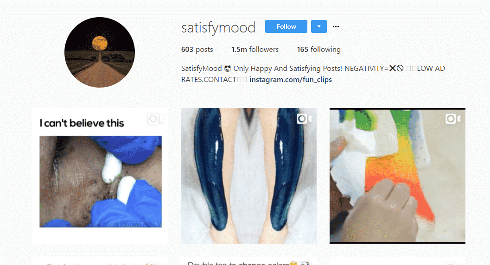

How’s It going, Guys! Hope you are having a great time advancing your business on Instagram. Well today, I am here to talk to you about an important lesson which will help you grow your account to the next level. Today, we are going to learn all about **Shoutouts**. 

This is the **_fourth_** installment to the Insta-Bible Series and make sure that you go through the prior three articles.

- _[The Insta Bible: Chapter 1](https://www.loginradius.com/blog/fuel/2017/05/the-insta-bible-chapter-1/) (Creating a Genuine business profile)_
- _[The Insta Bible: Chapter 2](https://www.loginradius.com/blog/fuel/2017/05/the-insta-bible-chapter-2/) (Finding & posting Right content)_
- _[The Insta Bible: Chapter 3](https://www.loginradius.com/blog/fuel/2017/06/the-insta-bible-chapter-3/) (Growth Hacking tips to help you grow)_

So, here’s all you need to study about shoutouts and how to team up with influential people on Instagram to form a great crew.

### **Share For Shares**

Share for share means sharing your image or shouting you out in an image’s caption. You can use S4S for rapid growth of your account. And if you do not use it, you will be missing out a vital step in the ladder to your account’s growth. Hence, what you need to?

- Go to your partner’s account and choose an image that relates to your account. The image should have a grabbed a good amount of attention.
- Take a screenshot of the image and share the image after editing it and captioning it properly. Add your partner’s name in the caption and tag him.
- Also, add your hashtags in the comment section.
- Thus, in return, your friend or partner will share you images as well

This technique is very useful and does not have any money involved in it. You can practice S4S formula and can do 4 to 5 shares in a day.

### **Paid Shoutouts**

Paid shoutouts are the medium where you can approach accounts or Instagram influences much bigger than you to share your posts. Thus, you can get maximum attention of your audience and you will see that extra bucks are well spent.

There are three types of shoutouts. They are as follows:-

- Discuss the rates of paid shoutouts with a person or a brand (who is bigger influence than you in your niche). After practicing paid shoutouts, you can evidently view a drastic change in your daily opt- ins. This type of advertising is also called native advertising. 
- Hire your partner’s bio to display your landing page link and therefore, push your product. Such shoutouts are called product push shoutouts.
- You can ask a business or a person to mention your name in the caption of their post. It is called caption-oriented shoutout. It is comparatively less expensive than other types of shoutouts.
- If you want to increase your followers instantly, you can go for a **screenshot shoutout** where your IG partner takes a screenshot of your account and posts it as an image in his account. He will ask his followers to follow your account and that will drastically improve your follower count.

Hence, use product push shoutouts, if you can negotiate nicely and want to push a product and go for screenshot shoutout if you want to just increase the number of your followers. You can club caption oriented shoutout with any of them.

#### **What Rates Should You Expect**

Any account that has followers between 20k to 90k, it will cost you $10 to $30 for 1 post. Whereas accounts with more than 1L and above can charge you $50 to $100 per post. You may also get a package deal of 10 posts but I recommend you go for a single post to see if the shoutout serves the purpose. You can gradually increase the number of your posts.

### **Finding the Best Influencers for S4S**

You can take the help of Google to find the best accounts in our niche.

Type “**Inurl:instagram.com** **_niche name_** **followers**” gives you the privilege to search in the Instagram’s database for perfect accounts for your S4S campaign. For example, if you type **Inurl:instagram.com** **_fashion_** **followers,** it will show some popular accounts in the niche- fashion. That’s how simple it is!

### **Timings for Paid Shoutouts and S4S**

When talking about paid shoutouts & S4S, mostly every account keeps your images for a fixed period of time. You pay for a fixed period while selecting paid shoutouts whereas accounts delete old S4S after sometime to keep their feeds clean and fresh. Hence, while doing paid shoutouts or S4S, discuss the time period you want your images to stay on that page.

### **Tracking Your Shoutout Campaigns**

You need to analyze ROI from shoutout campaigns and hence require track them. Well, there are various link tracker tools through which you can check whether your money is well spent or not. Here, I am providing the example of [LinkTrackr](http://www.linktrackr.com/), a tracking tool where you can have a look at all your investments. Here’s how the tool works:-

- Click on the Campaign tab and add a link which you want to customize and provide it to your shoutout partner.
- After customizing the link, set a goal by name and you will provide the modified link in the respective shoutout campaigns.

In this way, you can keep a record of sales and conversions which happened through different shoutout campaigns. 

### **Creating Your Crew  For Shoutouts and S4S**

It is always great and supportive to surround yourself by like-minded souls. Hence, creating your own Instagram crew can do lot more help than every time finding new people to do shoutouts. You cannot trust and depend on anybody and everybody on Instagram for serious things such as promoting your products or improving your brand recognition. Moreover, you have a set of trustworthy people who can diligently perform S4S and shoutouts for you, you can draw your focus on more important things like building your business or improving your content.

**Now, let me introduce to you about the characteristics of a perfect crew:-**

- People who are like-minded and have same goals.
- Generally, their accounts are of same size so that an impartial exchange can be performed.
- The crew will have a leader who can bind people together.
- The rules should be simple and rosters for sharing are pretty convenient for everyone.
- They will share tricks and hacks about what’s working and what’s not in your niche.
- They will certainly eliminate inactives from the group.

Now, how will you build the best crew in the world? Just follow these simple four steps:-

#### **1\. Discover your crew**

Get at least four accounts to begin with. Of course, you can ask your friends in your niche to join your crew or you may have to outreach for it. You can use tools like [SocialRank](https://socialrank.com/) to look for like-minded accounts who have approximately the same number of followers as you have. You can find your team with the help of hashtags.

#### **2\. Make The Move**

Contact those accounts and ask whether they would like to team up for a S4S. If they are interested, they will connect with you and fortunately, you may grow up a great team. Make sure you are reaching out accounts in the same niche and with strength of followers. Accounts with lesser number of followers will not be valuable for you and accounts with high number of followers may not be interested to team up with you. Also, ensure that you have an attractive logo that represents your business. You can also comment or like their posts.

Now, when you team up with them, test the team by doing few S4S with them. Hence, you will have an idea about how reliable they are.

#### **3\. Create your Crew**

Now, as you have got your set of people, you can straightly invite them to join your group. Decide a communication platform to create a group such as GroupMe or Kik. you can also use Gmail or Slack later after your group has grown bigger. Add your contact details like your Kik ID in your bio.

#### **4\. Get Started**

Start with a simple roster with everyone’s agreement. Share and maintain a Google Spreadsheet so that everyone gets easily updated about their slots for performing S4S or shoutout. Thus, help yourself by helping great people add into your account.

That’s all about shoutouts and how you need to use them to make your business grow constantly. Creating your own group and then building relationships with them is the best technique for mutual and rapid growth. Do not forget to share your experience in the comments below. Stay tuned for another interesting article of **_Insta-Bible Series_**.

_Till then, Shoutout Instagrammers!_
