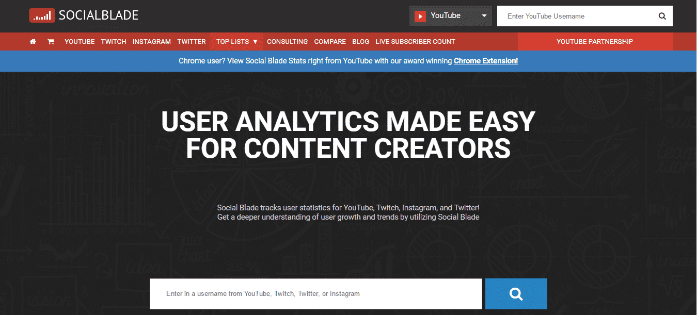
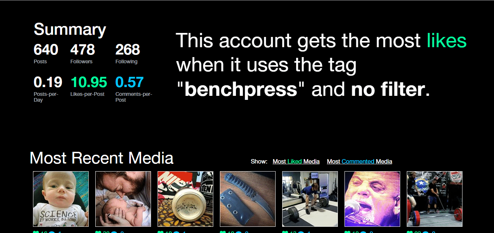
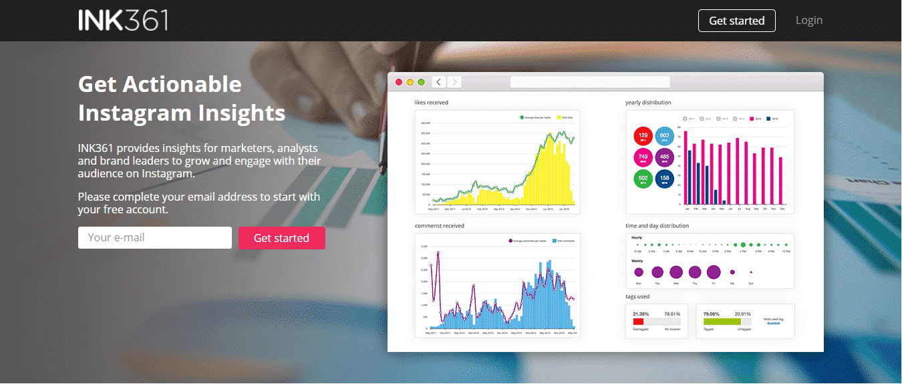

You can’t enhance your business unless you analyze it. Likewise, when using Instagram, it is very important to measure your Instagram practices to grow your Instagram account. That’s why, here’s an article entirely dedicated to some great tools that can help you analyze your IG practices and suggest you where to keep it tough and where to let go. 

Make sure you have already read the previous four installments in the Insta Bible series:-

- [The Insta Bible: Chapter 1](https://www.loginradius.com/blog/fuel/2017/05/the-insta-bible-chapter-1/): Creating a genuine Instagram profile
- [The Insta Bible: Chapter 2](https://www.loginradius.com/blog/fuel/2017/05/the-insta-bible-chapter-2/): Finding and posting content on your Insta profile
- [The Insta Bible: Chapter 3](https://www.loginradius.com/blog/fuel/2017/06/the-insta-bible-chapter-3/): Growth hacking tips for your Insta account
- [The Insta Bible: Chapter 4](https://www.loginradius.com/blog/fuel/2017/06/the-insta-bible-chapter-4/): A complete guide to IG shoutouts

Now, Let’s go into the details of these well developed Instagram Analytics tools and how can they help to improve your business statistics.

### **Iconosquare**

Iconosquare is a great tool for Instagram analytics. Go for free trial (14 days) and witness the difference yourself. You can also pick up the plans of your choice by clicking [here](https://pro.iconosquare.com/pricing).

With Iconosquare, you can make a record of your growth in number of followers, average number of likes and comments, weekly engagement on your feeds, comments and likes history and much more.

In addition, you can also see lost followers, new followers, people whom you are following and are not following back etc. You can also see which regions have maximum number of followers for your account. Thus, you post according to their timezone. Hence, you can decide what to post and when to post through the tool. You can even research hashtags on Iconosquare (not available in **plus** plan). Therefore, login to your Iconosquare account and start measuring your IG account to analyze and maintain your account’s health.

### **Social Blade**

Why Social Blade? Because it’s nice and easy to track your account’s development on this wonderful tool. 

You can measure your latest strategy, perform a S4S or do a paid shoutout on Social Blade. How? You can search for an account in Social Blade, look at its summary and decide whether you can do a S4S with them or not. On Social Blade, you can check your monthly statistics and actually witness how much your business has grown each day.

Download the application on your phone ([iOS](https://itunes.apple.com/ca/app/social-blade-statistics-app/id838333283?mt=8) & [Android](https://play.google.com/store/apps/details?id=com.socialblade.droid.statistics)) or get a [chrome](https://chrome.google.com/webstore/detail/social-blade/cfidkbgamfhdgmedldkagjopnbobdmdn) extension.

### **Social Rank**

Celebrities and influencers following can be an awesome boost for your business. [Social Rank](https://socialrank.com/) lets you to find your top followers.

You ask your influencers to shout you out and hence, increase your IG presence. Hence, Social Rank is a great Instagram Analytics tool which can be used to find out followers (highly influential personalities) and ask them to promote your account.

### **Unionmetrics**

Unionmetrics is one of the best IG Analytics tools I have ever come across to find the most relevant hashtags in your niche.

Go to its [website](https://unionmetrics.com/) and click on **try free tools** button. There, you will find an option to **start your checkup.** Signup and check the most useful hashtags that will bring more engagement, get to know your followers and how frequently to post. Now, if you don’t use this tool, you are going to miss out an important tool that is free and useful.

### **PicStats** 

[PicStats](http://picstats.com/u/maccosmetics) tells you everything about your account starting from number of tags, hashtags with maximum engagement, media type, kind of filter with maximum engagement and so on. You need to login with your Instagram account to use the tool. Run the report and find interesting analytics about any account.

### **Ink361**

[Ink361](http://ink361.com/) is an awesome tool to find the best and most likeable content for your niche. The tool is free and you will miss a big opportunity if you are not using Ink361.

How to use it? That’s pretty simple. Create an account, login and search for an account in the search bar and analyze the results.

The results that populated will contain number of posts, statistics, followers and following. So, basically you can search for the best accounts in your niche, see what their best images are or which posts got them the maximum engagement. Hence, you have can easily have an idea about the quality or kind of posts you need to publish to increase your account’s engagement. The tool is very simple and helps you keep fresh and more engaging content.

Use these Instagram Analytics tools on your Instagram account and experience the difference they can bring to your business. Stay tuned for more articles as there is lot to talk and lot to know. Till then, share your experience in the comments below.
