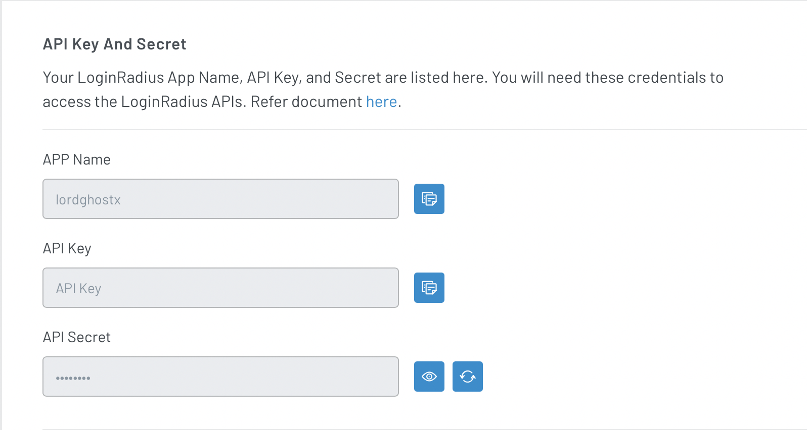
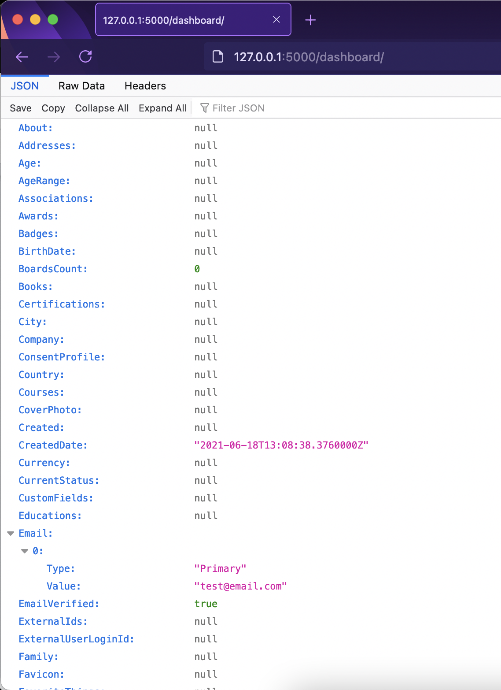

Authentication and user identity management are challenging tasks you are bound to run into when building applications. For example, you will need to create profiles for users, validate provided passwords, implement a password reset functionalities, manage user sessions (sometimes on multiple devices), manage social media authentication, and many others.

You still have to work on other parts of your application, and you might not have a lot of time. A lot of developers might hack their way through authentication, but that could lead to improper implementations. It is not advisable to do this as you can create doorways for cyber-related attacks in your application.

In this tutorial, you will learn how to properly implement user authentication and identity management in a Flask application.

> Here for the code alone? Head over to the [implementation section](#integrating-loginradius-with-python-and-flask) of this article or visit this [GitHub gist](https://gist.github.com/LordGhostX/01e9330dc4533a992a481fcd58fdd115) to browse demo code.

## Introduction

### What Is User Authentication?

User authentication is the process of validating a person’s identity to ascertain that they are who they claim to be. Authentication is achievable using passwords, one-time pins (OTP), biometrics, authentication apps, access tokens, certificates, and many more.

### What Is User Identity?

User identity is an entity used to identify a user of an application uniquely. Forms of user identifiers include full names, email addresses, system-generated values, and [UUIDs](https://en.wikipedia.org/wiki/Universally_unique_identifier).

### What Is an Identity Provider?

An identity provider is a system that helps create, maintain, and manage user identity information. It also provides authentication services to external applications to ease their authentication flow and make it seamless.

## What Is Authentication in Python?

When referring to authentication in [Python](https://www.python.org), we talk about user authentication concerning web applications built with it. Python is actively used in making web applications with many supporting frameworks, including but not limited to [Flask](https://flask.palletsprojects.com/en/2.0.x/), Django, FastAPI, Bottle, and Hug.

Every web application built with Python at one point or another would need to implement user authentication features. This article will cover implementing authentication and proper handling of user identity information using [LoginRadius](https://loginradius.com) and Flask.

## Getting Started with LoginRadius

### What Is LoginRadius?

[LoginRadius](https://accounts.loginradius.com/auth.aspx?action=register&return_url=https://dashboard.loginradius.com/login) is a cloud-based consumer identity and access management (CIAM) platform that allows seamless user authentication and SSO integration into your application. LoginRadius is simple to use, completely secure, and highly customizable.

To proceed with this tutorial, you will need an account with LoginRadius. If you have not created one before now, create one on the [LoginRadius website](https://accounts.loginradius.com/auth.aspx?action=register&return_url=https://dashboard.loginradius.com/login).

### Benefits of Using LoginRadius

* It simplifies user management.
* It provides unmatched data, user, and account security.
* It ensures automatic privacy compliance.
* It integrates seamlessly into your applications.
* It provides scalable infrastructure.

# Integrating LoginRadius with Python and Flask

* This section covers setting up the demo application that we will be integrating LoginRadius into in the remaining parts of the tutorial.
* It also covers LoginRadius integration with the Python and Flask demo application code.

### Acquiring LoginRadius API Credentials

Login to your [LoginRadius dashboard](https://accounts.loginradius.com/auth.aspx?return_url=https://dashboard.loginradius.com/login), then navigate to the app you want to integrate with Python (LoginRadius will set up a free app for you when you create an account).


Next, head over to the `Configuration` tab on the LoginRadius sidebar (left side of the screen).


Your API credentials are located under the `API Key And Secret` section. Once you have retrieved this, copy the `APP Name`, `API Key`, and `API Secret` and store them somewhere secure and easily retrievable.



### Whitelisting Your Domains

LoginRadius requires you to whitelist domains you will be integrating with your app. To whitelist, a domain, scroll down to the `Whitelist Your Domain` section in the `Configuration` tab of your app dashboard and add it.


> By default, LoginRadius whitelists your local computer (localhost).

### Installing LoginRadius Python SDK

We need to install the LoginRadius Python SDK. It provides functionalities that allow Python programs to communicate with LoginRadius APIs.

In the terminal, type:

```bash
pip install LoginRadius-v2 requests cryptography pbkdf2
```

### Setting up Our Flask Server

First, we need to install the Flask framework from PyPI. In the terminal, type:

```bash
pip install flask
```

After that, create a file named `server.py` and save the following code in it:

```python
from flask import *

app = Flask(__name__)
app.config["SECRET_KEY"] = "SECRET_KEY"


@app.route("/")
def index():
    return "Hello World!"


if __name__ == "__main__":
    app.run(debug=True)
```

When you run the `server.py` script and open your browser, you will get a response similar to the image below:


### Initializing the LoginRadius SDK

Update the `server.py` file with the code below:

```python
from LoginRadius import LoginRadius as LR

LR.API_KEY = "API Key"
LR.API_SECRET = "API Secret"
loginradius = LR()
```

Replace the values of the `API_KEY` and `API_SECRET` variables with your LoginRadius application keys we saved earlier.

## Setting up User Registration

To register users, you have to redirect them from your application to your LoginRadius Auth Page (IDX). Each LoginRadius app has a custom IDX. You can access it with the following URL pattern.

```
https://{APP_NAME}.hub.loginradius.com/auth.aspx?action={AUTH_ACTION}&return_url={RETURN_URL}
```

* The `APP_NAME` parameter refers to your LoginRadius app name, which you can retrieve from the `API Key And Secret` section in the `Configuration` tab of your dashboard.
* The `AUTH_ACTION` parameter refers to the authentication action you’re attempting to perform. It is either `register` or `login`.
* The `RETURN_URL` parameter refers to the URL LoginRadius should redirect your users to after successful authentication. It is usually a route on your application server.

Update the `server.py` file with the code below:

```python
LR_AUTH_PAGE = "https://<APP_NAME>.hub.loginradius.com/auth.aspx?action={}&return_url={}"

@app.route("/register/")
def register():
    # redirect the user to our LoginRadius register URL
    return redirect(LR_AUTH_PAGE.format("register", request.host_url))
```

In the code above, we created a `register` route that redirects users to our LoginRadius registration IDX. We also set our `AUTH_ACTION` to “register” and our `RETURN_URL` to our application home page.


> NOTE: Don’t forget to replace the <APP_NAME> placeholder with your LoginRadius app name we saved earlier.

### Authenticating Registered Users (User Login)

To authenticate registered users, you have to redirect them to your IDX page, passing “login” as the `AUTH_ACTION`.

Update the `server.py` file with the code below:

```python
@app.route("/login/")
def login():
    access_token = request.args.get("token")
    if access_token is None:
        # redirect the user to our LoginRadius login URL if no access token is provided
        return redirect(LR_AUTH_PAGE.format("login", request.base_url))

    return "You have successfully logged in!"
```

> When LoginRadius successfully authenticates a user, it attaches a `token` parameter to the `REDIRECT_URL` before redirecting your user there. This parameter contains the [access token](https://en.wikipedia.org/wiki/Access_token) of the user that we authenticated.

In the code above, we redirect users to our LoginRadius login IDX if the `token` parameter is absent (this means LoginRadius did not redirect the user here). We also set our `AUTH_ACTION` to “login” and our `RETURN_URL` to our login page.


## Fetching User Profiles From Access Tokens

We also want to fetch user profiles from the `access token` given by LoginRadius. It comes in handy when we want to verify if a given access token is valid (or has expired) or just fetch information about the current user.

Update the `login` route with the code below. We also added a `dashboard` route where we will redirect users after successful authentication.

```python
@app.route("/login/")
def login():
    access_token = request.args.get("token")
    if access_token is None:
        # redirect the user to our LoginRadius login URL if no access token is provided
        return redirect(LR_AUTH_PAGE.format("login", request.base_url))

    # fetch the user profile details with their access tokens
    result = loginradius.authentication.get_profile_by_access_token(
        access_token)

    if result.get("ErrorCode") is not None:
        # redirect the user to our login URL if there was an error
        return redirect(url_for("login"))

    session["user_acccess_token"] = access_token

    return redirect(url_for("dashboard"))


@app.route("/dashboard/")
def dashboard():
    return "You have successfully logged in!"
```

In the code above, we used the `authentication.get_profile_by_access_token` method from the LoginRadius SDK to fetch our user’s details. If the request was successful and the result does not contain an `ErrorCode` parameter, we save the access token in the user’s session and redirect them to the `dashboard` route. But if an error occurs somewhere, e.g., the access token is invalid/expired, we redirect the user back to the `login` route.


Next, we want to add more functionality to the `dashboard` route. Instead of just displaying a dummy text, let it show the user information we fetched earlier. Update the `dashboard` route with the code below:

```python
@app.route("/dashboard/")
def dashboard():
    access_token = session.get("user_acccess_token")
    if access_token is None:
        return redirect(url_for("login"))

    # fetch the user profile details with their access tokens
    result = loginradius.authentication.get_profile_by_access_token(
        access_token)

    if result.get("ErrorCode") is not None:
        # redirect the user to our login URL if there was an error
        return redirect(url_for("login"))

    return jsonify(result)
```

Here, we fetched the access token stored in the user’s session earlier, used it to get their details, and rendered the result.



### Invalidating Access Tokens (User Logout)

Invalidating access tokens means rendering particular access tokens useless and unusable. It comes in handy when we log out users. The LoginRadius SDK provides an `auth_in_validate_access_token` method that takes in an access token to be invalidated.

To add this to our server, create a `logout` route with the code below:

```python
@app.route("/logout/")
def logout():
    access_token = session.get("user_acccess_token")
    if access_token is None:
        return redirect(url_for("login"))

    # invalidate the access token with LoginRadius API
    loginradius.authentication.auth_in_validate_access_token(access_token)
    session.clear()

    return "You have successfully logged out!"
```


## Conclusion

This article taught us about user authentication, user identity management, and implementing it correctly. In addition, we saw how easy it is to integrate LoginRadius services into a Python application to ease the implementation of authentication and user identity management.

The source code of the demo application is available as a [GitHub gist](https://gist.github.com/LordGhostX/01e9330dc4533a992a481fcd58fdd115). You can learn more about the LoginRadius Python SDK features from the [official documentation](https://www.loginradius.com/docs/developer/references/sdk/python/).
