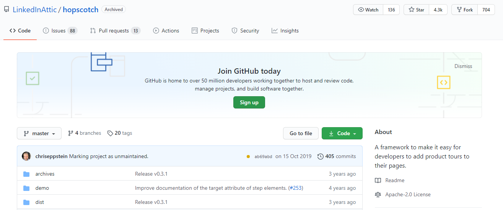
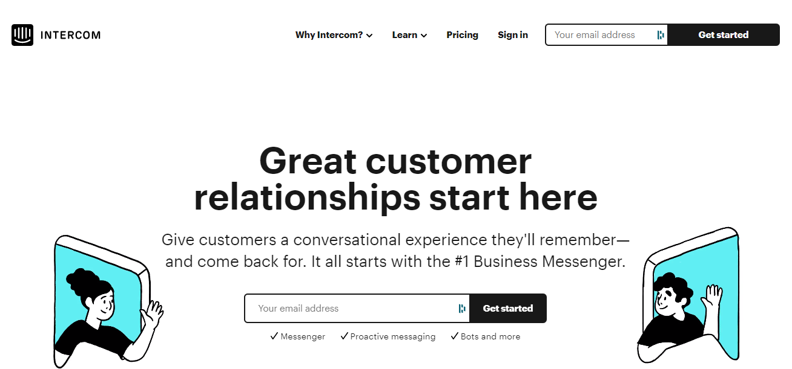
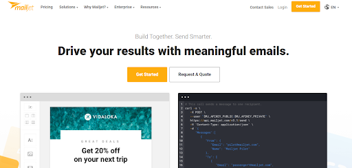
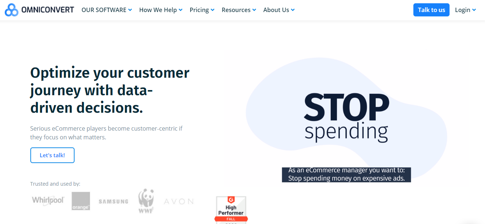
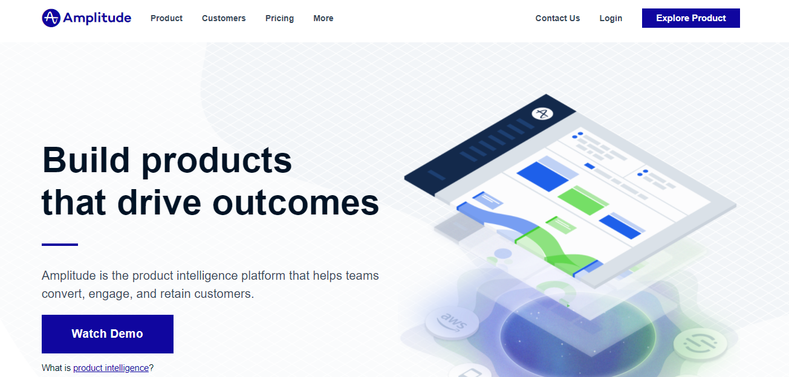
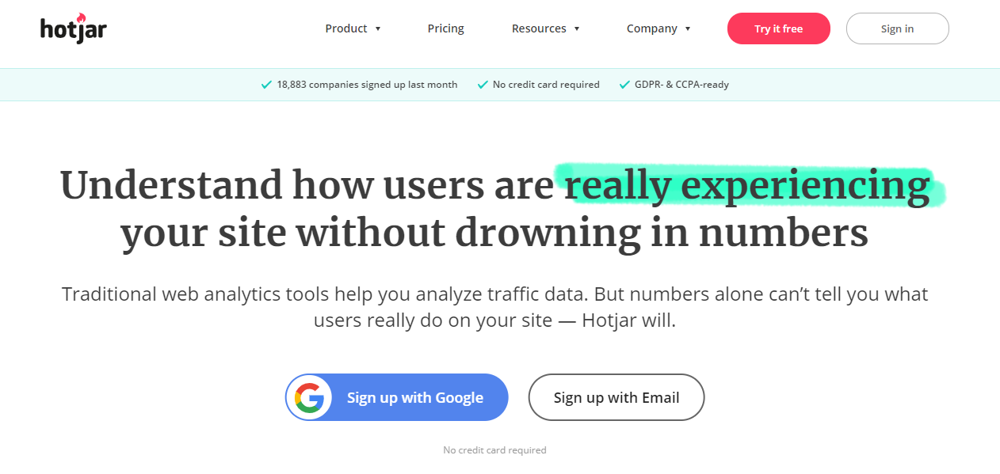
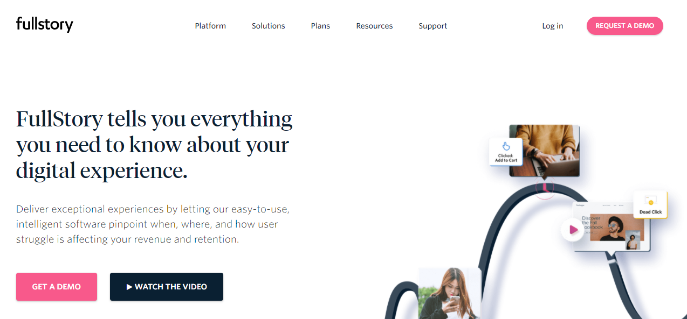
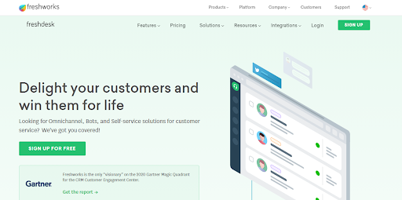
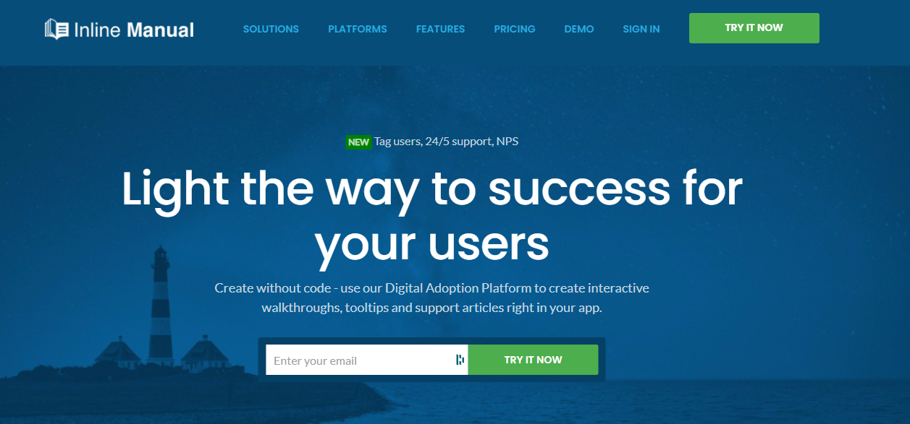

For your clients, a positive onboarding experience confirms that they have made the right choice. It often, finally, allows you to keep them.

The good thing is that your clients already love you, and they already trust your stuff, which is why they purchased it. Keeping it that way is your job.

By ensuring that their experience with your product is as good as your sales process, you can do this and fulfill the promises made in your marketing activities. Basically, from the first interaction point through the post-purchase stage, you want to create a [smooth customer experience](https://www.loginradius.com/customer-experience-solutions/).

Thankfully, there are several tools to help you make the offer more convenient for consumers. Here are some of my favorite onboarding tools, ranging from email to demos, that span a range of uses:

**_You can find the top 27 user onboarding tools for your SaaS enterprise in this list._**

## User Onboarding Tools:

Tool #1: AppCues

Tool #2: DIY with JavaScript

Tool #3: LoginRadius Single sign-on

Tool #4: Intercom

Tool #5: Mailjet

Tool #6: Drip

Tool #7: Customer.io

Tool #8: Optimizely

Tool #9: Omniconvert 

Tool #10: Google Optimize

Tool #11: VWO

Tool #12: Amplitude

Tool #13: Mixpanel

Tool #14: Feedier

Tool #15: Qualaroo

Tool #16: Wootric

Tool #17: Typeform

Tool #18: Hotjar

Tool #19: FullStory

Tool #20: Freshdesk

Tool #21: Olark

Tool #22: Helpscout

Tool #23: LiveChat

Tool #24: Zendesk

Tool #25: Loom

Tool #26: Inline Manual

Tool #27: Helpshelf 

## User onboarding tools for in-app experiences

## 1. AppCues

Without writing a single line of code, create customized user onboarding flows, and increase adoption and retention rates with [appcues](https://www.appcues.com/). Within one dashboard, you can design, publish, and manage your onboarding experience, enabling your users to delve deeper into your platform. Patterns and templates are available, including easy tooltips, full-screen takeovers, slide outs, and in-app alerts.

## 2. DIY with JavaScript

Onboarding helps to familiarise new users with an interface. There are several different styles of this, and there is no perfect way of doing it. But you can pick up ideas for your work if you study [how onboarding sites](https://speckyboy.com/onboarding-ui-css-javascript/) and apps do.

There is a wide range of tooltip plugins available to assist you in doing that if you have the time, development tools, and the ability to roll up your sleeves and code your user aboard.

[Hopscotch is a flexible platform](https://github.com/LinkedInAttic/hopscotch) that makes it simple for developers to add product tours to their websites, offering a PI to monitor the tour display's rendering and enabling you to track the time's progress. It includes callbacks for meetings, multi-page tours, support for several languages, and lightweight callouts.

**Intro.js **- Intro.js, a JavaScript tutorial, helps you harness this idea by adding a progress bar into your onboarding flow and allowing users to cross the finish line.

Just include the CSS and JS files on your page to get started, and you can start doing your tour. Target, placement, title, and content are the basic setup options.

## 3. Seamless Sign-in Experience With Single Sign-On

[Single sign-on](https://www.loginradius.com/blog/start-with-identity/2019/05/what-is-single-sign-on/) (SSO) is an access control property of several related but independent software systems. To gain access to a linked device, a user logs in with a single ID and password with this house.

It has always been tedious and time-consuming to fill out lengthy and thorough sign-up and registration forms that no one wants!

You could add SSO when creating the in-app experience, so your users would have fewer forms to fill out.

[LoginRadius SSO](https://www.loginradius.com/single-sign-on/) will not only help you boost your sign-up conversions with easy Sign-on solutions when we talk about user onboarding, but it will also protect your APIs and avoid malicious logins.

You will reduce the time taken for users to complete the registration process with LoginRadius and securely capture and retain their data.

LoginRadius supports both programming languages, so it doesn't matter if you have developed your application in C#, Java, or Angular. Due to its simplicity and freemium model, LoginRadius is suitable for small & medium enterprises, start-up developers, and large enterprises.

## User onboarding email tools

## 4. Intercom

[Intercom](https://www.intercom.com/) tells you who your clients are and what your product is doing. You can also interact with them using in-app and email messages in real-time. Using Intercom implies making educated decisions by asking for input with event-triggered notes at the right time. 

It is simple to embed and convert new users to become active customers, and you can manage all queries in a team inbox with customized responses and timely support options.

## 5. MailJet

[Mailjet](https://www.mailjet.com/) is an easy-to-use and all-in-one email-sending network. It's excellent for research and cooperation with A/B.

It enables you to collaborate, target specific users, and create personalized email campaigns with your team. With comprehensive and in-depth analytics and reports, you can also monitor the success of already sent emails.

## 6. Drip

[Drip](https://www.drip.com/) is an onboarding email creation tool. Without going to the promotion channel (if the user uses Gmail), it will send trigger-based emails directly in the inbox.

Drip helps you to go beyond simple emails and build multiple onboard processes for email automation, multi-channel marketing, and email promotions for users.

## 7. Customer.io (Paid)

The [Customer.io](https://customer.io/) tool for submitting drip campaigns is a little more costly. It's nice to start onboarding, converting, and keeping your audience for your needs.

What separates Customer.io from Mailjet and Drip is its ability for every customer to send notifications and messages, and real-time data.

## Enhance user onboarding with A/B testing tools

## 8. Optimizely

One of the best-known and most common experimentation platforms for SaaS companies is [Optimizely](https://www.optimizely.com/).

It enables both product and marketing divisions to experiment with each other. You can monitor how many individuals each experiment can see. Then Optimizely can calculate their behavior as a type of different statistics, graphs, and analytics and present it to you.

## 9. Omniconvert 

[Omniconvert](https://www.omniconvert.com/) is a platform for optimizing conversion rates that provides an A/B testing tool and tools for surveying, personalization, overlay, and segmentation. You can run desktop, mobile, and tablet A/B tests using their A/B testing tool. To validate your tests, you can convert winning versions of an A / B test into the control for a future trial and leverage Frequentist or Bayesian statistics.

## 10. Google Optimize

[Google Optimize](https://optimize.google.com/optimize/home/) can be an excellent way for you to A / B test various things if you're at your company's early stage. It's free, and it will meet all your needs at the start.

Currently, Google Optimize's most extensive feature is its in-depth integration with Google Analytics. This is an essential thing because it helps you to do more detailed targeting, more detailed monitoring, and more advanced tracking of conversions.

## 11. VWO

Trusted by over 4,500 enterprise brands, [VWO](https://vwo.com/) is a platform designed specifically for enterprise brands for A/B testing and conversion rate optimization. In their suit, with a drop-and-drop editor, you can create A / B tests, Split URL tests, and multivariate tests.

## User Onboarding Tools for Product Analytics

## 12. Amplitude

With a simple-to-use analytics app and dashboard, [Amplitude](https://amplitude.com/) enables you to monitor your data and metrics. The real-time platform tracks the use of your product and statistics from second to second, letting you know when your app crashes, or checkout flows break down.

## 13. Mixpanel

A behavioral analytics framework such as [Mixpanel](https://mixpanel.com/) can be used to run tests, such as slideouts and tooltips, on the performance of individual UI elements in your user onboarding.

You can gather accurate information about your product use with Mixpanel, recognize various patterns in the in-app interactions of your customer, set targets, and take steps based on your product analytics.

## User Onboarding tools for qualitative feedback

## 14. Feedier

[Feedier](https://feedier.com/) is an all-in-one feedback collection platform for your application, product, in-app interactions, or even onboarding processes for a customer.

It helps you with almost everything, from designing in-depth and informative surveys to resourceful analytics and studies to giving your recipients incentives.

Feedier has incorporated incentive management to make the survey enjoyable and straightforward for the customers to fill in.

## 15. Qualaroo

[Qualaroo](https://qualaroo.com/) user research and feedback tools promise the capacity to do precisely that. At each point of the onboarding process, you can segment your clients by attribute, plan the timing or action exactly when you want questions to pop up, and get the hot take.

## 16. Wootric

[Wootric](https://www.wootric.com/) is one of the best onboarding methods for customer loyalty and happiness tracking.

With Wootric, you can build custom micro surveys, ask the right questions on the right spots (across various channels), and skyrocket valuable consumer input to your user onboarding.

You can monitor the satisfaction of your customers in real time and even generate automatic customer sentiment measurements.

## 17. Typeform

Use a simple form development tool like [Typeform](https://www.typeform.com/) if you're strapped for cash but still need to get the answers you need. Its conversational, collaborative survey style is one benefit of Typeform. The simplicity of producing a survey is another advantage; it is similar to typing in a notepad, with no coding necessary.

## User Behaviour Tools For Seamless Onboarding

## 18. Hotjar

Through heatmaps, session recordings, and conversion funnels, [Hotjar](https://www.hotjar.com/) offers invaluable insights into the behavior of your users.

In a visual dashboard, you can track all the feedback and monitor sentiment across your onboarding process.

Knowing what your customers already do on your website will help you build smoother in-app interactions and onboarding processes for customers while unleashing the "aha moment" more quickly.

## 19. FullStory

Another tool for analyzing heat maps and digital experiences is [FullStory](https://www.fullstory.com/).

It probably captures more data than any other similar software. The unique value propositions of FullStory make it easy to solve various problems, capture more data, find answers, and optimize onboarding experiences for users.

Almost every session made on your website or application can be looked at. Your needs and processes can funnel and segment all sessions.

## Chat & Support tools for user onboarding

## 20. Freshdesk

Live chat is an excellent platform for onboarding your new users and gathering feedback for your product.

In your user onboarding processes, [Freshdesk](https://freshdesk.com/) is an excellent tool for implementing chat support.

With Freshdesk, you can keep track of all the discussions quickly. Through team coordination, all tickets can be prioritized and segmented, thus assigning them to some of your team members.

It has a fantastic dashboard that supports all of your tickets on multiple platforms. All your tickets, whether they come from email, chatbot, live chat support, website, social media, or even a phone, can be easily managed on a single platform.

## 21. Olark

A simple way to frustrate them and create unnecessary pressure is to disturb the users and sign in as they go through onboarding or complete vital tasks. With a live chat tool like Olark, you can do this. Using a chat box that suits your branding, [Olark](https://www.olark.com/) allows you to live chat with clients that run into an issue.

## 22. Helpscout

[Helpscout](https://www.helpscout.com/) is another perfect solution to incorporate live chat support in your user onboarding.

Helpscout's mission is to empower human driving and customizable support for live chat and email.

with this tool you can create more personalized ticket emails for every user. Together with your team, with articles that address all your client's questions, you will be able to build help docs quickly.

## 23. LiveChat

Another great software tool for talking to clients and solving their problems in real-time is [LiveChat](https://www.livechat.com/). Use it to speak with your users and address their issues as they happen. LiveChat's rich analytics show you where your users face most roadblocks during their onboarding (or elsewhere in their journey). Using LiveChat to monitor the onboarding process and recognize the moments of friction that your clients encounter.

## 24. Zendesk

Knowledge base tools such as [Zendesk](https://www.zendesk.com/) allow you to build an online support center where customers can access FAQs, fixes for prevalent problems, step-by-step posts, and community-cured solutions. Before it's too late, help the clients help themselves.

## Bonus User Onboarding Tools

## 25. Loom

One of the helpful onboarding video tools for customers is [Loom](https://www.loom.com/). Video user onboarding is the next best thing to offer you a competitive advantage if you do not have the time or the workers to hold in-person training or training seminars.

Loom helps you, the screen, or both, to record yourself.

By encouraging your future clients to watch a short video rather than read an entire manual, this onboarding tool will make the process simpler and faster.

## 26. Inline Manual

The [Inline Manual](https://inlinemanual.com/) is an advanced method for onboarding users, inline documentation, and quicker adoption of greater conversions applications. To engage and help your customers, you can quickly produce walkthroughs, onboarding guides, videos, and product documentation by presenting a new layer on top of your website or application that enables your customers to learn on the go.

## 27. Helpshelf

[Helpshelf](https://helpshelf.co/) is a fantastic user-onboarding knowledge base application.

It is necessary to surface the right content at the right time for user onboarding. Helpshelf helps you do this by showing guides, articles, and "how-to" to your clients when they need them and when your user is onboarding in various stages.

### **Conclusion**

You would need more than one or two user onboarding resources to create ideal and superior user onboarding procedures and in-app experiences.

Luckily, the market gives us an overwhelming range of different resources. We have covered 27 of the best user onboarding tools. Some of them are free, some are free, and some are paid for.

Customer Onboarding is a critical step that forms the entire lifecycle of the user. The best onboarding experiences help users quickly achieve their magic moment; they also set up new users for long-term success.

