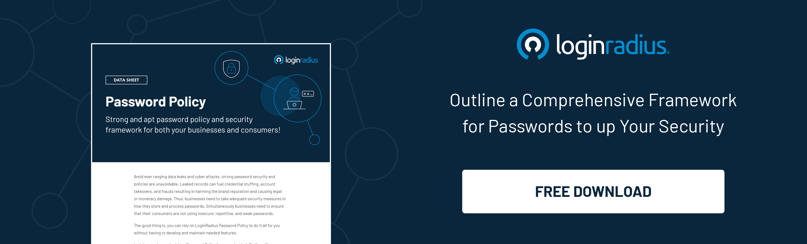

In February 2019, some [617 million online account](https://www.theregister.com/2019/02/11/620_million_hacked_accounts_dark_web/) details were stolen from 16 hacked websites and displayed for sale on the dark web. In April 2019, nearly [540 million records](https://www.upguard.com/breaches/facebook-user-data-leak) from third-party Facebook data were exposed. These are some of the most well-known data breaches that have occurred recently. Let us understand what causes such breaches and how we can protect our data from these.

## What is a Salt?

Salting hashes sounds like something that comes out of a recipe book. However, in cryptography, salt plays a significant role in the breach of data. While creating applications, security is usually not the biggest priority. While data leaks can sometimes happen, hash salting generators only come to mind when there is a major invasion of privacy that affects the majority of the consumers’ applications. 

Processes like user password hashing and salting are quite common in applications. They are indispensable for the [protection of data](https://www.loginradius.com/blog/start-with-identity/2020/12/data-security-best-practices/) and building long-lasting consumer trust and loyalty. But before we embark on how salting is useful to boost security, let us understand what salting is and how it works. 

## What is Salting?

Salting refers to adding random data to a hash function to obtain a unique output which refers to the hash. Even when the same input is used, it is possible to obtain different and unique hashes. These hashes aim to strengthen security, protect against dictionary attacks, brute-force attacks, and several others. 

Most commonly, salting is used in common passwords to strengthen them. So the next question is, what is salting when it comes to passwords? Often when we talk about passwords, we use terms like hashed and salted. This means there is an addition of random strings of characters (salting) to the password that is unique and known only to that site. Normally, this Salt is placed before the password and prevents people from figuring out even the simplest passwords like ‘123456’ or ‘password’. 

If a password has been hashed and salted, it is difficult for you to crack the passwords. Even if it is one of the most commonly used passwords, it takes several tries to break down the hashing and reveal the password. 

## How Can We Effectively Utilize Hashing Using Salt?

Whenever you are setting or resetting your password, the aim is to make it as unique as possible so that it cannot be easily guessed and subsequently hacked. This is the main aim of salts. They improve the uniqueness quotient of your password on the particular site you are accessing and add an extra security layer to the user password so that your data is not breached easily. 

So how can we use salts to increase the efficiency of hashing?

*   **Uniqueness**

The first step is to make your Salt as unique as possible. Make it as different as you can, using characters which one would never commonly pick. For example, if you use ten different salts, you are increasing the security of the hashed password by a factor of ten. 

Furthermore, when the salted password is stored separately, using rainbow tables, it makes it difficult for the attacker to determine the password. The best method to [ensure privacy protection](https://www.loginradius.com/blog/start-with-identity/2019/12/digital-privacy-best-practices/) is to use a unique salt each time the same user generates or changes their password. 

*   **Length of the salt**

 The length of the salt is as important as its quality or uniqueness. Very short salts are easier to attack and breach, thereby compromising your password. Ideally, the length of Salt should be as long as the output of the hash. For example, if the hash output is 32 bytes, the salt length should be at least 32 bytes, if not more. This step is an addition to passwords with specialized characters. 

*   **Predictability** 

Usernames must never be used as salt values. They are not only predictable but are also heavily overused by the user across several sites. This reduces their security. Since these usernames such as ‘admin’ and ‘root’ are very commonly looked up as well, it is easy to crack the hashes and cause a breach of privacy.

*   **Salt value generators**

The best way to ensure that your salted password hashing is secure is by using a cryptographically secure pseudo-random password generator to generate the salt values for you. As the name suggests, these are random, unpredictable, and reliable in terms of security and privacy.

*   **Addition of a secret key**

A public key is vulnerable to attacks. The ‘secret’ to securing and validating your password is by adding a secret key. When this private key is added, it allows the password to be validated. The key must also be stored externally in a separate server. This makes it difficult for the hacker to attack the data as he has to first access the internal system and then breach through the external server as well. 

*   **Salt reuse**

A common mistake when they are salting their password is reusing a salt they may have used previously. You may think that using the salt only once hardly takes away its uniqueness, but in reality, even one use of a salt depreciates its value. Reusing it can make it much easier for attackers to breach through both internal and external systems. Therefore, it is recommended to rely on a password salt generator each time. 

*   **Using extremely different combinations**

The more unique the combination of the hash, the more secure it is, but the combinations cannot be extremely strange. Combining random characters in the hopes that the [password will become more secure](https://www.loginradius.com/blog/start-with-identity/2021/01/how-to-choose-a-secure-password/) can actually backfire sometimes. 

It creates interoperability problems and reduces password strength. Never attempt to create crypto hashes and salts on your own. Always use standard designs that have been created by experts to avoid compromising your safety. 

*   **Kerckhoff’s Principle** 

To attack a hash, the hacker has to know the algorithm. However, according to Kerckhoff’s Principle, the hacker has access to the source code with which he can easily reverse engineer the algorithm. This access is only possible in free and open-source software. 

This is why your hash and salt must come from an external, closed source and server so that it is not easy to locate its origin and hack it. The more secure your link is, the more difficult it is to source the original Salt and hash.

## Why Use LoginRadius to Add a Password Salt?

Most businesses are not well-versed in the language of password salts and hashes and have to rely on experts for their help. LoginRadius offers a solution to manage passwords for strong authentication.

[The CIAM platform](https://www.loginradius.com/) offers a comprehensive set of services for the protection of data, including password hashing, salting, password compliance check, password peppering and BYOK (Bring your own key), and data encryption. 

LoginRadius has also launched a unique password policy that provides additional features such as password complexity, profile password prevention, password expiration, and password history. 

This policy makes LoginRadius an excellent choice for password protection among businesses and consumers alike. 

## Conclusion 

Protecting your data, whether you represent a company or simply for your personal accounts, is essential. Hashing and salting of passwords and cryptographic hash functions are the foolproof methods for this purpose. With salts, you can rest assured that your passwords and data are in good hands. 

