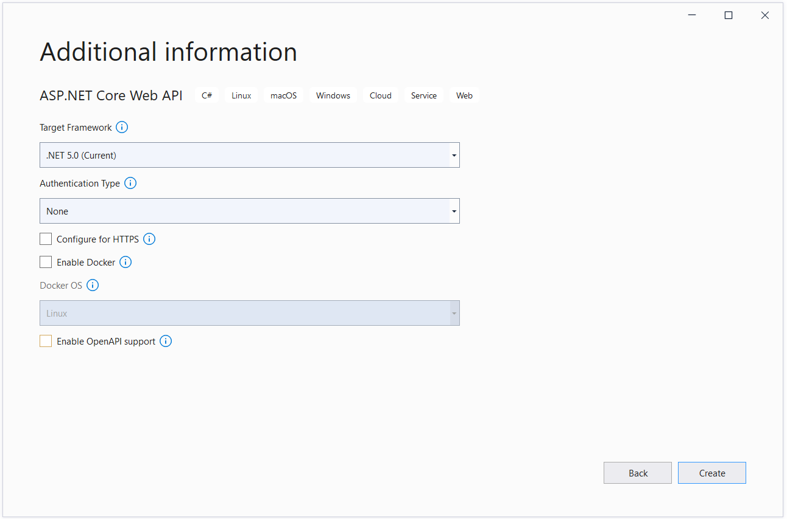

## Introduction

Azure Key Vault is a highly secure, dependable, and simple method to store your keys and secrets in the cloud. This article talks about:

- Azure Key Vault
- Why it is useful?
- How to set up and configure it?
- How to read a secret value stored inside it in C#?

Use the following steps to read a secret stored in an Azure Key Vault instance.

1.  Create a Web App in the Azure Portal

2.  Enable Managed Service Identity for your Web App

3.  Create and Configure Azure Key Vault

    1.  Create a new Azure Key Vault Instance

    2.  Create an App Secret in Azure key Vault

    3.  Authorize the Web App to Access Key Vault

4.  Create a new ASP.NET 5 Core application

    1.  Install NuGet Packages

    2.  Read Azure Key Vault Secrets in .NET Core

    3.  Specify the Vault Uri in AppSettings

    4.  Access Secrets from AzureKeyVault

    5.  Retrieve Secret Value from AzureKeyVault

    6.  Register the Dependencies in the ConfigureServices method

5.  Deploy the Application to Azure

6.  Execute the Application

## Prerequisites

To execute the code examples provided in this article, you should have each of the following:

1. Visual Studio 2019 (preferred)

2. Azure Account


If you don't have an Azure account, you can create one for free here:
<https://portal.azure.com>

## What is Azure Key Vault?

Azure Key Vault is a cloud service that helps you store your application's secrets securely: You can store and manage the keys, passwords, certificates, and other secrets. You can also leverage Azure Key Vault to set parameters shared among multiple applications, including applications running in App Service.

It enables you to isolate the sensitive and non-sensitive data in your application. For example, you can use application settings to store default parameters or key-value pairs containing some default settings used by the application. On the contrary, you can use Azure Key Vault to store API keys, secret keys, database connection strings, or Client IDs used in your application.

## Understanding Managed Identity

Managed identity is a concept that eliminates the need of having to store credentials once an application has been deployed in the cloud. By using managed identity, you can securely access a variety of Azure services without having to store any credentials like connection strings or passwords. Managed identity may be used to connect to Key Vault from an Azure Function App or an Azure Web App, as well as to connect to Azure Blob Storage from an Azure Web App.

Managed identities are of the following two types:

-   **System-assigned** -- this is activated directly on the Azure cloud service. For example, you can create a managed identity for your web app that will be automatically deleted once the web app instance is deleted
    
-   **User-assigned** -- this is a stand-alone Azure resource that is created independent of the actual service instance. You can assign this identifier to one or more Azure resources simultaneously. As an example, you can set this identity to both an Azure Web App and an Azure Function at the same time

## Create a Web App in the Azure Portal

You'll now create an Azure Web App instance with the permissions to access Azure Key Vault. Adhere to the steps given below that would guide you to create a new Azure Web App instance while you’re within the Azure portal:

1.  In the Azure Portal, click on "Create a resource" from the Home screen

2.  Select Web App from the list

    
    
1.  Specify the name and a region for your web app

2.  Mention the resource group and app service plan for your web app
  
    

3. In the Publish section, there are two choices, Code and Docker Container - choose Code
4. Specify .NET 5 as the Runtime stack
5. Set the Operation system to Windows
6. For the region, specify one that is closest to you
7. You can let the other options their default values and then click on "Review + Create"
8. Verify the configuration you've specified and if all is good, click "Create"

Once the Web App has been created successfully, you'll be able to see it on the Home screen of the Azure Portal.

### Enable Managed Service Identity for your Web App

To enable the system-assigned managed identity for the Azure Web App we just created, follow the steps given below:

1. Select Identity from the left-side menu in the Azure Web App

2. Change the Status toggle pertaining to the System-assigned tab to "On"

3. Copy the Object ID that is available after a few seconds


## Create and Configure Azure Key Vault

In this section you’ll examine how to create and configure an Azure key Vault instance.

### Create a new Azure Key Vault Instance

You'll now create an Azure Key Vault in the Azure Portal and then add a secret to it. To create a new Azure Key Vault instance, navigate to the Azure Portal and follow the steps below:

1.  Select "Create a resource" in the Azure Portal menu or the Home page

2.  Specify "Key Vault" in the Search box

3.  When the results are listed, choose "Key Vault"

4.  Click Create


5. In the Create key vault screen provide the name, subscription, resource group name, location and leave the other options to their default values.


    
6. Click “Review + Create”

7. Review the entered configuration and if all is fine, click Create

### Create an App Secret in Azure Key Vault

Now that a Key Value instance has been created, you'll add a secret to it and then make the secret accessible to the Azure Web App we created earlier. Follow the steps below to create a secret:

1.  Select Secrets from the Settings section of the Key Vault configuration page

2.  Click "Generate/Import" to add a secret

3.  Select "Manual" from the "Upload options" dropdown

4.  Next, mention the name and value of the secret

5.  Optionally specify the Content type

6.  Optionally set the activation and expiration date

7.  Click Create


### Authorize the Web App to access Your Key Vault

To provide access to the secret you created, follow the steps below:

1.  Select Access policies from the Key Vault screen

2.  Click "Add Access Policy"

3.  Provide the Get and List permissions

4.  In the “Select a Principal” option, specify the value for the Object ID you
    copied earlier for the Azure Web App

5.  Paste, search and then select it from the list

6.  Click Add

7.  Click Save to persist the changes and complete the process


## Create a New ASP.NET 5 Core application

First of all, you'll create an ASP.NET Core 5 web application. The project type comes bundled with all the template files to create a web application, even before you add something. Follow the steps given below to create a new ASP.NET Core Web application within the Visual Studio 2019 IDE.

1.  Launch Visual Studio 2019

2.  In the start window, choose "Create a new project"

3.  In the "Add a new project" window, choose "ASP.NET Core Web API" from the
    list of the project templates


    
4. Select C# as the programming language from the Language list
5. Click Next
6. In the "Configure your new project" screen, enter the name and location of the new project
7. Then, choose Next
8. In the "Additional information" window, ensure that .NET 5.0 (current) is selected as the framework version


    
1.  Since you'll not be using authentication, HTTPS or Docker, or OpenAPI, ensure that all these checkboxes are disabled
    
2.  Click Create to complete the process

A new ASP.NET 5 Core application will be created in Visual Studio

### Install the NuGet Packages

To work with AzureKeyVault, you must install the Microsoft.Extensions.Azure and Azure.Security.KeyVault.Secrets packages. While the former can be used for injecting dependencies for accessing Azure services, the latter can be used to access secrets via a SecretClient instance.

You may install these packages in one of two ways: Either via the NuGet Package Manager integrated into the Visual Studio 2019 IDE or by running the following command(s) in the Package Manager Console:

`Install-Package Microsoft.Extensions.Azure`

`Install-Package Azure.Security.KeyVault.Secrets`

### Read Azure Key Vault Secrets in .NET Core

In this section, you’ll examine how to read secrets from AzureKeyVault.

#### Specify the Vault Uri in AppSettings

Create a section named KeyVault in the `appsettings.json` file and specify a key
named VaultUri in there as shown below:

`"KeyVault": {`

`"VaultUri": "https://applicationsecretsdemo.vault.azure.net/"`

`}`

#### Access Secrets from AzureKeyVault

To access the secrets stored in the AzureKeyVault, you can take advantage of SecretClient pertaining to the  Azure.Security.KeyVault.Secrets namespace. Create an interface named IKeyVaultManager with the following code in there:

```c#
public interface IKeyVaultManager

{

public Task<string> GetSecret(string secretName);

}
```

Create a class named KeyVaultManager that extends the IKeyVaultManager interface and implements the GetSecret method as shown below:

```c#
public class KeyVaultManager:IKeyVaultManager

{

private readonly SecretClient _secretClient;

public KeyVaultManager(SecretClient secretClient)

{

 _secretClient = secretClient;

}

public async Task<string> GetSecret(string secretName)

{

try

{

KeyVaultSecret keyValueSecret = await

_secretClient.GetSecretAsync(secretName);

return keyValueSecret.Value;

}

catch

{

throw;

}

}

}
```

The KeyVaultManager class leverages the SecretClient class to retrieve secrets stored inside the AzureKeyVault.

#### The KeyValueController Class

The KeyValueController takes advantages of the KeyValueManager class to read the secret value for a given secret nameamd returns the value stored in there.

```c#
public class KeyVaultController : ControllerBase

{

private readonly IKeyVaultManager _secretManager;

public KeyVaultController(IKeyVaultManager secretManager)

{

_secretManager = secretManager;

}

[HttpGet]

public async Task<IActionResult> Get([FromQuery] string secretName)

{

try

{

if (string.IsNullOrEmpty(secretName))

{

return BadRequest();

}

string secretValue = await

_secretManager.GetSecret(secretName);

if (!string.IsNullOrEmpty(secretValue))

{

return Ok(secretValue);

}

else

{

return NotFound("Secret key not found.");

}

}

catch

{

return BadRequest("Error: Unable to read secret");

}

}

}
```

#### Register the Dependencies in the ConfigureServices Method

You should specify the necessary code for dependency injection to work in the ConfigureServices method of the Startup class as shown in the code snippet given below:

```c#
public void ConfigureServices(IServiceCollection services)

{

services.AddAzureClients(azureClientFactoryBuilder =>

{

azureClientFactoryBuilder.AddSecretClient(

Configuration.GetSection("KeyVault"));

});

services.AddSingleton<IKeyVaultManager,KeyVaultManager>();

services.AddControllersWithViews();

}
```

## Deploy the Application to Azure

To deploy the application, follow the steps below:

1.  Right-click on the project in the Solution Explorer Window

2.  Select Publish

3.  Select Azure as the target from the Publish window as shown below:


4. Select Azure App Service (Windows) as the specific target as shown below:


    
5. Specify, or associate, the App Service instance with your application


    
6. Click Finish

## Execute the Application

Lastly, you can use Postman to send a Http Get request to the endpoint to retrieve the stored secret as shown below:


    
## Summary

Azure key vault helps you to keep your application's secrets out of the application. You can use it to isolate secrets from your code files. These secrets include connection strings, API keys, environment variables, etc. You can take advantage of Azure Key Vault to keep secrets out of source control or out of your application in a centralized storage place. In this article, you've used managed identity to connect an Azure web app in .NET to an Azure Key Vault and retrieve secret value from there.

The complete source code of the application discussed in this article can be found here:

https://github.com/LoginRadius/engineering-blog-samples/pull/118
