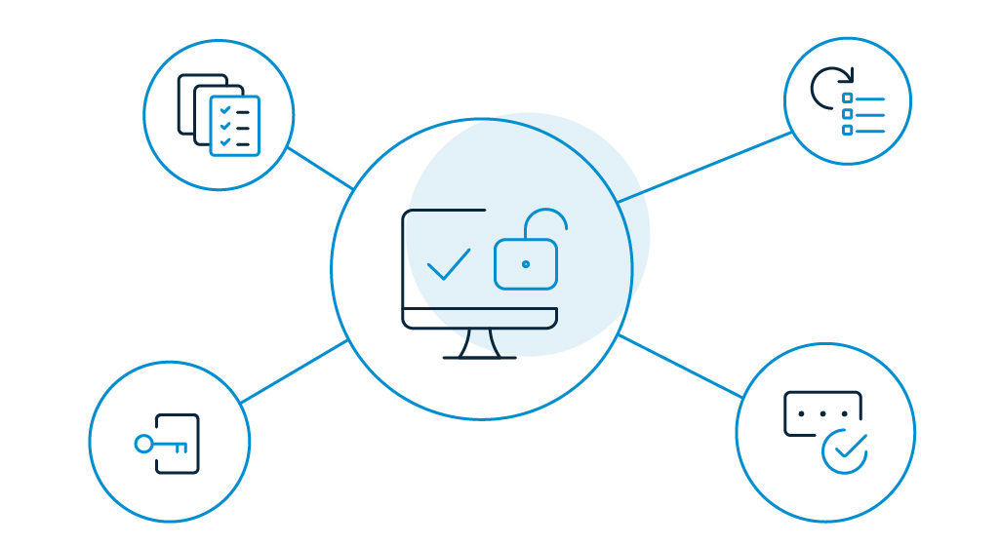

These days, businesses have an understanding of security hygiene and the risks of using insecure passwords. 

Yet, the _password management struggle is real_ and it is hitting businesses _hard_. 

Given the fact that stolen or reused passwords are responsible for 80% of [hacking-related breaches](https://www.helpnetsecurity.com/2019/10/10/poor-password-hygiene/), it’s high time for businesses to fix their overall security posture and step up their cybersecurity game. 

While more and more businesses are taking this concern seriously and are implementing security measures like password management, [multi-factor authentication](https://www.loginradius.com/blog/2019/06/what-is-multi-factor-authentication/) (MFA), and [single sign-on (SSO)](https://www.loginradius.com/blog/2019/05/what-is-single-sign-on/), it is unfortunate that people still cling to poor password habits. 

NordPass came up with a database of 500 million leaked passwords and ranked them based on their usage in its list of worst passwords in 2019. Keep reading for some of the worst of the bunch. 

## The Top 51 Worst Passwords of 2019 

In this list, you’ll recognize some old standbys like "123456" and "password" in the top spots. But there are some unexpected ones here, too. 

For example, passwords like zinch and g\_czechout may seem harder to crack, yet they still made it to the 7th and 8th positions, respectively.

You’ll also see popular female names like Jasmine or Jennifer. Another tactic is using a string of letters that forms a pattern or a line on the keyboard. Popular examples include asdfghjkl and 1qaz2wsx. 

Here they all are in top ranking order.  

**Rank**    | **Password** |  **Count** 
--- | --- | --- | --- |
1 | 12345 | 2812220
2 | 123456 | 2485216
3 | 123456789 | 1052268
4 | test1 | 993756
5 | password | 830846
6 | 12345678 | 512560
7 | zinch | 483443
8 | g_czechout| 372278
9 | asdf | 359520
10| qwerty | 348762
11| 1234567890 |329341
12 | 1234567 | 261610
13 | Aa123456. | 212903
14 | iloveyou | 171657
15 | 1234 | 169683
16 | abc123 | 150977
17 | 111111 | 148079
18 | 123123 | 145365
19 | dubsmash | 144104
20 | test | 139624
21 | princess | 122658
22 | 122658 | 116273
23 | sunshine | 107202
24 | BvtTest123 | 106991
25 | 11111 | 104395
26 | ashley | 94557
27 | 00000 | 92927
28 | 000000 | 92330
29 | password1 | 92009
30 | monkey | 86404
31 | livetest | 83677
32 | 55555 | 83004
33 | soccer | 80159
34 | charlie | 78914
35 | asdfghjkl | 77360
36 | 654321 | 76498
37 | family | 76007
38 | michael | 71035
39 | 123321 | 69727
40 | football | 68495
41 | baseball | 67981
42 | q1w2e3r4t5y6 | 66586
43 | nicole | 64992
44 | jessica | 63498
45 | purple | 62709
46 | shadow | 62592
47 | hannah | 62394
48 | chocolate | 62325
49 | michelle | 61873
50 | daniel | 61643
51 | maggie | 61445

## Why is password hygiene not taken seriously? 

Now that you've seen the worst passwords, you may want to [improve the password hygiene](https://www.loginradius.com/blog/2018/05/infographic-poor-password-hygiene-letting-cybercriminals-clean/) of your enterprise.

But what if your customers don't follow good password hygiene? 

Unfortunately, many don't. The biggest reason is that remembering multiple passwords for multiple accounts is hard work. This leads to people using easy-to-guess passwords or recycled passwords which can lead to a domino effect of attacks on both consumers and companies. 

Another flawed approach is that people may think their information is insignificant, so they assume that no hacker would care about them. However, a ransomware attack can lock users out of their accounts and become quite costly.

## How can you improve password security?

As our worst passwords list shows, you can’t stop everyone from using bad passwords. However, you can prevent hackers from accessing passwords by using a Customer Identity and Access Management (CIAM) solution. Here’s how.

An Identity Platform can help companies implement industry-standard hashing algorithms that protect passwords during transit or at rest. This is an effective way to prevent data from being exposed to hackers. 

With the increase in frequency and complexity of attacks, companies could also utilize additional features like two-factor authentication, risk-based authentication, and [passwordless login](https://www.loginradius.com/blog/2019/10/passwordless-authentication-the-future-of-identity-and-security/).

By implementing these features, companies can increase security to customer accounts that will help prevent data breaches and hacks.

A CIAM solution also saves resources. Your support and development teams can devote their time to growing your business rather than responding to data breaches. 

Overall, bad passwords coupled with smart hackers are a big problem for  businesses. To protect your company from costly hacks and breaches, you need cybersecurity that prevents access to your sensitive data. For state-of-the-art cybersecurity and enhanced customer experience, choose a globally-certified CIAM solution like LoginRadius. 

