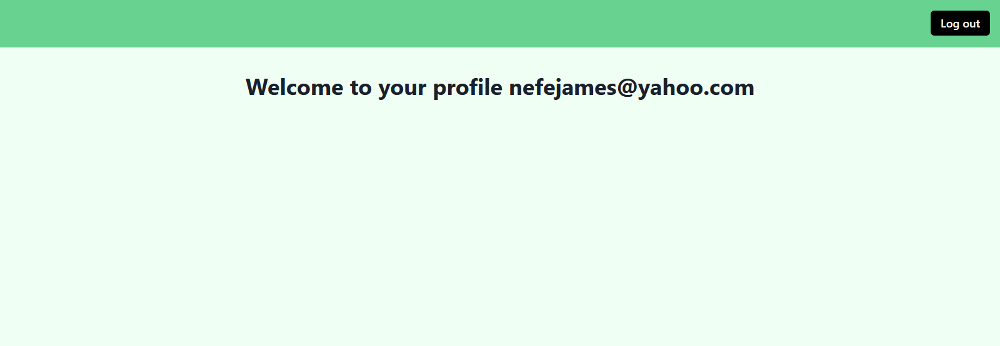

  
In this article, we will learn about authentication in Next.js, and how we can authenticate Next.js applications with [LoginRadius](https://www.loginradius.com/). 

**_Note: an understanding of React, Hooks and Next.js are beneficial to follow along with this article._** 

  
## What is Authentication?
Authentication is the process of validating that an individual is who they claim to be. Authentication is an essential feature for applications, particularly those that store user data.

We must be careful not to mistake authentication for authorization. Authorization is the process of verifying the data a user has access to. 

Authentication deals with identifying a user, while authorization checks what resources or data an authenticated user is permitted to access.   

Some of the methods we use to implement authentication are:
* Username/email and password
* Fingerprints
* Face recognition
* Security questions
* One time pins (OTPs)
* Magic links

## Should You Build Your Own Authentication System or Use a Third-Party Solution?

Authentication is one of the most critical parts iof an application’s security, so we must address it properly.

There are some things we should consider when assessing if we should build ours or use a third-party solution: 

* **Progressive Enhancements**
Security systems require frequent enhancements and upgrades to keep users safe from evolving hacker strategies. How much time and resources can we commit to keep our security system up-to-date with the latest countermeasures and safe from the latest vulnerabilities?

* **Identity Provider Support**
How many identity providers do we plan to support, if any? With third-party solutions, we can authenticate our users with email/password and identity providers such as Google, Github, Facebook, and more. Third-party solutions are always working hard to add support to even more providers. They also provide other authentication methods like magic link. Can we build an authentication system that allows our users to use their preferred authentication method, or will they be restricted?
 
* **Advanced Security Features** 
Security and authentication go beyond email/password sign-in. Most third-party solutions provide necessary features such as email confirmation, two-factor authentication (2FA). 

We should let the security experts such as LoginRadius do what they do best while we focus on our main tasks — building awesome applications.

Considering these factors, we can say that relying on a third-party solution is easier, cheaper, and more secure than building our own authentication system.

## What is LoginRadius?
> Loginradius is the World's first no-code identity platform. It is a simple, implementable solution for adding user authentication and authorization to your website.

LoginRadius provides no-code services for authorization, authentication, account security, and much more. It has several interesting features, and some of them are: 

* Social login
* Passwordless login
* Standard login (email and password)
* Multi-factor authentication
* Phone login
* Single sign-on
* User management


## Understanding Authentication Patterns in Next.js
When working with Next.js applications, we have two authentication patterns, client-side and server-side authentication.

**Client-Side Authentication**
With client-side authentication, the authentication logic and user redirection are done in the browser. The page component fully loads before the redirect logic is executed.

When this authentication approach is used, developers usually make use of a loading indicator to indicate to the user that a process is running in the background. The loading indicator helps boost the user’s experience. If the user’s authentication fails, we redirect the user to a login page.

The example below shows how to handle client-side redirects:
```javascript
import { useEffect } from "react";
import { useRouter } from "next/router";
import authService from "auth-service"; //imaginary auth service

export default function ProtectedPage() {

	const router = useRouter();

	 useEffect(() => {

		const authUser = authService.getUser();


		// if there is no authenticated user, redirect to login page_

		if (!authUser) {

			router.push("/login");

		}

	 }, []);
 
 
	 return (
		<>

			<h1>Welcome {user.name}. This is a protected page</h1>`

		</>

	 );

}
```
In the code snippet above, we handle client-side redirects in the browser using [next/router](https://nextjs.org/docs/api-reference/next/router). We also use an imaginary authentication service, “auth-service”, for illustration purposes. We’ll work with LoginRadius later in the article.

We check if there is an authenticated user with the `authService.getUser()` method in the `useEffect`. If there is none, we redirect the user to the `/login` page using Next.js’ router object.

This is a simple illustration of client-side authentication and redirection.


**Server-Side Authentication**
With server-side authentication, we can redirect a user from say pages/profile to pages/login. When a non-authenticated user tries to access a protected page, they are redirected to a login page. All of this is done on the server — before the request reaches the browser.

A benefit of this pattern is that non-authenticated users do not see flashes of unauthenticated content before they are redirected.

The example below shows how we can handle server-side redirects:
```javascript
export default function ProtectedPage({ user }) {
	return (
		<>

			<h1>Welcome {user.name}. This is a protected page</h1>

		</>

	);

}

export const getServerSideProps = async (context) => {

	const { user } = authService.getUser(context.req);

	// if there is no authenticated user, redirect to login page

	if (!user)

		return {

			props: {},

			redirect: { destination: "/login" },

		};

		return { props: { user } 
	};

};
```

Using `getServerSideProps` enables us to render pages on the server. We take advantage of that to also handle the redirection on the server. 

In the code snippet above, we use the `authService.getUser()` method to get the authenticated user’s object. If there is no user, we return an object that has a `redirect` object. The `redirect` object contains a `destination` key, where we put the page we want to redirect the user to, which is our application’s login page.

Now that we’ve examined the authentication patterns available, let’s see how to authenticate a Next.js application with LoginRadius.

  

  

## Authenticating Next.js Apps with LoginRadius
The steps below highlight how we can integrate and authenticate our Next.js applications with LoginRadius:

1.  **Create a LoginRadius Account**
We must [create an account](https://accounts.loginradius.com/auth.aspx?return_url=https://dashboard.loginradius.com/login&action=register) to get started with LoginRadius. There is a free plan we can begin with.

2.  **Get Account Credentials**
Now that we have an account, we need to [get the credentials](https://www.loginradius.com/docs/developer/faq/#how-to-retrieve-api-key-and-secret) for our `appName` and `apiKey` from our dashboard. We will need them later to use the React SDK.

3.  **Start a New Next.js Application**
Run the command below in your terminal to create a new Next.js application:
```javascript
npx create-next-app <name-of-project>
or
yarn add create-next-app <name-of-project>
```

4.  **Install the LoginRadius React SDK**
Next, install the [React SDK](https://github.com/LoginRadius/loginradius-react) into the project:
```javascript
npm install loginradius-react
or
yarn add loginradius-react
```
 
5.  **Integrate the SDK**
We need to wrap our root component with the SDK’s authentication provider. 
We also need to pass our account credentials to the provider. We can get these credentials from our account dashboard.
```javascript
import { LRAuthProvider } from "loginradius-react";
import Head from "next/head";
import "../styles/globals.css";

function MyApp({ Component, pageProps }) {
	return (
		<>

			<Head>

				<title>Loginradius Next</title>

			</Head>

			<LRAuthProvider

				appName="nefejames1"

				apiKey="909cf7d5-5332-4071-ad98-43501a128d82"

				redirectUri={"http://localhost:3000/"}
			>
				<Component {...pageProps} />

			</LRAuthProvider>

		</>

	);

}

export default MyApp
```

In the code snippet above, we import the `LRAuthProvider` component from `loginradius-react`. We pass the `appName` and `apiKey` we got earlier to `LRAuthProvider`. We also set the `redirectUri` to `http://localhost:3000/`.

The `redirectUri` is the callback URL where we want to redirect our users to after they have been authenticated. We must [whitelist the `redirect_uri` in our account dashboard](https://www.loginradius.com/docs/developer/faq/#how-to-whitelist-domain-in-loginradius-dashboard). Localhost URLs are whitelisted by default.

Now that we have integrated the SDK, let’s add the authentication functionality. 

6.  **Add Login and Logout Functionality**
Our users should able to log in and out of our application, so let’s set that up. 
```javascript
import { useLRAuth } from "loginradius-react";
import { Button, Heading, VStack, Center } from "@chakra-ui/react";

export default function Home() {
	const { loginWithRedirect, logout } = useLRAuth();

	return (
		<Center pt={10}>
			<VStack spacing={[6, 8]}>
			<Heading as="h2">Welcome</Heading>
			<Button onClick={() => loginWithRedirect()}>Login to continue</Button>
			<Button onClick={() => logout()}>Log out</Button>
			</VStack>
		</Center>
	);
}
```

Here, we are using Chakra UI for our UI components. 

First, we import the `useLRAuth` hook from the SDK. Next, we access the `loginWithRedirect` and `logout` methods from the `useLRAuth` hook. 

Then, we pass `loginWithRedirect` and `logout` to the login and logout buttons’ `onClick` event handlers respectively.

With that, we have added authentication to our application. However, we need a way to track the authentication state. We need to know if there is a logged-in user and do something with that information.

  

7.  **Tracking Authentication State**
The SDK also provides `error` and `user` objects, along with `isLoading` and `isAuthenticated` booleans. We will use these to track the authentication state.

We can access information about an authenticated user, such as their email address, from the `user` object. We can display error messages, if any, from the `error` object.

`isAuthenticated` returns true if there is an authenticated user and false if there is not. 
```javascript
import { useEffect } from "react";
import { useLRAuth } from "loginradius-react";
import { Button, Heading, VStack, Center } from "@chakra-ui/react";

export default function Home() {

	const { loginWithRedirect, logout, isLoading, isAuthenticated, error, user } = useLRAuth();

	const router = useRouter();

	useEffect(() => {
		if (user && isAuthenticated) {

			router.push("/profile");

		}

	}, [router]);
	

	if (isLoading) {
		return <div>Loading...</div>;

	}
	

	if (error) {

		return <div>Oops... {error.message}</div>;

	}

	return (
		<Center pt={10}>
			<VStack spacing={[6, 8]}>
			<Heading as="h2">Welcome</Heading>

			{!user && (
				<Button onClick={() => loginWithRedirect()}>Login to continue</Button>
			)}

			{user && isAuthenticated &&  (
				<Button onClick={() => logout()}>Log out</Button>
			)}
		</Center>
	);
}
```

Let’s break down the code snippet above:

* In the `useEffect`, we check if there is a user object and if `isAuthenticated` is true. If these conditions are true, then we redirect the user to their profile page. These conditions will only be true when the user has logged in. We will set up the profile page later.
* We check if the page is loading using the `isLoading` boolean. If true, we display a “loading…” text. In a production-ready application, we would display a loading spinner.
* If there is an error during the authentication process, we access the message from the `error` object and display it to the user.
* Finally, we conditionally display the login and logout buttons with the information we get from `user` and `isAuthenticated`.   

8.  **Displaying Authenticated User Data**
We want to display information about the authenticated user. Let’s set that up.
```javascript
import { Box, Center, Heading } from "@chakra-ui/react";
import { useLRAuth } from "loginradius-react";
export default function Profile() {

const { isLoading, isAuthenticated, user } = useLRAuth();

	if (isLoading) {
		return <div>Loading...</div>;
	}

	if (isAuthenticated) {
		return (
			<Box>
				<Nav />
				<Center mt={10}>
					<Heading a="h2">
						Welcome to your profile {user.Email[0].Value}
					</Heading>
				</Center>
			</Box>
		);
	}
}
```

We only want to display a user’s information if they are authenticated. We check that they are authenticated with the `isAuthenticated` hook. If they are authenticated, we return some JSX and display the user’s email address.  

9.  **Protecting a Route**
We can create protected routes to ensure only authenticated users can access those routes.
```javascript
import { withAuthenticationRequired } from "loginradius-react"

const Profile = () => {
	if (isAuthenticated) { 
		return (
			<Box
				...markup goes here
			</Box
		)
	}
}

export default withAuthenticationRequired(Profile, 
	Show a message while the user waits to be redirected to the login page.
	onRedirecting: () => (
		<Text>Redirecting you to LoginRadius awesome Login page</Text>
	),
});
```
Here, we use the `withAuthenticationRequired` higher-order component to wrap the `Profile` component. With this, anytime an unauthenticated user tries to access the `/profile` route, they will be redirected to LoginRadius’ login page and then back to `/profile` after they log in.

The image below shows an authenticated user's profile page.



## Conclusion
In this article, we have learned about the different authentication patterns available in Next.js and how to authenticate Next.js applications with LoginRadius’ React SDK.