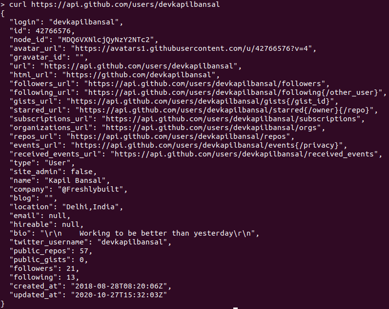
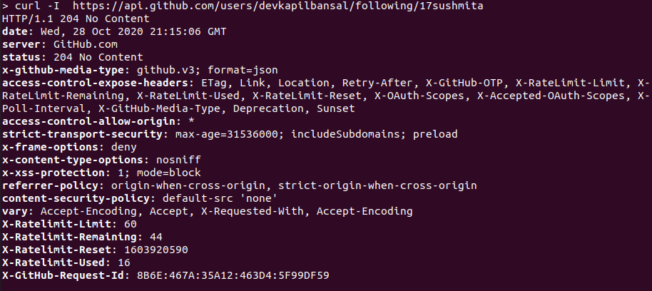

# Introduction to Github APIs

## What are APIs

API stands for Application Program Interfaces, which developers use to access web tools or information on the cloud. It allows different cross-platform applications to talk to each other.
One of the common examples of it is [Google Speech to Text API](https://cloud.google.com/speech-to-text) used when you talk to Google Assistant.

## What is [Github APIs](https://developer.github.com/v3/)
Github APIs( or Github ReST APIs) are the APIs that you can use to interact with GitHub. They allow you to create and manage repositories, branches, issues, pull requests, and many more.
For fetching publicly available information (like public repositories, user profiles, etc.), you can call the API. For other actions, you need to provide an authenticated token.

## Basic Github APIs Examples
The base URL for GitHub APIs is:- https://api.github.com/

### Accessing Public Information

#### Fetching user information with its username
Request type: GET
API endpoint: /users/{username}

Example :- `curl https://api.github.com/users/devkapilbansal`

As you can see, API returns us a JSON response with info about the user, like its image_url, name, mail_address.

#### Fetching user's followers' list
Request type: GET
API endpoint: /users/{username}/followers

Example :- `curl https://api.github.com/devkapilbansal/followers`

This URL returns info about all the users that follow a particular user.

#### Check if a user follows another
Request type: GET
API endpoint: /user/{username}/following/{target_username}

This endpoint doesn't return any content. It just returns a status code.

A status code of 204 means the `target_user` is followed by the user, whereas a status code of 404 means the user does not follow a `target_user`.

Example :- `curl https://api.github.com/devkapilbansal/following/KapilBansal`

When a user follows another user

When a user doesn't follow another user

### Performing tasks as an authenticated user

If you provide an authenticated token, you don't need to provide a username in the endpoints mentioned above.

By providing the token, you can create repositories/gists, comment on pull requests/issues, and all other tasks that you can perform from the Web Interface.

#### Generating Token

You can get a token by going to https://github.com/settings/tokens and clicking on _Generate new token_. You will be asked for the permissions/scopes of that token. Choose them **wisely** while creating one as some of these might be destructive.

After selecting scopes, click on generate token and save the token somewhere as you will not see that token again.

**Note**:- Store your token in a secured environment while using it.

#### Creating a Repository

Request type: POST
API endpoint: /user/{repos}
Required data: name

Example :- `curl -H "Authorization: token ${token}" -d '{"name":"Github API Testing"}' https://api.github.com/user/repos`

#### List issues assigned to you

Request type: GET
API endpoint: /issues

Example :- `curl -H "Authorization: token ${token}" https://api.github.com/issues`

#### Creating an issue

Request type: POST
API endpoint: /repos/{owner}/{repo_name}/issues
Required data: title

Example :- `curl -H "Authorization: token ${token}" -d '{"title":"Issue_For_Test"}' https://api.github.com/repos/devkapilbansal/Github-API-Testing/issues`

#### Commenting on issue

Request type: POST
API endpoint: /repos/{owner}/{repo_name}/issues/{issue_no}/comments
Required data: body

Example :- `curl -H "Authorization: token ${token}" -d '{"body":"Test comment"}' https://api.github.com/repos/devkapilbansal/Github-API-Testing/issues/1/comments`

**Note** - The same endpoint is used for commenting on pull requests too. Just change the issue number with the pull request number.

#### Opening/Closing an issue
Request type: PUT
API endpoint: /repos/{owner}/{repo_name}/issues/{issue_no}

Example :- `curl -H "Authorization: token ${token}" -d '{"state":"close"}' https://api.github.com/repos/devkapilbansal/Github-API-Testing/issues/1`

**Note** - The same endpoint is valid for updating pull requests too.

#### Results
The above results can be verified on the GitHub website too.

## Conclusion
There are a lot more endpoints that you can explore at https://developer.github.com/v3. Also, you can only do the work you are authorized to with that token.
Although there are plenty of data fields that can be sent with these endpoints, only required ones are shown above.
