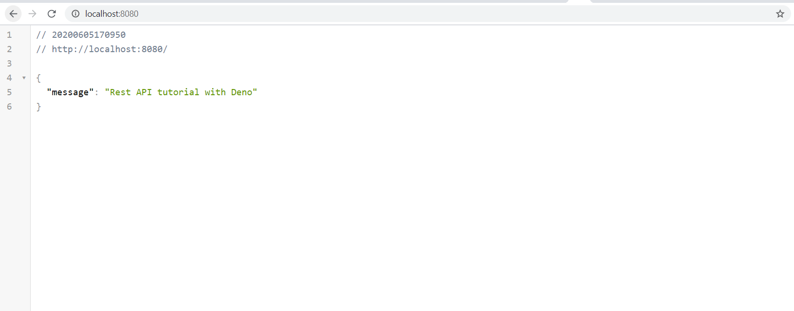
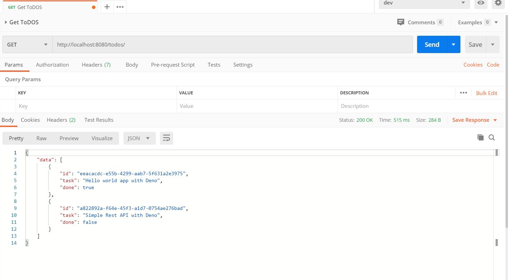

Deno, the creation of Ryan Dahl is a simple, modern, and secure runtime for JavaScript and TypeScript that uses V8 and is built in Rust. As Deno 1.0.0 has released, there is much-awaited curiosity amongst developers around working with this new stack.

When it comes to learning a new language, the first thing that comes to our mind is the creation of a todo app, supporting CRUD functionality. So here we will be creating a very simple Todo application using the Deno. 

So before starting I assume you have installed Deno on your system, if not then you can find the link [here](/hello-world-deno/). 
For the database, we will be using the `JSON` file as of now to completely focus on creating web API using Deno. Not more words and now let's start.

The file structure we are going to follow is as below

```

  // Final directory structure
  deno-todo-api/
    --|controllers/
      |--|todo.ts
      |data/
      |--|todos.ts
      |interfaces/
      |--|Todo.ts
      |routes/
      |--|todo.ts
    --|server.ts
  
  ```

At any point in time, if you are stuck somewhere, you can follow this link to get the complete [code](https://github.com/LoginRadius/engineering-blog-samples/tree/master/Deno/RestAPIWithDeno).

1. Create a directory named `deno-todo-api` and move into that directory 

```
  mkdir deno-todo-api && cd deno-todo-api
```
2. Create the file `server.ts` in the root of the directory. 

3. Write the following code into the `server.ts` file to start a server

```JavaScript

import { Application, Router } from "https://deno.land/x/oak/mod.ts";

const app = new Application();
const port: number = 8080;

const router = new Router();
router.get("/", ({ response }: { response: any }) => {
  response.body = {
    message: "Rest API tutorial with Deno",
  };
});
app.use(router.routes());
app.use(router.allowedMethods());

console.log('running on port ', port);
await app.listen({ port });

```

Unlike `NodeJS` Deno does not need the `package.json` file for dependency management. Dependency management is simplified by having a list of modules and their respective URLs. 

Here we have used [oak](https://deno.land/x/oak), a middleware framework for Deno's HTTP server, including a router middleware.

4. `server.ts` is the entry point for our web application. To check it run the following command in the root directory

```
deno run --allow-net server.ts

```
Open the browser and hit the URL [localhost:8080](http://localhost:8080)

You can see the following output in your browser




5. Now following the directory structure, we will create following folders in our project with the help of below command

```
mkdir controllers data interfaces routes

```
6. First of all, we will create dummy data to play with our todo APIs.Go to the data folder and create a file called `todos.ts` and the following code into it

```TypeScript
import { v4 } from "https://deno.land/std/uuid/mod.ts";
// interface
import Todo from '../interfaces/Todo.ts';

let todos: Todo[] = [
  {
    id: v4.generate(),
    task: 'Hello world app with Deno',
    done: true,
  },
  {
    id: v4.generate(),
    task: 'Simple Rest API with Deno',
    done: false,
  },
];

export default todos;

```
We will be using `v4`  provided by the `uuid` module to generate unique IDs.

7. Now create a file in `interface/` folder `Todo.ts` and paste the following code. 

```TypeScript

export default interface Todo {
  id: string,
  task: string,
  done: boolean,
}

```

What are the interfaces??

An interface defines the specifications of an entity. 

 > One of TypeScript’s core principles is that type checking focuses on the shape that values have. In TypeScript, interfaces fill the role of naming these types and are a powerful way of defining contracts within your code as well as contracts with code outside of your project.

8. Now create a file named `todo.ts` in `controllers/` directory and paste the following code

```TypeScript

import { v4 } from "https://deno.land/std/uuid/mod.ts";
// interfaces
import Todo from "../interfaces/Todo.ts";
// stubs
import todos from "../data/todos.ts";

export default {
  getAll: ({ response }: { response: any }) => {
    response.status = 200;
    response.body = {
      data: todos
    };
  },
  create: async (
    { request, response }: { request: any; response: any },
  ) => {
    const body = await request.body();
    if (!request.hasBody) {
      response.status = 400;
      response.body = {
        message: "Please provide the task detail and  status",
      };
      return;
    }
    let newTodo: Todo = {
      id: v4.generate(),
      task: body.value.todo,
      done: false,
    };
    let data = [...todos, newTodo];
    response.body = {
      data
    };
  },
  getById: (
    { params, response }: { params: { id: string }; response: any },
  ) => {
    const todo: Todo | undefined = todos.find((t) => {
      return t.id === params.id;
    });
    if (!todo) {
      response.status = 404;
      response.body = {
        message: "No task found related to given ID",
      };
      return;
    }
    response.status = 200;
    response.body = {
      data: todo
    };
  },
  update: async (
    { params, request, response }: {
      params: { id: string },
      request: any,
      response: any,
    },
  ) => {
    const todo: Todo | undefined = todos.find((t) => t.id === params.id);
    if (!todo) {
      response.status = 404;
      response.body = {
        message: "No todo found",
      };
      return;
    }

    const body = await request.body();
    const updatedData: { task?: string; done?: boolean } = body.value;

    let newTodos = todos.map((t) => {
      return t.id === params.id ? { ...t, ...updatedData } : t;
    });
    response.status = 200;
    response.body = {
      data: newTodos,
    };
  },
  delete: (
    { params, response }: { params: { id: string }; response: any },
  ) => {
    const allTodos = todos.filter((t) => t.id !== params.id);

    response.status = 200;
    response.body = {
      data: allTodos,
    };
  },
};

```

9. Now go to `routes` and create `todo.ts` file in it and paste the following code 


```TypeScript

import { Router } from "https://deno.land/x/oak/mod.ts";

const router = new Router();
// controller
import todoController from "../controllers/todo.ts";

router
  .get("/todos", todoController.getAll)
  .post("/todos", todoController.create)
  .get("/todos/:id", todoController.getById)
  .put("/todos/:id", todoController.update)
  .delete("/todos/:id", todoController.delete);

export default router;

```
10. Now since we have created the complete MVC project for our todo APIs, we will be going to update our main `server.ts` file with following code

```TypeScript

import { Application, Router } from "https://deno.land/x/oak/mod.ts";
import todoRouter from "./routes/todo.ts"; // added the router call

const app = new Application();
const port: number = 8080;

app.use(todoRouter.routes()); // Intitialize the router with our application. 
app.use(todoRouter.allowedMethods());

app.addEventListener("listen", ({ secure, hostname, port }) => {
  const protocol = secure ? "https://" : "http://";
  const url = `${protocol}${hostname ?? "localhost"}:${port}`;
  console.log(`Listening on: ${port}`);
});

await app.listen({ port });

```

11. Now run again the server with the following command 

```
deno run --allow-net server.ts
```

Now open the postman and hit the get URL [http://localhost:8080/todos/](http://localhost:8080/todos/)



To check the getByID router, copy the ID of any task and hit the URL like 

http://localhost:8080/todos/:id

You will be getting output like below 

```json
{
    "data": {
        "id": "eeacacdc-e55b-4299-aab7-5f631a2e3975",
        "task": "Hello world app with Deno",
        "done": true
    }
}
```

Similarly, we can verify the complete crud API created. Below is the reference of all APIs created in the blog post


API|Method|Description
-----|-----|-----
http://localhost:8080/todos/  |   GET     |   Fetch All todos
http://localhost:8080/todos/{id}  |GET    |   Fetch todo by ID
http://localhost:8080/todos/      |POST   |   Create New todo
http://localhost:8080/todos/{id}  |PUT    |   Update todo by ID
http://localhost:8080/todos/{id}  |DELETE    |   Delete todo by ID


You can find the complete code of the repo [here](https://github.com/LoginRadius/engineering-blog-samples/tree/master/Deno/RestAPIWithDeno) 
