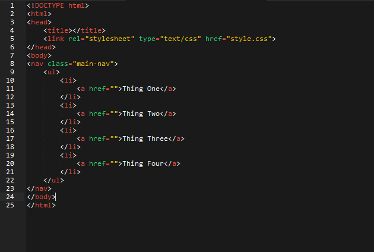
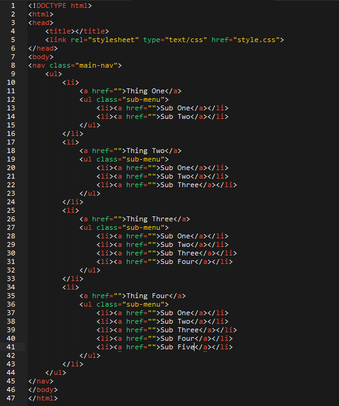
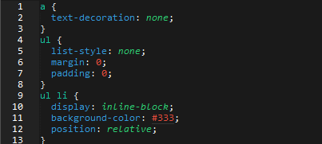
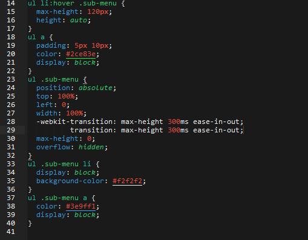

What's one thing virtually every website has? If you said navigation (you did) you're absolutely right! Go ahead and enjoy that wonderful feeling of being right for a moment... and now that we're feeling like a champ, let's get to it.

Navigation buttons, depending on your site of course, are likely going to be some of the most commonly used items on your web site. Typically they're found near the top so people can quickly and easily... well navigate of course! With this in mind it's worth it to make sure your navigation is both visually appealing and provides an enjoyable user experience.

A common featured for navigation menus is the drop down functionality for displaying sub options. This can be achieved through Javascript if you really feel like it (you don't), but why bother with that when CSS3 offers a much more elegant solution!

First we start out building a simple un-ordered list, and give it some list items each of which contain a link that point nowhere in particular.  

By the way, if you're on Sublime Text there's a great shortcut for making lists: ul>li+li+li+li and then "Tab" creates an un-ordered list with 4 list item tags inside of it. For more excellent Sublime tips check out my amigo Lucius' [blog post](/beginners-guide-for-sublime-text/) on the topic.

Now that we've got the bare bones, let's give this skeleton a spine. We're now going to put another ul inside of those list items, and once again more list items inside of those lists which contain, you guessed it, links to nowhere.  

That's all the HTML we have to write for this example, so now we move on to the CSS.

The first few things on the ul's and links are just to remove some default styles that I don't care for.

The first actually relevant style is the inline-block display property on the list items to make them spread out horizontally. If you're unfamiliar with using inline-block for positioning I highly recommend reading up on it because it's an awesome alternative to floats or sometimes even flex-box. Next up we give these list items a relative position, so that the later absolutely positioned sub menu will use this as a reference point.

To quote every MTV cribs star ever, here's where the magic happens. We put a max-height (that is at least as tall as all of the list items on the sub menu) and a height of auto on the sub menu. Note the ul li:hover, meaning these styles only apply when the first level of list items are hovered over. This might seem weird now, but it'll hopefully make sense with the styles we make use of in a bit.  

Next up we just give the links some padding, which is highly preferable to giving the list item padding because then you can end up with a small hitbox for the actual link and a bunch of dead space around it. Only other thing to note here is the display block on the link which is required for the absolute positioning used later.

The .sub-menu styles are pretty basic, just give it a position of absolute and then top: 100%, left: 0 and width: 100% to make it sit flush below the first level of list items. Finally throw on a transition to really allow the animation to shine, and fine tune the timing if you'd like.

Still on the .sub-menu we give it a max-height of 0 and overflow: hidden. What this does is it hides the element from our view, similar to display:none or visibility:hidden... but for our animation we have to do it this way!

Lastly we give the sub menu list items and links a display of block and some colors because pretty.

That's it, you've now got a simple dropdown navigation with a neat little animation! You can add a height of 0 to the ul .sub-menu as well for a slightly different effect, or play around with the transition time and effect. Much to the same effect, increasing the value of the max-height on the sub menu hover will have an effect on the time it takes the dropdowns to make it to the end.

[Check it out on Codepen.](https://codepen.io/anon/pen/bVKEwK)
