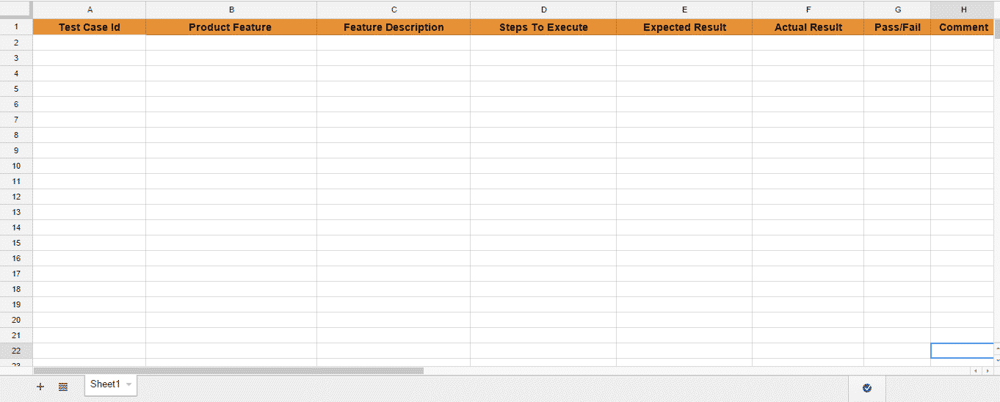
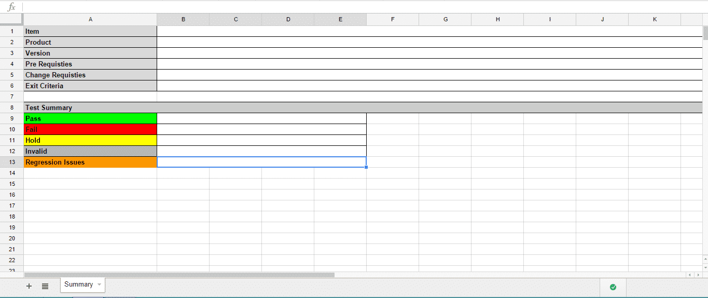
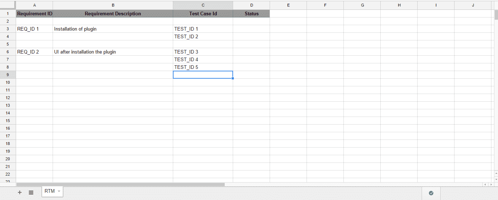

Hi guys! When you write test cases, do you face the problem of sharing your test cases with your team members or having to use multiple colors for test cases?  
I have a solution for these problems that is to maintain your test cases in an excel sheet.

**Definition**  
Test cases are the part of testing by which a product can be tested properly according to a set of requirements.

**Advantages of using test cases in excel sheets**

1. Easily handle the test cases in the sheet.
2. Easily attach links.
3. Easily share sheets with team members.
4. Easily use multiple colors in a sheet.

**Standard format of Test Cases**  
Some common fields that are used in test case writing are:  

1. 1. **Test Case Id:** This field is defined by what type of system we are testing. Below are the standard rules:
        - If we are making a test case for any application which doesn’t belong to any specific module then ID would start as TEST\_ID 1.
        - If we are making test cases for any specific module then ID would be used as MOD\_ID 1.
        - If test case has more than one expected result then we can use test cases as TEST\_ID 1.1,TEST\_ID 1.2 etc. All these test cases are a sub-part of TEST\_ID 1.

In this way we can maintain all the test case IDs and if in the future we can get any requirement or change logs then easily add or change the test case using the following  standard rules without changing the test case IDs of previously written test cases.

**Note:** Test Case Id always uses capital letters.

1. **Feature Of Product:** This field defines the feature of a product for the type of product we are using.The main advantage of maintaining this field is, in the future if any requirements change then we can easily calculate how many test cases are affected by this and we will change or remove the test cases.**
2. **Feature Description:** This field explains what type of feature we will test on which condition.**
3. **Steps To Execute:** These are the steps to be executed on the system being tested to get the expected results. Steps should be understandable and correct. They are written and executed according to a sequence.**
4. **Expected Result:** These are the wanted outputs from the execution steps performed. Results should be clearly defined for every step. It specifies what are the specifications and what we will get from a particular specification.
5. **Actual Result:** This field has the real result after the performed execution steps on the system under testing. If the result matches with the expected result then we can write as expected.
6. **Pass/Fail:** If the result is showing according to the expected result, mark as pass and if not get the output according to the expected, result mark as fail. You are using color for status. Use the green color for Pass and red color for Fail.
7. **Comment:** This column is for additional information for e.g. if status is set to “cannot be tested”,  then tester can give the reason in this column.**

Here I have explained a very general format, this will cover almost all the scenarios but we can not assure that all the requirements have been covered, you can proceed the following way to cover all requirements.

**Knowing that all the Requirements have been covered**  
To know that all the requirements have been covered, you need to maintain a Traceability Matrix documentation. Let's take a look on how to create this document.

Traceability Matrix is a document which provides linking between the requirements and the product which we have developed.  
Traceability Matrix can be divided into 2 parts:-

- Summary
- Traceability Matrix

1. **Summary** :- 
    This section contains a summary of requirements like

 1.1 **Item**: This field contains short descriptions of the items which will be tested.  
 1.2 **Product Name**: It contains the product name which you want to test.  
 1.3 **Product Version**: It contains the product version which you want to test.  
 1.4 **Prerequisites**: Prerequisites are the requirement of a system which are  
 needed before we start testing. Prerequisites could be:

- A certain page that a user needs to be on
- A certain data that should be in the system
- A certain action to be performed before execution steps are performed.  
      
    Prerequisites should be satisfied before the test case execution starts.

 1.5 **Change Prerequisites**: Changes that were not necessary before but now are necessary for the system.  
 1.6 **Exit Criteria**: This field contains the requirements that must be fulfilled  
 in order to announce the completion of testing.  
 1.7 **Test Summary**: This field contains the status of the product: how many test  
 cases are passed, how many are failed, how many are on hold or how many   are  Invalid etc.  

2. **Traceability Matrix** :  
      
    Traceability Matrix covers all the product requirements.We can say that it is a document which maps and traces requirements with test cases. Prime fields of this traceability matrix are

 2.1 **Requirement Id**: This field identifies all the testable requirements.  
 2.2 **Requirement Description**:  This field contains the short  
 description of requirements.  
 2.3 **Test Case Id**: According to requirements description which test case id is  
 covered.  
 2.4 **Status**: Mention here the status of test cases such as passed, failed, on hold or  
 invalid.

As per the image below:  

  
Requirement ID REQ\_ID 1 covered in Test Case Id TEST\_ID 1 and TEST\_ID 2  
Requirement ID REQ\_ID 2 covered in Test Case Id TEST\_ID 3 ,TEST\_ID 4, TEST\_ID 5

**Advantages of using Traceability Matrix**

1. Easily identify missing functionality.
2. Easily cover all customer requirements.
3. Make sure that all requirements are covered by developers in test cases
4. If any change request is made we can easily change in test cases.

So we can say that test cases are easily handled in excel sheets. We can use multiple colors in excel sheets for test cases, easily attach links with test cases and easily trace test cases.
