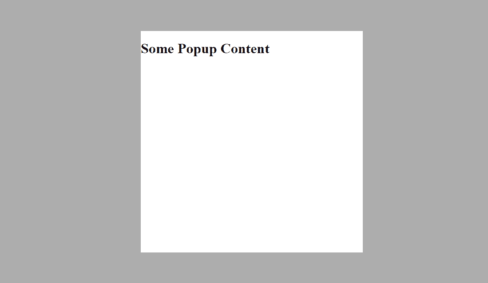

Creating a popup is a very simple addition to any webpage. In this tutorial, I will show you how to create a popup using basic Html, javascript and CSS. The first thing we want to think about is what we want to do to trigger a popup. You can trigger an event on almost anything such as a button, link or keypress. In this tutorial, we will be clicking on a button to trigger a popup.

**What you will need:**

- Text Editor such as notepad++ or Sublime Text Editor – Choose a text editor you prefer to write code in
- Basic knowledge of HTML, JavaScript, CSS

**Let’s start building the popup**

```Html
<html>
<head>
  <title>A Simple Popup</title>
</head>
<body>
<div id="maincontent">
    <h1>Page Content<h2>
</div>
<div id="overlay"></div>
<div id="popup">
    <div class="popupcontent">
        <h1>Some Popup Content</h1>
    </div>
</div>
</body>
</html>
```

We’ve created a div with id overlay to cover all the page content when the popup is displayed. This forces the user to close the popup before returning to the page content and also creates a nice user experience. The div with id popup will be our popup containing controls at the top to close the popup and our content area. Currently, this popup has no content and no styling so nothing will show. Let's add some styling next.

```Html
<html>
<head>
  <title>A Simple Popup</title>
  <style>
    #overlay {
        position: absolute;
        top: 0;
        bottom: 0;
        background: #999;
        width: 100%;
        height: 100%;
        opacity: 0.8;
        z-index: 100;
    }

    #popup {
        position: absolute;
        top: 50%;
        left: 50%;
        background: #fff;
        width: 500px;
        height: 500px;
        margin-left: -250px; /*Half the value of width to center div*/
        margin-top: -250px; /*Half the value of height to center div*/
        z-index: 200;
    }
  </style>
</head>
<body>
<div id="maincontent">
    <h1>Page Content<h2>
</div>
<div id="overlay"></div>
<div id="popup">
    <div class="popupcontent">
        <h1>Some Popup Content</h1>
    </div>
</div>
</body>
</html>
```

We’ve now added some CSS for the overlay and the popup. At this point, we can see a white box above our grey overlay. We’ve added an h1 tag inside our popup a page title and some main page content. We should now see something like this:



Next let's add a control to close this popup. We’ll add a span containing an X that we can click on to close this popup and JavaScript to handle this event.

```Html
<html>
<head>
  <title>A Simple Popup</title>
  <style>
    #overlay {
        position: absolute;
        top: 0;
        bottom: 0;
        background: #999;
        width: 100%;
        height: 100%;
        opacity: 0.8;
        z-index: 100;
    }

    #popup {
        position: absolute;
        top: 50%;
        left: 50%;
        background: #fff;
        width: 500px;
        height: 500px;
        margin-left: -250px; /*Half the value of width to center div*/
        margin-top: -250px; /*Half the value of height to center div*/
        z-index: 200;
    }

    #popupclose {
        float: right;
        padding: 10px;
        cursor: pointer;
    }
  </style>
</head>
<body>
<div id="maincontent">
    <h1>Page Content<h2>
</div>
<div id="overlay"></div>
<div id="popup">
    <div class="popupcontrols">
        <span id="popupclose">X</span>
    </div>
    <div class="popupcontent">
        <h1>Some Popup Content</h1>
    </div>
</div>
<script type="text/javascript">
    // Initialize Variables
    var closePopup = document.getElementById("popupclose");
    var overlay = document.getElementById("overlay");
    var popup = document.getElementById("popup");
 
    // Close Popup Event
    closePopup.onclick = function() {
        overlay.style.display = 'none';
        popup.style.display = 'none';
    };
</script>
</body>
</html>
```

Now we can close this popup…. Ah, that’s nice. Here we’ve added our X to click on, some CSS to style this close area. Also, we’ve added the javascript to handle the click event to hide the popup. Save your file as index.html and open it in your browser to test closing the popup. You’ll notice that the popup is displayed when we first open the page. Let's hide this with CSS on load so that we have to do something to open it.

```css
#overlay {
    display: none;
    ...
}
 
#popup {
    display: none;
    ...
}
```

After adding display: none; to our overlay and popup, you’ll notice that when you load the page in your browser we cannot see them. To show this popup we’ll have to do something, so let’s make a button to click on and some JavaScript to handle this event.

```Html
<html>
<head>
  <title>A Simple Popup</title>
  <style>
	#overlay {
		display: none;
		position: absolute;
		top: 0;
		bottom: 0;
		background: #999;
		width: 100%;
		height: 100%;
		opacity: 0.8;
		z-index: 100;
	}

	#popup {
		display: none;
		position: absolute;
		top: 50%;
		left: 50%;
		background: #fff;
		width: 500px;
		height: 500px;
		margin-left: -250px; /*Half the value of width to center div*/
		margin-top: -250px; /*Half the value of height to center div*/
		z-index: 200;
	}

	#popupclose {
		float: right;
		padding: 10px;
		cursor: pointer;
	}

	.popupcontent {
		padding: 10px;
	}

	#button {
		cursor: pointer;
	}
  </style>
</head>
<body>
<div id="maincontent">
    <h1>Page Content<h2>
    <button id="button">Show Popup</button>
</div>
<div id="overlay"></div>
<div id="popup">
    <div class="popupcontrols">
        <span id="popupclose">X</span>
    </div>
    <div class="popupcontent">
        <h1>Some Popup Content</h1>
    </div>
</div>
<script type="text/javascript">
	// Initialize Variables
	var closePopup = document.getElementById("popupclose");
	var overlay = document.getElementById("overlay");
	var popup = document.getElementById("popup");
	var button = document.getElementById("button");
	// Close Popup Event
	closePopup.onclick = function() {
	  overlay.style.display = 'none';
	  popup.style.display = 'none';
	};
	// Show Overlay and Popup
	button.onclick = function() {
	  overlay.style.display = 'block';
	  popup.style.display = 'block';
	}
</script>
</body>
</html>
```

We’ve added a button in our main content area. To show the popup we’ve added a JavaScript function to change the overlay and our popup to `display:block;` on event `onclick`. After making these changes click on your button to open your popup.

Demo:

See the Pen [OPmQMP](https://codepen.io/zoie-loginradius/pen/OPmQMP/) by Zoie Carnegie ([@zoie-loginradius](https://codepen.io/zoie-loginradius)) on [CodePen](http://codepen.io).

Please post your questions or feedback in the comment area.
