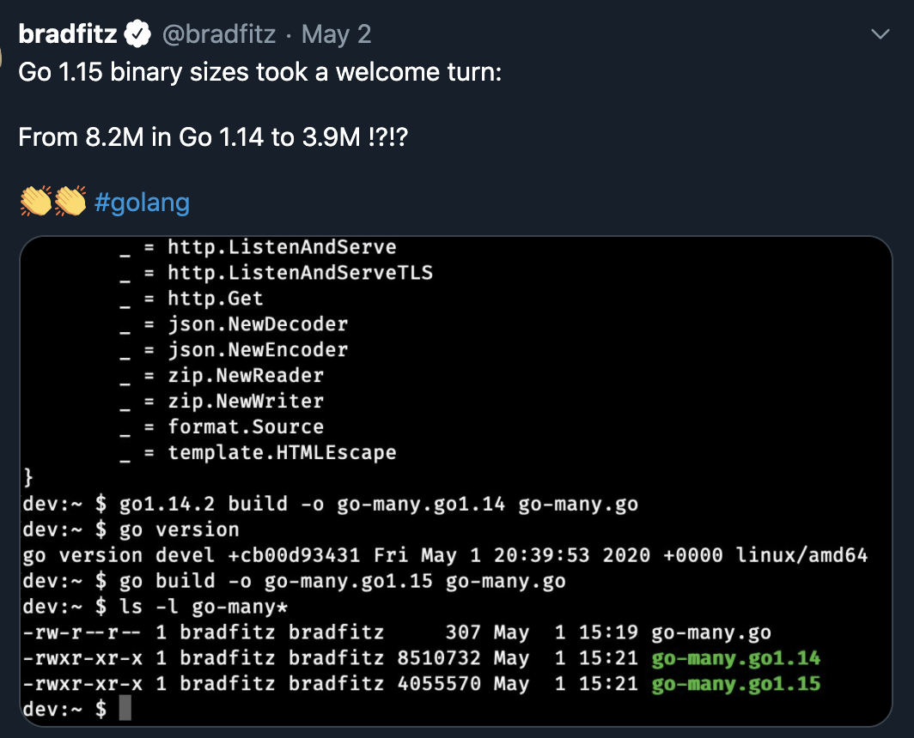
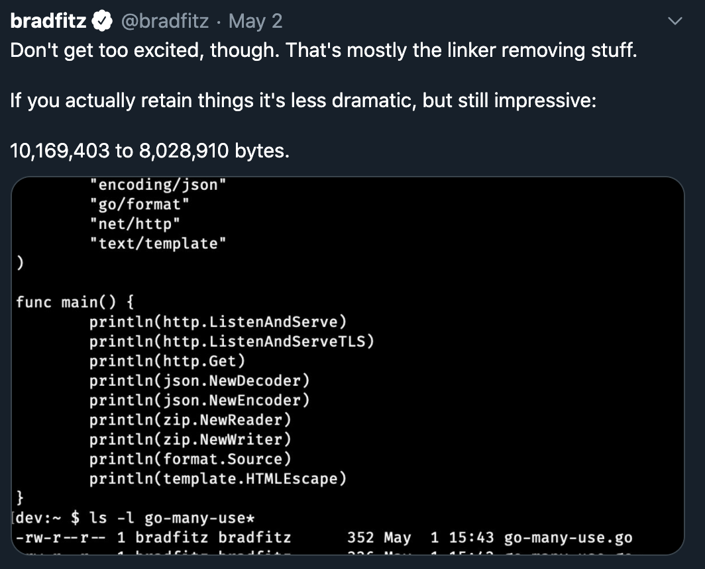

Go announced [Go 1.15](https://blog.golang.org/) version on 11 Aug 2020. Highlighted updates and features include Substantial improvements to the Go linker, Improved allocation for small objects at high core counts, X.509 CommonName deprecation, GOPROXY supports skipping proxies that return errors, New embedded tzdata package, Several Core Library improvements and more. 

As [Go promise](https://golang.org/doc/go1compat) for maintaining backward compatibility. After upgrading to the latest Go 1.15 version, almost all existing Golang applications or programs continue to compile and run as older Golang version.

Download the latest Go Version from [Here] (https://golang.org/dl/).

### Operating system and platform compatibility

#### macOS
Go 1.14 version announced some changes for the macOS. According to announcement  

> Go 1.14 is the last release that will run on macOS 10.11 El Capitan. Go 1.15 will require macOS 10.12 Sierra or later.

The lastest macOS 10.15 (Catalina) is no longer supporting 32-bit binaries. Go 1.14 will likely to be the last Go release to support 32-bit binaries on iOS, iPadOS, watchOS, and tvOS (the darwin/arm port). Go continues to support the 64-bit darwin/amd64 port.

#### Windows

Go now generates Windows ASLR executables when -buildmode=pie cmd/link flag is provided. Go command uses `-buildmode=pie` by default on Windows.

The -race and -msan flags now always enable `-d=checkptr`, which checks uses of unsafe. Pointer. This was previously the case on all OSes except Windows.

#### Android

Mobile applications were crashing in some devices due to some invalid lld linker versions so now avoiding the crashing the latest Go 1.15 version explicitly selects the lld linker available in recent versions of the NDK. This explicitly lld linker avoids crashes on some devices. it becomes the default NDK linker in a future NDK version.

### Smaller binaries & Performance improvements 
Always new Go 1.15 brings many minor/major performance improvements. The first major improvement has reduced the executable's binary size by almost 5% - 10% as compared to Go 1.14. As Brad Fitzpatrick [tweet](https://twitter.com/bradfitz/status/1256348714198654976?lang=en), test program down from 8.2MB in Go 1.14 to 3.9MB in 1.15. 

Go 1.15 has improved the code build process now unused code is eliminating in the new linker, along with several targeted improvements, such as Clements's CL 230544, which reduces the number of stack and register maps included in the executable.  

### Standard library additions
Always in every new version release Go come with various minor changes and updates to the library. I m including some useful and important changes  

#### tzdata Package
A new embedded tzdata package was added that permits embedding the timezone database into a program. Importing this package (as import _ "time/tzdata") which allows the program to find timezone information without the timezone database on the local system. We can also embed the timezone database by building with -tags timet/zdata. This approach increases the size of the program by about 800 KB. This might be useful and can test some code with the virtualized environments like [Go playground](https://play.golang.org/).

#### X.509 CommonName deprecation
Go older versions were using CommonName field on X.509 certificates as a hostname if there is no Subject
Alternative Names, would be disabled by default. If Still want to use this legacy behavior then we need to add x509ignoreCN=0 in the GODEBUG environment variable.

#### net/url Package
The `net/url` package adds a new URL. The redacted () method that returns the URL as a string. This is proposed in the [Issue 34855](https://github.com/golang/go/issues/34855). It is a very useful improvement for audit logging and security. It's a simple derivation from the URL.String() that masks the password if exists from the string being passed. It does not modify at all to the URL itself but a copy of it.

### Summary
Go 1.15 has released with various improvements, bug fixes. We can get all improvements, closed proposals and features details for the Go GitHub repository.

### Referance 
- [Go Blog](https://blog.golang.org/)
- [Go 1.15](https://golang.org/doc/go1.15)