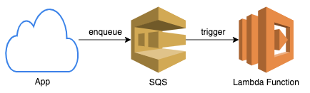
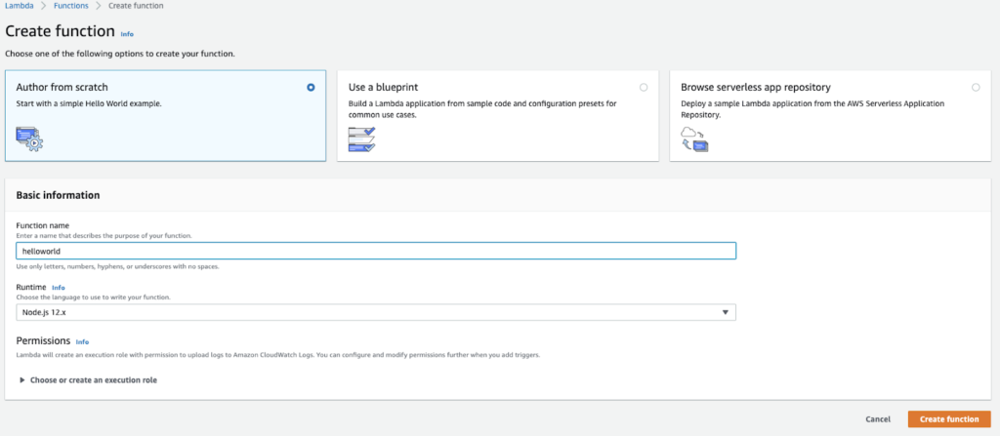
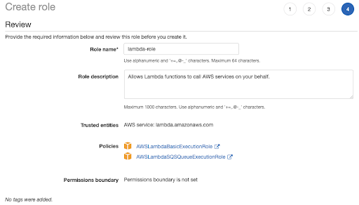
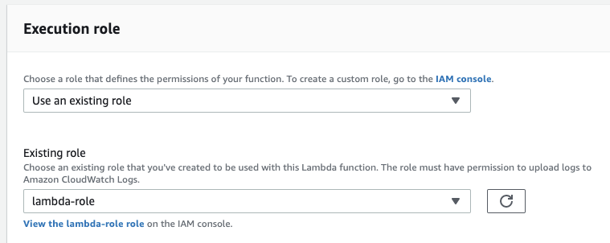
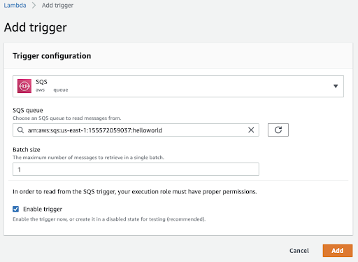
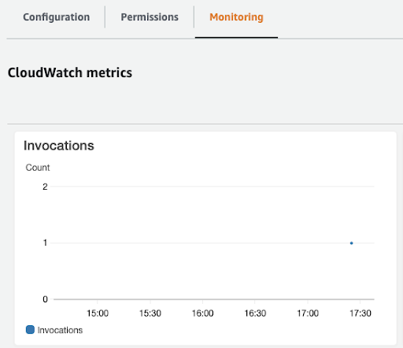

This blog is a short guide on implementing AWS Lambda and SQS together. First we’ll introduce these technologies and explain why they work well together, then walkthrough some configurations and invocation using a simple Nodejs script.


**What are they?**
AWS Lambda is a popular choice in serverless computing. As an event-driven platform, AWS Lambda requires users to configure event sources in order to run a function. Their built-in support for many AWS services like S3 and SQS as event sources allow for relatively simple configuration. Note that Lambda functions can also be triggered via HTTP(S) by using AWS API Gateway service.

AWS SQS (Simple Queue Service) is a queue service with 2 types: standard and FIFO. The major difference is that standard queues guarantee “at-least once” delivery of its messages, while FIFO queues guarantee “exactly-once” delivery. FIFO queues, however, provide lower maximum throughput than standard.

As previously mentioned, AWS SQS can be an event source for AWS Lambda. This means that when a message is added to the queue, the configured Lambda function will be invoked with an event containing this message.



**But why use them together?**  
Common reasons include better handling Lambda function invocations and errors. For function invocations, the default concurrency limit is 1000. If a function has reached this limit, any additional invocations will fail with a throttling error. However, with SQS as an event source, events resulting in throttling errors are automatically retried based on set configs. This prevents the loss of events due to unexpected jumps in usage. Additionally, dead-letter queues (DLQ) can be configured as a place where failed events go, to avoid retrying indefinitely. Failed events in DLQ can then be sent somewhere like a DB for analysis.

One limitation for many use cases was the “at-least once” delivery model of events with standard queues. Essentially, there was no guarantee that an event will only be delivered once to a consuming Lambda function. In cases where each event can strictly only be processed once, one would have to employ various strategies resulting in higher overhead and complexity. But, this is no longer an issue because recently the AWS team added support for FIFO queues as event sources to Lambda functions.

**Walkthrough**  
Let’s set up a basic “Hello World” application with SQS and Lambda.

1\. Starting with SQS, add a standard queue.

2\. Now, add a Lambda function:



3\. Create a new execution role with the following configs:  
a. Trusted Entity: Lambda  
b. Permissions: AWSLambdaBasicExecutionRole; AWSLambdaSQSQueueExecutionRole



4\. Use newly created role in Lambda function. Remember to save (top right).



5\. Add a trigger:  
a. Batch size set to 1, so the Lambda Function will process 1 message at a time.



6\. Programmatically enqueue a message into SQS with the following code in Nodejs:

```javascript
const AWS = require("aws-sdk");
AWS.config.update({
  region: <AWS_SQS_REGION>, // TODO
  accessKeyId: <AWS_ACCESS_KEY_ID>, // TODO
  secretAccessKey: <AWS_SECRET_ACCESS_KEY> // TODO
});

const sqs = new AWS.SQS({ apiVersion: "2012-11-05" });
sqs.sendMessage({
  MessageBody: JSON.stringify({hello: "world"}),
  QueueUrl: <AWS_SQS_URL> // TODO
}, (err, data) => (err) ? console.log("Error", err) : console.log("Success", data.MessageId));
```

a. Create package.json with \`npm init\`  
b. Install aws sdk dependency with \`npm i aws-sdk --save\`  
c. Fill in your specific AWS account details. Find AWS\_SQS\_URL by selecting the queue you created, while AWS\_ACCESS\_KEY\_ID and AWS\_SECRET\_ACCESS\_KEY require creating a new IAM user with programmatic access. This user also needs permission to push messages into SQS.  
d. Run script with \`node app.js\`  
e. Navigate to Monitoring tab in your Lambda function, the invocations graph should have a new data point (may take a few minutes to update).


