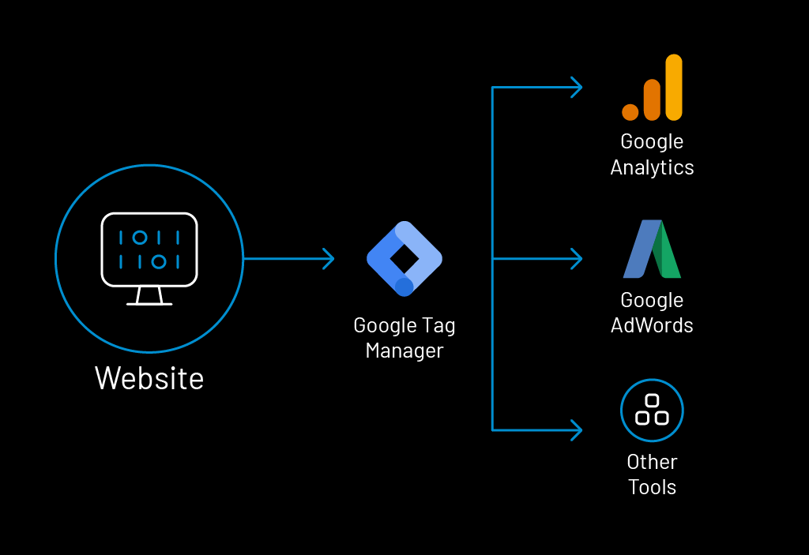

---
title: "Benefits of Google Tag Manager — Easy To Use And Easy To Launch"
date: "2021-05-11"
coverImage: "Google-Tag-Manager.jpg"
category: ["loginradius"]
featured: false 
author: "Rashmi Mathur"
description: "Google Tag Manager provides a simple, cost-effective solution for managing all of your tags and code snippets. It is even free for small teams. With powerful yet easy-to-learn tools, Google Tag Manager lets you track data across all of your digital channels."
metadescription: "Tag Manager allows you to create and update your own tags for conversion tracking, site analytics, and more. Discover the working and benefits of Google Tag Manager."
metatitle: "Benefits of Google Tag Manager-How Does it Work?"
---

Running a business relies heavily on visibility and analytics. With the use of Google Tag Manager, your marketing team can ensure that both these needs are met.

  

Google Tag Manager is yet another tool that online shopping websites use to reach large audiences. The online lodging company Airbnb states that the use of Tag Manager has [improved the data collection](https://marketingplatform.google.com/about/tag-manager/) of vendors by 90%.

  

To understand why your business should use a **[Google Tag Manager](https://www.loginradius.com/integrations/google-tag-manager/)**, you must first understand what is a tag.

## What is a Tag

A tag is a piece of code available on a website. The code is usually present in Javascript but can also be in the form of a pixel or a transparent image. It functions as a medium through which data about a certain product can be gathered. This data can also relate to a visitor’s onsite behavior.

  

Tags are also a connecting link between third-party analytical tools like [**Google Analytics**](https://www.loginradius.com/integrations/google-analytics/) and marketing tools like Campaign Manager and Google Ads. Facebook Pixel is another analytical tool that tracks the conversion rate of advertisements or visitor engagement with the help of tags.

## How does Google Tag Manager Work

A tag manager essentially acts as a platform where marketers can manage several tags present on their website. There is no need for a developer to edit the code that is used to create tags.

  

The best part is, only minimum technical knowledge is required to use the Tag Manager. The working of the Google Tag Manager relies heavily on a data layer  that  relays information from the website to the Tag Manager.

  

  
This information from the GTM data layer can then be used to deploy or fire desired tags. For example, the Google data layer will integrate the information in the tag to Google Analytics.

Therefore, Google Analytics can now analyze the information to determine the conversion rate of the Google Analytics tag.

To learn how to create a Tag, visit the official instructional page [here](https://developers.google.com/tag-manager/quickstart).

## Advantages of Google Tag Manager

### 1. Creation of tags

The tool helps create unique tags relevant to your business or product. Therefore, it is capable of tracking a variety of aspects like conversion ratio, clicks on the internal and external linking and many other analytical features.

### 2. Easy integration

The tool can integrate with other Google analytical tools as well as tools from third-party companies. This option can allow you to have the best of both worlds as they run their online **[B2B Marketing Strategies Post COVID](https://www.loginradius.com/blog/fuel/2021/03/How-to-Make-Businesses-Marketing-Plans-After-Coronavirus/)**.

### 3. Faster loading time

The GTM (Google Tag Manager) tool gives the option to add a long list of tags. The tool then adds the tags while ensuring that the loading time of the web pages stays intact and does not slow down.

### 4. Display of fired tags

Another interesting feature and significant advantage is the ability to view which tags have been fired on the platform. A simple visit to the tags section of the GTM dashboard will display the tags that functioned due to the click of a link or a file download.

### 5. Single region

All the tags added to the webpage will be listed on the GTM dashboard. Therefore, it is easy to track how many tags and the types of tags are present on the page.

### 6. Debugging and error checking

The platform also possesses the provision to check certain errors in the code or particular bugs that may be slowing down the web page.

  

These are some of Google Tag Manager advantages that make GTM a compelling one.

## What Are Some of the Setbacks of Google Tag Manager

Even though the GTM platform can be fairly easy to use, it does require a significant learning curve. The biggest hurdle that first-time users face is that they will have to learn the various features of Google Tag Manager from scratch. This includes learning basic programming and a long list of terms.

  

There can be some problems with the various components that are involved in the use of tags and managing them. They may not fire at the required time and would, therefore, require some tweaking.

## Conclusion

You can utilize Google Tag Assistant  to attain better functionality of GTM. This is a free Chrome extension that can be downloaded [here](https://get.google.com/tagassistant/). Now, get a user-friendly website that suits the needs and wants of your consumers with all the required analytics.

