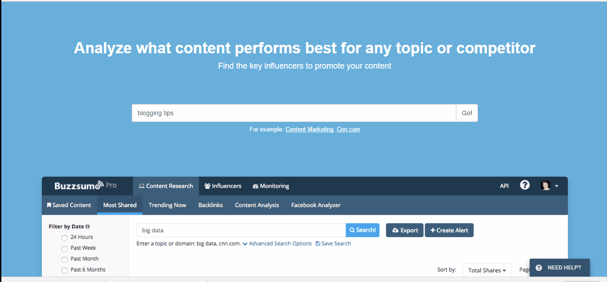
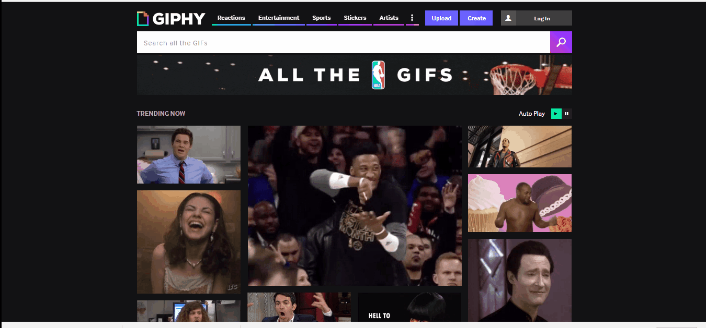

Every writer, amateur or professional, needs to pick up new ways to expand their writing techniques and create elite contents. Well, there are many ingredients which you will need to serve the best content to your cult and this demands some _extra_ help. So, if you are looking for some best writing tools which can improve your blog posts, then lucky you. Here is a list of some essential online writing tools for you which can help you to improve your articles.

Word processors can only help you to generate words on the page but generating a valuable content is a complex job yet it can be much simpler if you have got the right tools to help you. Whether you are a first timer in using writing software for a content generation or a pro trying the best writers’ instruments in the market, the article is worth your attention. But before moving ahead, we need to discuss what sort of help does a writer needs from his software.

### **What should you check in software for writers?**

Your tools do not need to invent the wheel. They just require refining your content. So, don’t go frenzy over an extensive list of technical specifications and features. You should always choose a software which suits your style of writing. Because those features will seldom matter if you do not use them.

Here, I have classified the necessary attributes of the software in three categories:-

**Readily Usable**

Any user loves an easy to use software. Even though every writing software is specialized for creative writing, writers will feel much relaxed if their software which is easy to use.

**Advanced Features to edit your work**

Editing is a very necessary process of content generation, and there is a huge difference between ‘being grammatically incorrect’ and your articles being ready to be published. Word processors can correct you when you are grammatically incorrect, but only a writing software can tell you about the use of recurring phrases, over-description, and passive verbs.

When it comes to creative writing, you need to have a keener outlook at your articles, or you may lose your readers.

**Some Additional Features**

Choosing extra features depends on your writing style as each and every feature will not apply to you. Features may include a word thesaurus, a twist generator or a character creator. Again, don’t be confused over features. Be aware of your requirements and then choose the product.

Now, here are some tools according to various categories every writer should use:-

### **Title generator tools**

#### **1\. Hubspot’s blog topic generator**

This blog title generator from Hubspot is very efficient. You just need to provide it with three keywords (even one keyword can work). The tool helps you to find topics you can write upon. Hence, if you are struggling for ideas, [Hubspot’s blog topic generator](https://www.hubspot.com/blog-topic-generator#/Tools%20for%20Writers) is the right tool for you.

#### **2\. TweakYourBiz Title Generator**

Just like the above line from the text box says “just enter your topic and go” using this tool is insanely easy. The title generator also breaks your given ideas into various categories such as ‘problems,' ‘motivation’ and ‘how to.' So, [Tweak Your Biz Title Generator](http://tweakyourbiz.com/tools/title-generator/index.php) is worth a try.

#### **3\. Portent’s Content Idea Generator**

This great tool on my favorite list is very easy to use. You just need to enter your idea and [Portent’s Content Idea Generator](https://www.portent.com/tools/title-maker) will provide you with a great title for your post. And if you don’t like the title, refresh your subject, and it will give you a different title instantly.

### **Topic researcher tools**

#### **1\. Google keyword planner**

Google keyword planner is a chunk from the Google AdWords program. The tool is completely free and is used to figure out and discuss keywords and develop a pay per click strategy. Type a keyword in the search bar, check the competition for your keywords and other related keyword phrases. Moreover, you can find out things like:-

- Analyze ideas about keywords which are related to your product category, landing page or specific phrases. Entering a seed keyword, selecting a product category or entering URL of a landing page will populate a list of keywords. It will also give you a look at trend data and search volume.
- Estimate the average search volume per month for a particular period. You just need to enter existing keywords. It will help to load new search volume related to keywords.
- You can also multiply your list of keywords through keyword multiplier. It populates all possible keyword combinations from different keyword phrases.
- Forecasting tools available in the planner will help you get forecast about clicks. Hence, you can use it for predicting future searches for keywords.

[Google keyword planner](https://adwords.google.com/KeywordPlanner) helps you to amplify your content strategy.

#### **2\. Buzzsumo**

The tool although starts with a $99 pro plan per month, you can quickly catch content industry-wise using broad keywords. Filters like guest posts, videos, and infographics are available in the tool.

### **Image editor tools**

#### ****1\. Canva****

It is my most favorite tool for graphics generation. This easy to use tool helps you to create engaging graphics that can get shared easily. Moreover, [Canva](https://www.canva.com/) has a massive database of content types which keeps on growing continually. Sign in for free, pick your favorite layouts for multiple social profiles and craft your masterpiece. The drag-drop feature in canva with an extensive list of professional designs (mostly free or cost you just an ace) will provide you outstanding graphics.

#### **2\. Infogr.am**

If you want to present your technical content in a fun way, use [Infogr.am](https://infogr.am/app/#/library). Infographics are a great way to attract more readers to your posts. So, sign in and get your data loaded in your favorite theme. Well, you may not be able to customize much with the tool like Canva, and you don’t get a blank option in Infogr.am but it may be a lifesaver tool when you want to create a detailed infographic.

#### **3\. Giphy**

One of the most sought GIF maker Giphy is here to make insanely rocking GIFs. This tool will help you to create a happier GIF making experience. You can make and share GIFs easily and simultaneously in Giphy. Get a video from Vine, Vimeo or Youtube and select your portion from the video which you want to make it into a GIF. The option for adding captions is also available in [Giphy](http://giphy.com/).

You can also turn a group of images into a GIF or edit an existing GIF on a website. In a nutshell, if you are a GIF fan (we all love GIFs), you will love this tool.

### **Readability test tools**

Readability score of your article helps you to know how well your readers understand your post. Because senseless information is not a useful, here are two of my favorite readability checkers to check your readability score.

#### ****1. [The Readability Test Tool](http://www.webpagefx.com/tools/read-able/)****

#### 

You can use this online readability tool to check your article’s readability score. You can insert your piece of writing through an URL, text or you can add a link to the source material. However, there is also another form to introduce your articles which are a browser bookmarklet form. The readability indicators are Automated Readability Index, Coleman Liau Index, Gunning Fog Score, Flesch-Kincaid Grade Level, and Flesch-Kincaid Reading Ease.

#### **2. [Readable.io](https://readable.io/)**

This user-friendly tool expertly examines your article for a perfect readability score. You can import your piece of writing through text or URL. Other amazing features of the tool include integration with your Slack app or Dropbox. It also has featured such a readability alerts or keyword density alerts (premium users only). These features can be helpful when you need to get alerts related to less search engine friendliness of your website or high readability scores for your site content.

Readable.io is a free tool when you use it occasionally. To move to advanced features, you can select any of these plans.

Plans are available for individual and business purpose. Features like Readable.io’s API is only for business plans.

### **Other useful tools**

#### **1\. Grammarly**

Grammarly is an effective tool which can improve your language skills. It can find typo errors and grammatically incorrect sentences. Just enter your text in the [Grammarly](https://www.grammarly.com/) web app and the Grammarly editor will proofread your blog post.

Grammarly is free but there is a premium version available for this app. It is available in three plans- monthly, quarterly and annually.

#### **2. [Copyscape- The Free Plagiarism Checker](http://www.copyscape.com/)**

Plagiarism checker is an essential tool for writers and no other name could come to my mind other than Copyscape. Copyscape is free and can be used to check whether your content has any duplicates. Enter the URL of your post and get results about your article.

### **Some apps for writers (mobile and desktop)**

So, if you are more convenient using apps than browsers, here are some goodies for more productive writing.

#### **1\. Hemingway App**

Hemingway App work wonders when it comes to rectifying your content. It increases clarity in your writing. Thought, it was introduced as a web app, later it evolved as one of the best desktop apps for writers. The app edits your content, comes with distraction free mode feature, exports PDFs and does much more. If you want to buy the latest version which is Hemingway 3.0, it will come with a price tag of $19.99. Well, the web app continues to be free.

#### **2\. Evernote**

Evernote can be your best friend when you like to store media, information or ideas. Devices can easily integrate with the content stored in Evernote which make materials more accessible. You can share your content on LinkedIn, Facebook, Twitter or just your content’s URL to clipboard.

#### **3\. Tomighty Pomodoro timer**

It is my personal favorite Pomodoro timer. It is a small desktop app which can help you stay productive during your working hours. The free app uses Pomodoro technique to keep you focused throughout the day while allowing you to relax properly at regular intervals.

As you have gained some information about tools, now it’s your turn to convert this search into an exercise with these tools. Use some of them you find exciting or move on with others. From searching engaging topics to generating and sharing high-value contents, these instruments can help you secretly build your article. Do you think these tools can mold your story? Which is your personal favorite from the league? Please add up your comments and suggestions below.
