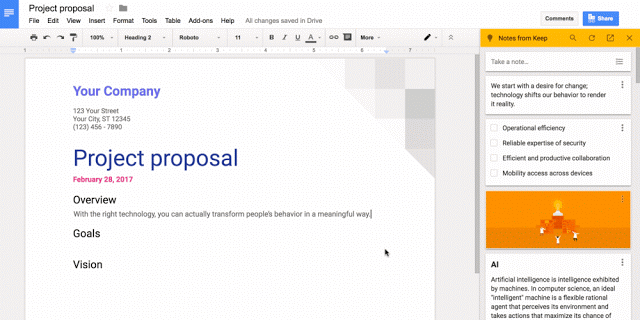
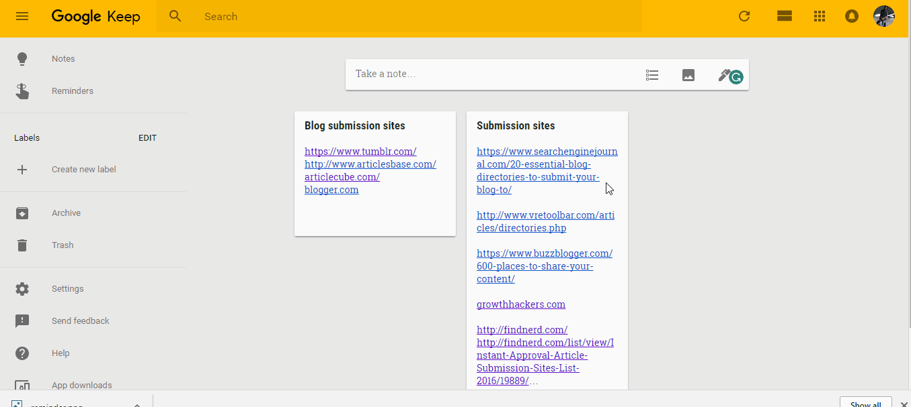
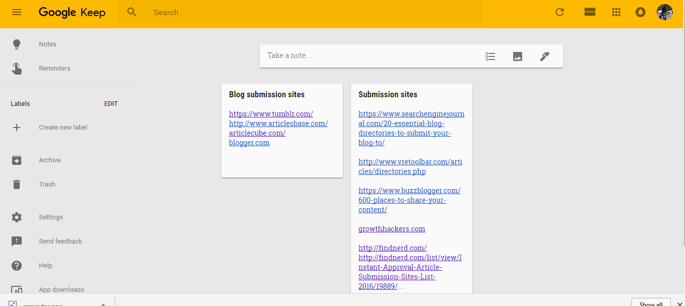
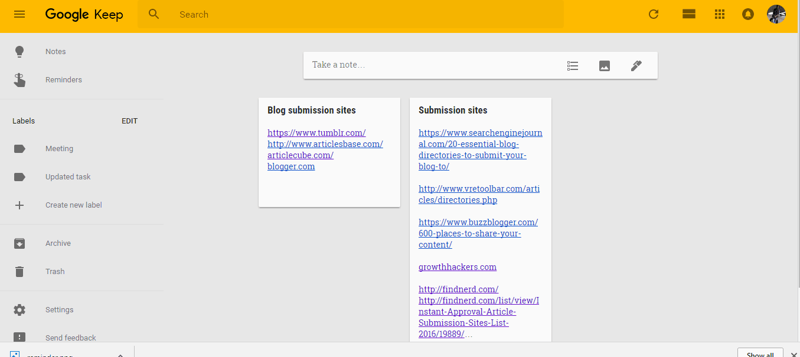
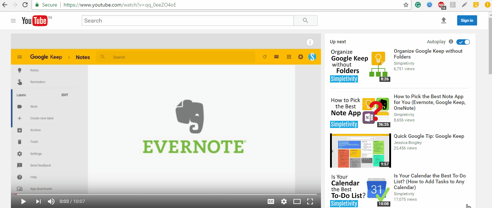
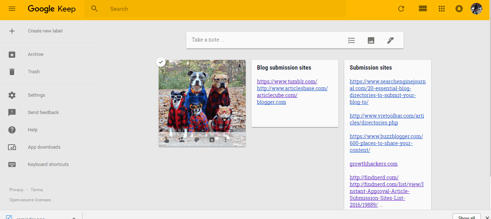

To be honest, I literally hated Google Keep when it came as default with my Nexus 5 Phone.  I was using Evernote back then. But gradually I have developed interest towards Keep due to its lightweight and non lagging interface.

So, the much Awaited Google Keep Feature is now on the floor - Keep is now integrated with G Suite. Read more about it and a few other tips on Keep below.

### **1\. You can now add your Google Keep notes in doc right from Docs menu.**

Some of the blogs have reported that it is available for G suite only but I can see that the update is rolled on regular Google accounts too.

[\[Source\]](https://gsuiteupdates.googleblog.com/2017/02/google-keep-now-g-suite-core-service.html)

The Above GIF by Google’s Official G Suite blog shows how you can easily fetch notes from keep to docs. You can not only fetch the notes from keep to docs but you can save the content from Google Docs to keep too. Just Select any Text, right click and choose “Save to Keep notepad”

_Many of the keep users don’t know but there was a “copy to google doc” feature already available for desktop users. (keep.google.com)_

### **2\. Add reminders in Google Keep**

You can setup reminders in keep. You can also set it up for daily chores like feeding your pet or buying groceries.

P.S. if on phone you can also set up place based reminders. For example, you can remind yourself to workout when you reach home.

### **3\. Segregate notes using Labels**

Using Keep for multiple things like homework or some event? Create Labels and add a label to each of the notes for easy organization. No more messed up notes, yay!

### **4\. Add Keep widget in your phone.**

Add your desired keep note to the home screen of your Android using the Keep widget. You can choose which note you want to display. Using the widget you can also add a note or an image and view the existing notes. For me, the Keep widget is a great way to remind myself about the important tasks I have.

### **5\. Visual notes, add images to Keep!**

Saw an awesome DIY bottle and want to make it too? Just save it to Keep by opening your camera right from the Keep dashboard and save the image as note or reminder!

### **6\. Voice Notes**

You can also add voice notes if you don’t want to type the notes!

Pro tip: Don’t have microphone in your laptop or PC? Or facing issue with recording on laptop, Just record using keep, open keep in desktop and download the file.

### **7\. Save a Tab, Try the Google Keep extension!**

Google Keep Chrome Extension is a bliss especially when you are a frequent keep user. It also saves you a tab.

### **8\. Share keep with your friends, family, and colleagues and let them edit it too.**

Just like Google Docs, you can also share your keep notes with your team and friends.

### **9\. Make a checklist!**

Add checkpoints to your tasks and mark them check when you are done. The checked points move down to the list.. \[Though you can change that in settings\]

### **10\. Add a pinned note**

Want to keep a note always at top? Pin it.

### **11\. Keyboard Shortcuts**

Here are a few shortcuts which can be really helpful.

c: Create a new note

/: To search from the list of notes

ESC: Close Note after editing

J and K: Move to next or previous note

N and p: To Move to next or previous list item in the note

?: For opening the complete list of keyboard shortcuts TL;DR watch this video if you are in short of time!

Happy Notes.

