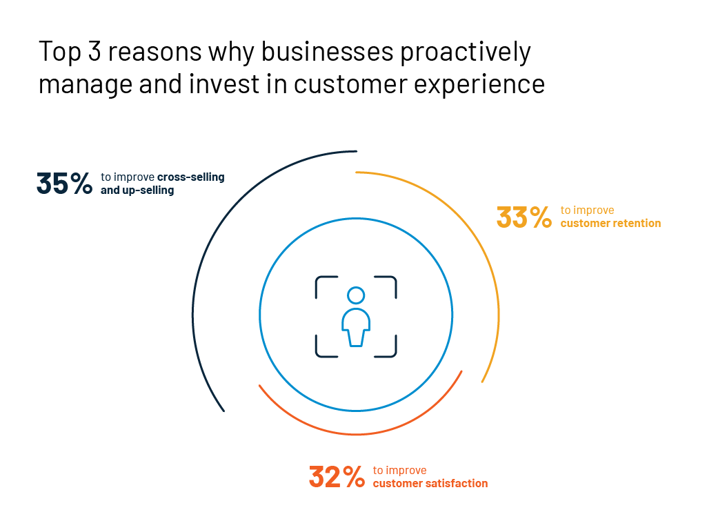
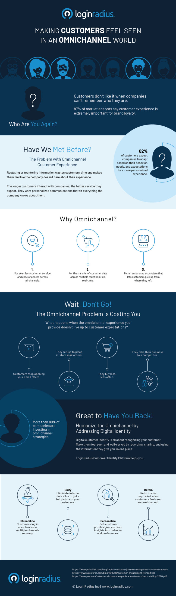

Companies are investing heavily in omnichannel customer experiences lately. But why are they doing so?

Well, the answer is simple.

Today, customers expect a seamless and consistent interaction across major communication touchpoints.

Creating separate web, mobile, and social media experiences are no longer effective. Today, businesses are integrating marketing, support, and sales channels as part of one big omnichannel experience instead.

But then,  pulling this off can be quite expensive. 

Firstly, brands need to understand what omnichannel customer experience is, how it should function, and why companies are investing in them.

## Defining the omnichannel customer experience

An omnichannel customer experience is a multifold approach to advertising, selling, and supporting customers across multiple marketing touchpoints. 

This means a customer could be shopping from his desktop, mobile phone, or offline store and still enjoy a [seamless buying experience](https://www.loginradius.com/blog/2019/11/improve-customer-experience-ecommerce/). 

Let's explain this further.

Here's what the journey of a customer will look like in the omnichannel world when he wishes to buy a smart TV.

- The customer will search for the best smart TV online, compare features with different brands, and read reviews.
- Once the TV is shortlisted, the customer will visit the brand's website to understand its specifications better.
- If need be, the customer may consider visiting its offline store to try out its features in-person. 
- The customer will also ask for available in-store offers.
- If not satisfied, the customer will go back to the website and buy the smart TV.
- The customer may leave reviews and suggestions for other buyers online.
- Meanwhile, the customer may also consider buying other accessories from the same brand.

This is how customers interact with brands today. They don't mind going all out. Customers are okay with venturing both online and offline, prior, during, and post their purchase journey. 

All-in-all, a brand that advocates the omnichannel customer experience module should ensure that [the customer's journey is seamless](https://www.loginradius.com/customer-experience-solutions/), especially while switching between different physical and digital channels.

That being said, the following are a few industry figures that will highlight the importance of omnichannel customer experiences in the new world.

## Omnichannel customer experience statistics

- Highlighting the value of customer experience, a study by Esteban Kolsky reveals that [72% of customers](http://www.slideshare.net/ekolsky/cx-for-executives) are likely to share their positive experiences with six or more people. In comparison, 13% of customers may share their unhappy experiences with 15 or more customers.
- According to a survey by PwC on 15,000 consumers, [one in every three customers](https://www.pwc.com/us/en/retail-consumer/publications/assets/pwc-retailing-2020.pdf) tends to leave their favorite brand after a bad experience, while 92% completely abandons a brand after two or three negative interactions.
- [57% of customers](https://www.socpub.com/articles/the-5-mobile-marketing-mistakes-infographic-14849) do not recommend a brand if they use a poorly designed website on the mobile view. [50% will stop accessing](https://www.business2community.com/marketing/38-mobile-marketing-statistics-you-need-to-know-02185085) a site if it is not mobile-friendly.
- 70% of consumers expect an omnichannel customer experience across all channels, but only 29% of brands are successful in delivering it.

### The Growing Popularity of Omnichannel Customer Experience

The omnichannel approach to the customer experience is here to stay. And with the growing popularity, it is all set to emerge as a game-changer. 

While the obvious benefit includes producing a consistent customer experience across all channels, omnichannel offers other benefits too.

- It gives customers the independence to manage their own experiences. 
- It contributes to automated processes and happier customers.
- It helps reduce back-office complexities due to a simpler customer journey. 
- It offers a continuous scope of relevance, reliability, and system refinement. 
- It aligns processes and strategies to fulfill customer expectations and generate more leads.
- It allows brands to interact with customers in real-time.
- It enhances [shopping experiences by redefining](https://www.loginradius.com/blog/2018/11/improving-customer-experience-in-the-retail-e-commerce-industry/) personalized customer engagements as we know it.

## The Role of LoginRadius in Building an Omnichannel Customer Experience

With LoginRadius' cloud-based [customer identity and access management](https://www.loginradius.com/blog/2019/06/customer-identity-and-access-management/) solution, businesses can meet the need of modern customers in a way that is highly scalable, fast, and flexible. 

Along with robust data security, it offers the following capabilities for delivering omnichannel customer experiences to its clients.

- **Data management:** The identity platform helps you understand who your customers are. It will offer an overview of your customers' data landscape by breaking down silos and making data available across all channels of service delivery. 
- **Single admin panel:** After you are done with mapping your data landscape, it will offer a single dashboard view for your customer data. You can unite all your channels into one seamless admin panel.
- **More focus on the customer, less on the channel:** The [identity platform makes it almost](https://www.loginradius.com/blog/2019/10/digital-identity-management/) irrelevant about how your customers choose to interact with you. You can view your customer activities from a single panel rather than witnessing it as a series of isolated remarks.

To learn more about the omnichannel customer experience, here is an infographic created by LoginRadius that describes the customer experience journey in an omnichannel world.

## Conclusion

Building an omnichannel customer experience does not necessarily mean having to invest in new-age digital technologies. It rather means channelizing your [customers in a centralized environment](https://www.loginradius.com/blog/2019/12/identity-as-a-service-for-business/). The LoginRadius identity solution supports automated pathways, doubles customer experiences, and humanizes interactions with every customer

