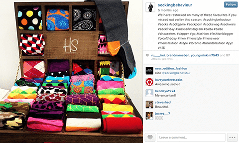

Hey Guys! Hope you are doing good like I do. Before we dive deep into this article, please make sure that you already have a good idea about [managing your Instagram account](https://www.loginradius.com/blog/fuel/2017/05/the-insta-bible-chapter-1/) and [creating content on Instagram](https://www.loginradius.com/blog/fuel/2017/05/the-insta-bible-chapter-2/)._ 

In this article, I am going to explain to you everything you need to know about Hashtags. Hashtags help you cut through the competition and that’s why you require to master it. You will get to know how to research your niche’s hashtags, tips to post hashtags and how to improve your content with hashtags. Moreover, the article also reveals about the techniques which help you receive gobs of likes, followers and engagement for your account. Hence, if you are already done with the two previous articles, read this article to rapidly grow your account.

### **Posting Hashtags**

In this piece of the article, I am going to stress on why posting hashtags is a must do task for every business instagrammer.

Avoid hashtags on your posts and you will lose the [extra 442% engagement](http://louisem.com/7198/how-to-use-hashtags-on-instagram) on your account. Eventually you will lose your potential followers, leads and traffic. Hence, posting hashtags is considered as a game changer on Instagram. So, I recommend to post more than 11 hashtags on each post you make. Moreover, it is recommended to post your hashtags in comments and not in captions. 

#### **How do you do it?**

It’s simple. Share an image and paste all your hashtags in the comment area.

#### **How To Choose The Right Hashtags**

No one wants to look stupid by posting poor hashtags. Your hashtags are meant to hit the right audience. They should find you easily with your hashtags and eventually get converted into followers and customers. Now, for researching tags, you can use [**TagsForLikes**](http://tagsforlikes.com/). You can find the most relevant and high traffic hashtags in your market through this website. Other than the website, you can also search hashtags from Instagram. _Note:- I recommend you to use hashtags which have moderate engagement. You can also have high engagement hashtags but too much._  Also make a hashtag of your brand. Eg:- #nike

### **Conduct Competitions, Grow Your Account**

Competitions are constructive hacks to aggressively promote your account. You can follow a proper pattern on conducting competitions on your profile i.e conducting competitions twice a month.

You can go like:-

_Win a free pair of branded shoes featured on XYZ , follow the procedure:-_

- _Follow the account_
- _Tag a friend on the post_
- _Comment on another post_

_5 lucky winners will be selected on 29th may PDT._

Other than organizing a competition, make sure that you also promote at least a couple of times. And these small steps will add to your growth.

### **Push Your Product**

Pushing your product is an important process to promote your business. But you cannot always add a call to action to advance your sales. Hence, you can perform a product push through a post by asking your audience to go to your bio to access your products.

[**Source**](http://www.socialmediaexaminer.com/use-instagram-to-promote-products/)

You can perform 6 product pushes in a week in addition to other growth strategies.

### **How to Use DM** 

Direct Messaging (DM) are great tools through which you can generate leads. You can make your audience connect to you, build your relationship with them, make them arrive on your landing page and close sales with the help of DMs. How? Advertise your success or reached milestones and ask your audience to DM you if they want to know how you achieved the goal in such a short span. Thus, you can convert your traffic to sales.

### **How to Influence Other IGers to Build Your Business**

There are basically few ways to increase the extent of your business with the help of other active users on Instagram. How? Let me teach you:-

- Ask the person to create images for you and in return, shout them out. Thus, you can have other IGers contribute to your growth and do a favor in return.
- **Paid Shout-outs:-** You can also go for paid shout-outs where you have to pay an influential account your business. The charges entirely depend upon the person or the account.
- You can ask for interviews from influential personalities in your niche.

Other than these ways, you can also create your set of creative ways to promote your business on Instagram through Instagram audience. The secret to work this out is trying to identify the needs of other business and then working out a partnership.

### **The Ultimate- Thunderclap Strategy**

Yes, you can absolutely obtain more than 3000 opt-ins by following this simple strategy called- The Thunderclap Strategy. The strategy will consume money but it can give you **5x** your investment. So, what’s thunderclap?

It is performing a shoutout through a string of accounts (40 accounts) simultaneously to amplify the effect. Also, hire your partner's bio to post your link. In this way, your partner’s followers will not hesitate to click your business link as it recommended by your partner.

To perform a thunderclap:-

- Find accounts related to your niche (40 at least plus they should do a paid shoutout)
- Discuss the rates (includes shoutout + posting + hire bio for a day)
- Fix a time for thunderclap

Try testing thunderclap initially at a small level and eventually scale up the strategy. You will enjoy maximum exposure and better ROI through thunderclap.

### **Like Bombs and their Use**

Like bombs are providing likes for first ten posts on an account. So, how do they help you?

As soon as you grow your network consisting of other fellow IGers in your own niche and have a shout-out group, you can ask your group to provide likes to your most recent posts. If your group performs the task in less than five minutes after the posting, you can acquire some big amount of engagement.

Therefore, make sure that you create a shoutout network and work on a schedule where your group can effectively give likes to your posts in less than five minutes of posting it.

### **Mix Up Your Lead Magnets**

After sometime, your audience may get used to your lead magnet or an offer. Thus, it is advisable to have different kinds of offerings or lead magnets to keep your offers lively for your customers. You can offer audience different offers according to their interest and engagement. Just mix up your offer to keep it fresh.

### **Fan Page and How They are Beneficial**

Fan pages are pretty good promoters of your business. As you already know that your bio is the only space where you can display your business link on your account, you can promote your links via fan pages. Creating fan pages will multiply your channels to advertise your business. However, you should be clear on how you are going to cross promote your business and fan pages. 

### **Generating Like for Like Groups**

As I mentioned above the importance of like bombs and how they are powerful tools to promote your business. More likes provide more visibility to your images as they push your posts in the recent news feeds. Hence, if you are able to acquire likes from other accounts (they should have decent number of followers), it can generate huge engagement.

Hence, create a group with other accounts so that you can mutually provide likes to each others posts. You can generate like bombs for your images.

### **Make Stories and Drive Traffic**

Telling stories are a great method to grab attention on Instagram. Good stories can acquire more than 50k views and hence, create great product awareness amongst your audience. In this section, I am going to introduce how to make your own stories on your Instagram account to generate more traffic.

Click on the ‘+’ on the top left corner of your screen. Now, you can add live videos, images or swipe down to add images (that are not older than 24 hour). Thus, use this nice trick and you can drive extra traffic other than your posts.

### **Add Scarcity In Your IG Stories**

‘Fear of Missing Out’ or displaying scarcity is  powerful emotion that can trigger sales for your business. Here’s how you can use it with Instagram stories:-

Create a story and add an element of scarcity like

_“30% Off, Till this Weekend, Hurry UP!”_ 

In addition to creating an urgency, these types of offer build a call to action for your audience. People don’t like missing out on offers they like and hence, they will click on compelling ads on your stories.

However, humanizing your business or brand is another way to add more effect to scarcity. As people tend to purchase items through people they know or acknowledge, humanizing brands can influence your audience’s purchasing behavior.

That’s all folks! Now, rapidly grow your account with these awesome techniques. Stay tuned for more articles on how to tweak your business on Instagram.
