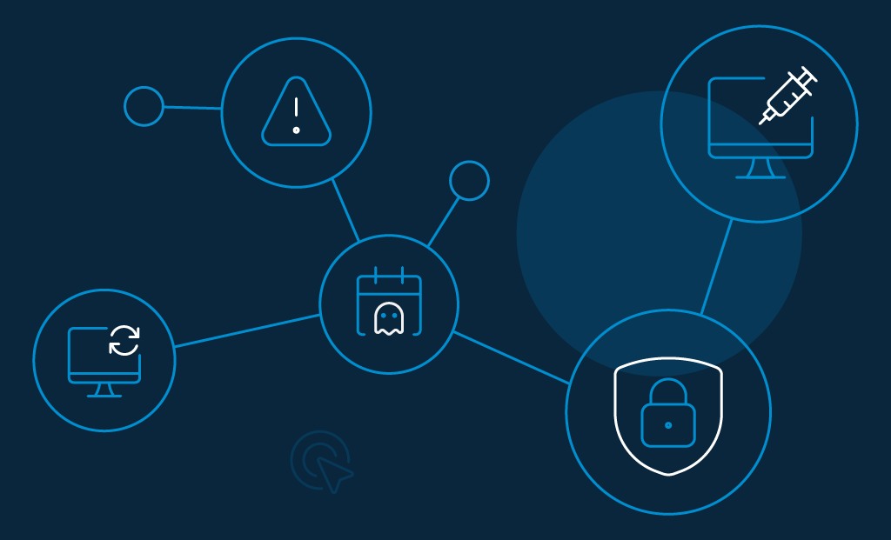
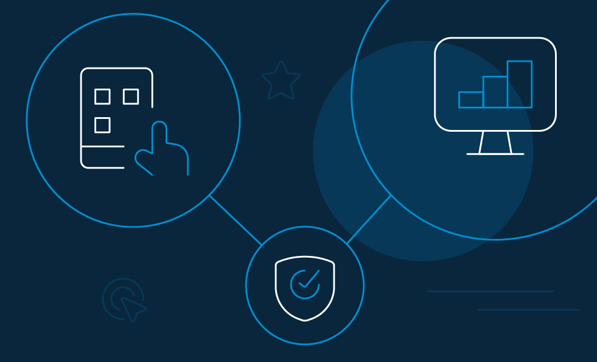

Malicious actors and security experts are in an endless battle over data. While the former wants to steal it, the latter seeks to protect it. 

Each year, attackers develop inventive web application security threats to compromise sensitive data and access their targets' database. Consequently, security experts build on the exploited vulnerabilities and strengthen their systems through their learnings every year. 

The aggregate frequency and cost of data breaches seem to be growing exponentially. This cost is high (approx. [US$8.64 million in the US in 2020](https://www.ibm.com/security/data-breach)) because of developers' inability to incorporate the latest changes and updates into their code to overcome already detected vulnerabilities. Unintuitively, [96% of web apps](https://www.infopoint-security.de/medien/cenzic-vulnerability-report-2014.pdf) have some known defects and anomalies. 

To ensure adequate safety against web application security threats, businesses should incorporate security consideration in the applications' development phase. Unfortunately, most developers tend to hold it off until the end.

## 7 Common Web Application Security Threats

### 1. Injection Attacks

A web app that is vulnerable to injection attacks accepts untrusted data from an input field without any proper sanitation. By typing code into an input field, the attacker can trick the server into interpreting it as a system command and thereby act as the attacker intended. 

Some common injection attacks include SQL injections, Cross-Site Scripting, Email Header Injection, etc. These attacks could lead to unauthorized access to databases and exploitation of admin privileges.

**How to prevent:**

*   Keep untrusted inputs away from commands and queries.
*   Use a safe Application Programming Interface (API) that avoids interpreters or uses parameterized interfaces.
*   Filter and sanitize all inputs as per a whitelist. This prevents the use of malicious character combinations.

### 2. Broken Authentication

Broken authentication is an umbrella term given to vulnerabilities wherein authentication and session management tokens are inadequately implemented. 

This improper implementation allows hackers to make claims over a legitimate user’s identity, access their **sensitive data**, and potentially exploit the designated ID privileges.

**How to prevent:**

*   End sessions after a certain period of inactivity.
*   Invalidate a session ID as soon as the session ends.
*   Place limiters on the simplicity of passwords.
*   Implement [multi-factor authentication](https://www.loginradius.com/blog/start-with-identity/2019/06/what-is-multi-factor-authentication/) (2FA/MFA).

### 3. Cross Site Scripting (XSS)

It is an injection-based client-side attack. At its core, this attack involves injecting malicious code in a website application to execute them in the victims’ browsers eventually. Any application that doesn’t validate untrusted data adequately is vulnerable to such attacks. 

Successful implementation results in theft of user session IDs, website defacing, and redirection to malicious sites (thereby allowing [phishing attacks](https://www.loginradius.com/blog/start-with-identity/2018/02/phishing-for-identity/)).

**How to prevent:**

*   Encode all user-supplied data.
*   Use auto-sanitization libraries such as [OWASP’s AntiSamy](https://owasp.org/www-project-antisamy/).
*   Whitelist inputs to disallow certain special character combinations.

### 4. Insecure Direct Object References (IDOR)

 \
Mostly through manipulation of the URL, an attacker gains access to database items belonging to other users. For instance, the reference to a database object is exposed in the URL. 

The vulnerability exists when someone can edit the URL to access other similar critical information (such as monthly salary slips) without additional authorization.

**How to prevent:**

*   Implement proper [user authorization](https://www.loginradius.com/blog/async/user-authentication-react-application/) checks at relevant stages of users’ web app journey.
*   Customize error messages so that they don’t reveal critical information about the respective user.
*   Try not to disclose reference to objects in the URL; use POST based information transmission over GET.

### 5. Security Misconfigurations

 \
According to [OWASP top 10 2017](https://owasp.org/www-project-top-ten/), this is the most common web application security threats found across web applications. This vulnerability exists because developers and administrators “forget” to change some default settings such as default passwords, usernames, reference IDs, error messages, etc.

Given how easy it is to detect and exploit default settings that were initially placed to accommodate a simple [user experience](https://www.loginradius.com/customer-experience-solutions/), the implications of such a vulnerability can be vast once the website is live: from admin privileges to complete database access.

**How to prevent:**

*   Frequently maintain and update all web application components**: **firewalls, operating systems, servers, databases, extensions, etc.
*   Make sure to change default configurations.
*   Make time for regular penetration tests (though this applies to every vulnerability that a web app could have).

### 6. Unvalidated Redirects and Forwards

Pretty much every website redirects a user to other web pages. When the credibility of this redirection is not assessed, the website leaves itself vulnerable to such URL based attacks. 

A malicious actor can redirect users to phishing sites or sites containing malware. Phishers search for this vulnerability extensively since it makes it easier for them to gain user trust.

**How to prevent:**

*   Avoid redirection where possible.
*   Give the destination parameters a mapping value rather than the actual URL. Let the server-side code translate the mapping value to the actual URL.

### 7. Missing Function Level Access Control

 \
The seventh web application security threats in this list is mostly similar to IDOR. The core differentiating factor between the two is that IDOR tends to give the attacker access to information in the database. 

In contrast, Missing_ Function Level Access Control _allows the attacker access to special functions and features that should not be available to any typical user. 

Like, IDOR, access to these functions can be gained through URL manipulation as well.

**How to prevent:**

*   Implement adequate authorization measures at relevant stages of user web app use.
*   Deny all access to set features and functions unless attempted by a pre-approved (admin) user.
*   Allow for a flexible shift in grant and rejection of access to feature privileges in your code. Hence, allowing a practical and secure shift in privilege access when needed.

## How Loginradius Helps in Securing Web Applications for Businesses While Providing a Seamless Experience

 \
Despite the multitude of solutions available to each vulnerability, it is hardly easy to produce your own code to secure a site against web application security threats. Managing an extensive portfolio can be unscalable. 

This is probably why it is best to rely on dedicated virtual security firms with dedicated years of research into incorporating security as a governing factor in writing scalable codes.

LoginRadius protects consumer identity through a multilevel security web app environment. The APIs use OpenID Connect (OAuth 2.0 protocol). Also, applications on LoginRadius are hosted by Microsoft Azure and AWS. 

The [CIAM platform](https://www.loginradius.com/blog/start-with-identity/2019/06/customer-identity-and-access-management/) also ensures that it is updated with the latest government regulations and compliances of respective regions. The cloud directory protects sensitive consumer data while allowing and managing consumer consent for data collection and use.

Among other features, LoginRadius offers:

*   End-to-end SSL encryption for data in transit acts as protection against unauthorised access.
*   Automated security monitoring systems to warn admins to take actions against unwarranted activity.
*   One-way hashing of passwords allows for added user security: even from database admins.
*   Flexible multi-factor authentication shuns the risk of being exposed to a multitude of attacks.
*   [SSO solutions](https://www.loginradius.com/single-sign-on/) for quick access to multiple web properties with a single set of credentials. 

## Conclusion 

We recommend using this list of top 7 web application threats and vulnerabilities to find a sound security base for your web apps. Developers can build on these vulnerabilities and learn from previous exploits of other entities to create a more secure application.

