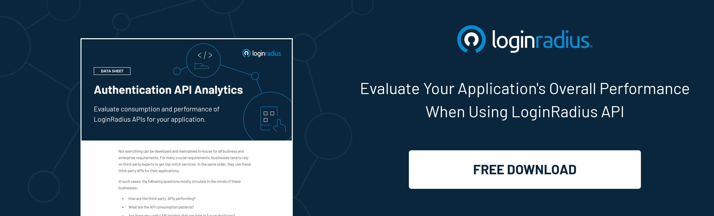

Businesses can't build and manage everything in-house. Many a time, they require third-party experts to help them meet a variety of critical needs. The use of third-party APIs for their applications is a similar requirement. 

In addition, businesses need the right data to address the following questions:

*   How are the third-party APIs performing?
*   What are the API consumption patterns?
*   Are there any useful API Insights that can help in future decisions? 

LoginRadius being a CIAM solution provider, completely understands these requirements and launches Authentication API Analytics for businesses. 

The feature contains useful charts and analytic tools to view and measure an application's overall performance (where using LoginRadius).

## Intend Behind the Launch

The [Authentication API Analytics](https://www.loginradius.com/resource/authentication-api-analytics/) feature offers the following benefits from the business and its developer's point of view:

*   **Assess app performance**: LoginRadius allows your  developers to create high-quality and secure authentication for your apps. Besides, your developers can also evaluate the efficiency of your applications based on provided API insights.
*   **Assess API performance**: Based on the provided dataset and insights, your developers and business team can evaluate how the LoginRadius APIs are performing, like API response time and the number of requests handled.
*   **Informed business decisions**: API consumption insights and data help businesses analyze their consumer behavior, detect patterns and make informed business decisions based on the data.

## Key Characteristics of Authentication API Analytics

The API analytical and performance data are available in the following three categories:

*   **Request Count**: It offers a comparative chart view for the number of requests made to various forms of LoginRadius APIs. 
*   **Response Code**: It lets you track all response codes from your API to see the number of HTTP success(2xx) and error(4xx, 5xx) requests the LoginRadius server has handled for the selected time interval. 
*   **Performance Analysis**: This gives information on how the LoginRadius APIs are performing for you, i.e., the response time of the APIs. It is available for APIs like Profile lookup APIs, Authentication APIs, Profile creation APIs, Profile deletion API, and Profile update APIs. 

## Conclusion 

As businesses evolve toward becoming more data-driven, analytics become essential. LoginRadius’ Authentication API Analytics not only helps businesses create personalized sales and marketing campaigns, but also enhances the experience of their developer towards the use of APIs.
