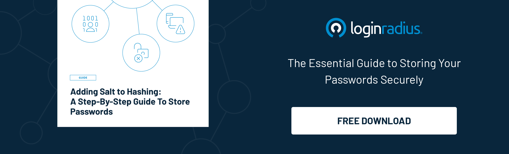

Re-authentication is the process of ensuring the constant presence that has to be authenticated when there is a long period of usage. The purpose of re-authentication is to ensure that the person who is currently using the resources is the same person who had initially signed in to use it. This will ensure that there is no breach of identification or exploitation of data.  

## Benefits of Re-authentication 

So, what are the benefits of imposing a re-authentication time limit? Let’s find out. 

### 1. It offers central control on user access.

The re-authentication process offers enterprises or service providers complete control over who has access to a particular system or services. Some systems use control panels to ensure that all the data regarding the user is recorded and has easy access. This also plays an important role in solving any future issue regarding identity breaches.

### 2. It dispels the concept of password fatigue.

When a user requires to generate and remember more than one password, password fatigue may arise. While there are solutions like password managers that help solve the issue of remembering multiple passwords, they might not always be a safe choice. Many people still find it difficult to use and maintain a separate list of passwords on the side. There might be chances in which an intruder can gain access to such sensitive data and misuse it.

Thus, a re-authentication is considered ideal for the elimination of password fatigue. The system will undertake the identity test without the need to type the password and ensure a safe environment for the users.

### 3. It reduces the need for IT support calls.

There are many instances where users forget their passwords and are locked out of their system due to multiple wrong attempts. This issue is often resolved with the aid of the IT call center. However, the process of resetting the password in high-security systems is very time-consuming and costly.

The [average cost for the IT department](http://www.mandylionlabs.com/PRCCalc/PRCCalc.htm) to reset a password is $70, and around 50% of the IT department focuses on resetting the password.

Re-authentication ensures that there is minimal effort to be put on behalf of the IT department. It is both a cost-effective and time-saving mode of usage.

### 4. It integrates enhanced password policy.

Re-authentication helps [implement better password policies](https://www.loginradius.com/blog/start-with-identity/loginradius-password-policy-business-consumer/) in an enterprise. This can be regarding how an employee uses the password and manages it. For instance, who can change the password, what can be the length of the password, and other similar password settings? Some of the password policies are:

* A password history policy where old passwords cannot be reused
* A maximum age policy for passwords. This will expire the password validity after the stipulated time.
* A minimum password length policy so that the password used is not too short and easy.
* A password audit policy to recognize the identity of who alters the password.
* A minimum password age policy to ensure that passwords are not constantly changed.

Having such a tight password policy will ensure that the team has only secure and quality passwords being used in their systems.

### 5. It alleviates on-premises security danger

Apart from forgetting passwords or misplacing them, the other major issue of saving passwords on-premises is cyber theft. There is an increasing rate of hacking in many highly secure office systems, mainly due to the easy storage of passwords. 

On average, there are about [1,473 reports of data breaches](https://www.statista.com/statistics/273550/data-breaches-recorded-in-the-united-states-by-number-of-breaches-and-records-exposed/?utm_source=xp&utm_medium=blog&utm_campaign=content) being reported every year. It has been predicted that, with the growth of technology, the risk of hacking will only increase further in the following years.

Re-authentication ensures that hackers don’t get easy access to a system’s content and leverage no other loopholes to exploit sensitive consumer credentials. Apart from internal combustion, re-authentication can also save you from external intrusion.  

All-in-all, you can save a lot of time and password exploitation with re-authentication. Speaking of which, the LoginRadius Re-authentication feature can help businesses securely re-authenticate consumers without taking a toll on user experience. [Contact us](https://www.loginradius.com/contact-sales) today to find out more. 

