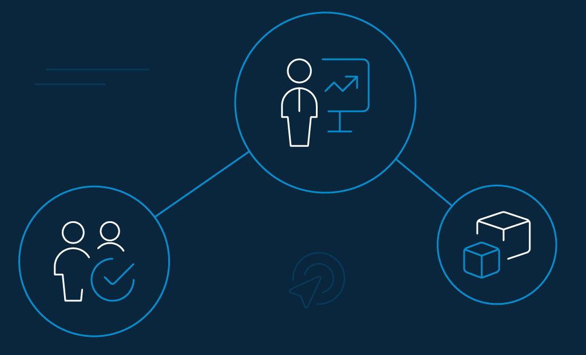
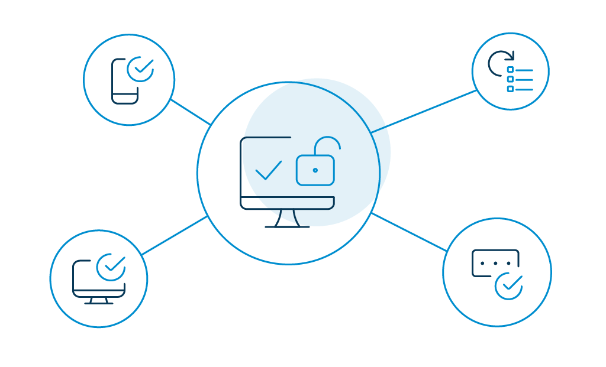
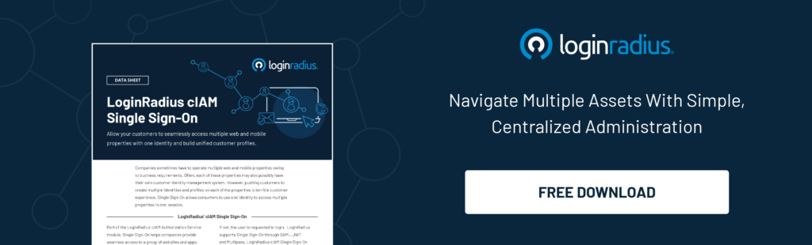
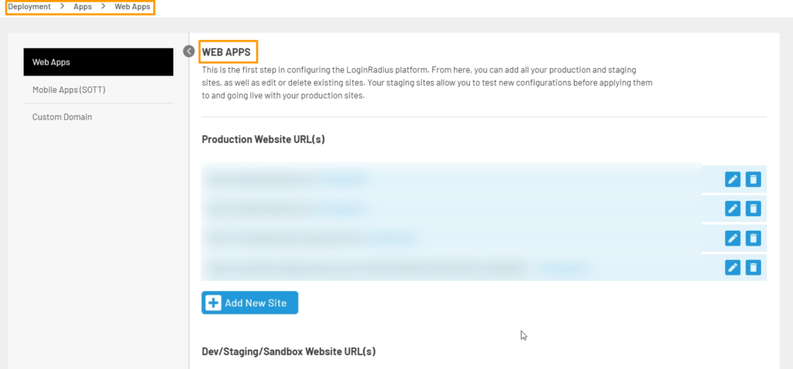
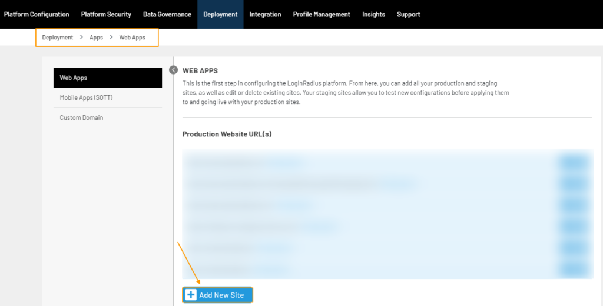

Single Sign-on (or SSO) is a unique authentication method that allows users to access multiple applications with a single set of credentials, like a username and password. 

SSO products are usually designed to simplify the verification process and create a seamless environment when accessing multiple apps, portals, and servers.

Off late, SSO tools have become an integral part of enterprises' and developers' security landscape. 

Simply put, these implementations have entirely removed the need for users to enter their login credentials for individual applications. Alternatively, users sign in once, and the interface sends the necessary credentials to the assigned systems through various proxies and agents. 

Usually, identity providers offer SSO as part of their security access protocol. These platforms aren't similar, and the decision to choose the right one should be taken with professional advice.

LoginRadius offers the ability to serve a broad range of users to cover everyone in an organization and beyond.

We will breakdown the key features that make LoginRadius a highly rated SSO solution [in its space](https://www.loginradius.com/single-sign-on/) and discuss the implementation process later in this blog. 

But first, there are a few things you need to know.

## Importance of Single Sign-On 

[Single Sign-On](https://www.loginradius.com/blog/2019/05/what-is-single-sign-on/) is the perfect fit for organizations that want to reduce their data protection vulnerabilities, improve consumer experiences, and streamline processes for identity management and log in.

What else makes single sign-on the best choice for your enterprise? Let's find out.

### SSO offers greater security.

According to a [survey by Google](http://services.google.com/fh/files/blogs/google_security_infographic.pdf), 53% of users still reuse the same password for multiple accounts. Therefore, reducing login to a single set of credentials is a good start in reducing the attackers' surface area. Because users log in only once, there are lesser opportunities for mistakes. 

Enterprises can also go the extra mile with techniques such as two-factor authentication (2FA) and multifactor authentication (MFA). 

### SSO helps with regulatory compliance.

Regulations like HIPAA require users to authenticate before they are allowed to access electronic records along with options like automatic log-off and audit controls to track user access. 

SSO makes these requirements around data access and control at the granular level. It also [allows enterprises](https://www.loginradius.com/blog/2019/06/enterprise-single-sign-on-authentication/) and developers to comply with regulations that require provisioning and deprovisioning users. 

### SSO saves time.

Because users need not remember multiple credentials for multiple logins anymore, it definitely saves time and improves productivity. Also, remembering one password instead of many miraculously reduces [password fatigue](https://www.loginradius.com/blog/2018/12/infographic-the-death-of-passwords/). More so, it gives users the perfect opportunity to come up with even stronger passwords. 

### SSO lowers IT costs.

This one is interlinked. When there are lesser passwords to remember, there will be even lesser chances of users forgetting them—leading to a reduced number of reset help tickets. This will reduce the need for IT involvement and lower IT costs.

## Top 5 Feature of the Best Single Sign-on Solutions Provider

Looking for factors to consider when selecting an SSO solution. The following are the top five. 

### 1\. Customizable user experience

A good single sign-on solution will let you customize the user experience. For instance, it will let you transform your login page into something that resonates with your corporate branding. 

Apart from the flexible appearance, it will help you make adjustments to your security practices as well. You should be able to add various authentication factors at your discretion.

### 2\. Reliability

You need to ensure that your single sign-on solution offers everything that your company requires (including access to certain custom applications)—however, it takes experience to ascertain the same. Yet, look for options that provide [100% uptime](https://www.loginradius.com/blog/2018/08/23-months-since-our-last-incident/) and the tools to monitor usage in realtime. 

### 3\. Authentication via SAML

Given its growing popularity in web applications, any feasible SSO provider should support SAML authentication for applications at a fundamental level.

SAML (or Security Assertion Markup Language) allows users to authenticate to web applications without passwords. This authentication approach centralizes and simplifies their login process. It is much better than entering passwords for each application because the end-users no longer enters credentials across third-party websites. 

### 4\. Multi-Factor Authentication (MFA)

You should also ensure that your MFA solution enables [multi factor authentication](https://www.loginradius.com/blog/2019/06/what-is-multi-factor-authentication/) too. It is one of the security expert's favorite tools to dodge majority data breaches— more than implementing password complexity or expiration requirements. 

Another primary requirement of MFA in SSO is because end-users access all their applications through a single portal, it is critical that the portal should be closely guarded for security.

### 5\. Testing

Though not an unconditional necessity, it is a good gesture if the SSO solutions offer free trials. It will be a lot easier if you get to assess a solution by testing if it is the right solution. Therefore, make it a point to ask for free trials, if possible. 

## Why LoginRadius Is the Best SSO Solution Provider for Developers and Businesses

LoginRadius goes beyond a single sign-on solution with its broader consumer identity and access management functions, but it is an excellent platform for SSO nonetheless. 

With its simple-to-use one-click access, it works great for small to large-scale, consumer-facing deployment. The added 2FA/MFA security protects data—both in-house and consumers.

The LoginRadius Identity Platform offers SSO in the following ways:

- **Web SSO**: LoginRadius offers browser-based session management when the SSO is required between two or more web applications. It uses localStorage, cookies, and similar storage mechanism to maintain the user's session across applications. To execute the authentication, a centralized domain operated by LoginRadius IDX is used.
- **Mobile SSO**: After logging into an application, the user can log in across multiple apps without the need for multiple passwords. It works by storing the LoginRadius access token in a shared session. It enables you to identify a currently active session and utilize the data to configure the user account in successive applications. 
- **Federated SSO**: Login also helps you implement SSO with third-party applications. It is done through [federated SSO](https://www.loginradius.com/federated-sso/). LoginRadius Identity Platform supports all major industry single sign-on protocols like SAML, JWT, OAuth, and OpenID SSO protocols for interaction with various third-party web applications.
- **Custom IDPs**: Consider this as Social Login. Custom IDPs are used to configure a Social Login provider that is not available in the default list of providers by LoginRadius. You can use any external database to authenticate your application users. 

Here is how the LoginRadius SSO benefits developers and businesses. 

### Single Sign-On for Developers

The LoginRadius Single Sign-On takes the authentication load off web app developers, as the end-user authentication functionality is transferred outside the app. 

Another good reason for developers to shift to LoginRadius is they can embed SSO with LoginRadius. This comprehensive digital identity feature can be implemented with [Identity-as-a-Service (IDaaS)](https://www.loginradius.com/blog/2019/12/identity-as-a-service-for-business/).

Because developers need not focus on complex authentication anymore, it (kind of) gives the liberty to work on other functions of the application.

### Single Sign-On for Enterprise

Why should any enterprise invest in the LoginRadius SSO? We have three main factors that will motivate your decision.

1. **Reinforce security with stronger authentication**: You can control your enterprise's access efficiently by deploying the LoginRadius SSO in all parts of your work station. For example, in the top management systems, doctors' access to patient records, video surveillance desk with access to personal data, operator with access rights to bills, front office trader working on a cluster of workstations, and more. LoginRadius offers multiple authentication types, including SMS-based, email-based, and others.
2.  **Reduce help desk costs**: According to [research by Gartner](https://www.gartner.com/en), 20% to 50% of all help desk calls are for password resets. Therefore, handling application password constraints should do the trick. With the LoginRadius SSO tool in place, the hidden help desk cost is considerably reduced. 
3. **Open up information without risk**: Let's explain this benefit with a use case. For example, one of your employees is on a business trip. That person must bring a specially configured PC to use the intranet applications. To overcome these reservations, SSO will allow the user to access your internal web applications from any browser securely. This is really useful as it makes your employees extremely independent.

## Why LoginRadius SSO Solution Is Better Than Its Competitors

LoginRadius guarantees unparalleled uptime 99.99% every month. The cloud-based identity provider manages 180K logins per second, 20 times more than its major competitors!

Apart from delivering the industry's best consumer, the following are a few ways where the platform excels compared to its competitors.

- **Autoscalable infrastructure**: The platform offers an auto-scalable infrastructure to handle surges during daily and seasonal peak loads. It automatically accommodates data storage, account creation, consumer authentication, new applications, and more.

- **Scalability**: LoginRadius ensures that it accommodates your continually growing consumer base. The even better part is, there are no limitations to the number of users. Also, the LoginRadius Cloud Directory scales automatically to handle incremental data every time—in realtime. It has the ability to autoscale and handle hundreds of applications.

- **Globally compliant**: The LoginRadius platform also complies with major global compliances like the GDPR, CCPA, etc. You can keep track of your consumers, manage preferences, and customize the kind of [consent consumers want](https://www.loginradius.com/blog/2020/06/consumer-data-privacy-security/). 

- **Security Certifications**: LoginRadius is compliant with [international regulatory bodies](https://www.loginradius.com/compliances-list/) like AICPA SOC 2, ISAE 3000, Cloud Security Alliance, Privacy Shield, and more.

So far, so good? 

Willing to try out the LoginRadius SSO for your business? You can register for a free account here.

## How to Configure Single Sign-On With LoginRadius

Here is the step-by-step guide on configuring Web Single Sign-On with LoginRadius.

**Step 1:** Log in to the LoginRadius Admin Console account. Navigate to Deployment and click on Apps.

**Step 2:** Under the Production Website URL, add the domains you want to implement your Web SSO. There is an Add New Site button at the bottom. Click on it to add the domains. 

## Conclusion

Single Sign-On clearly improves consumer experience and boosts productivity by a considerable margin.

By implementing the benefits of the LoginRadius SSO as a unified solution, you increase business agility, security, convenient and streamlined experience for your business and consumers alike. And, that's awesome! 

