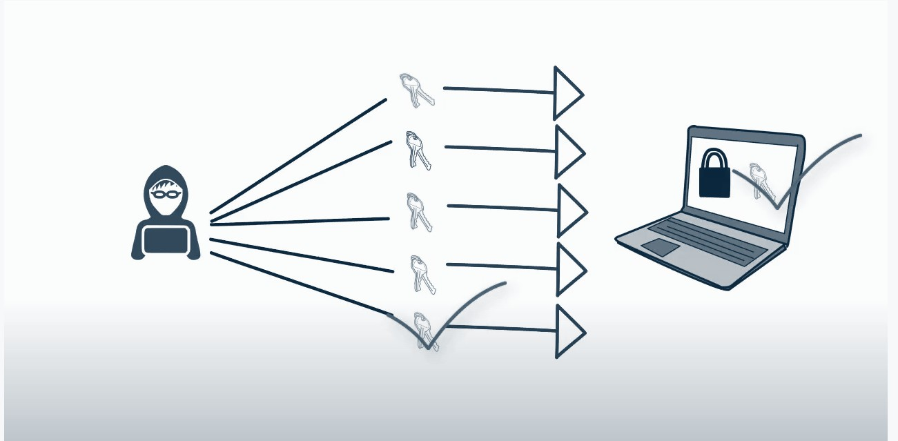
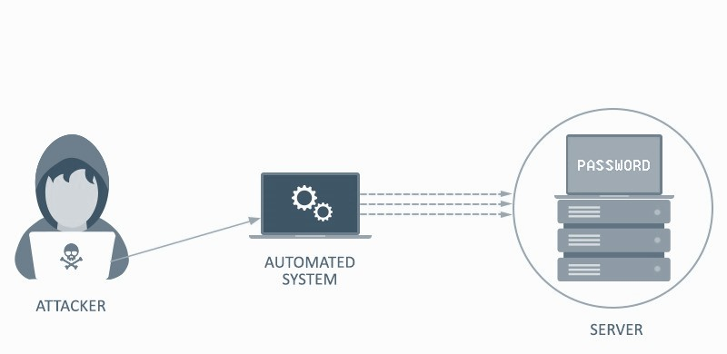

# What is Brute Force Attack

Brute Force is a hacking technique used to find out the user credentials by trying out possible credentials. 

So in brute force attacks, you are not exploiting any vulnerability in the web application. Instead, you are trying all the possible combinations and permutations of passwords and usernames of the victim and trying to see if you get any of those right. 

## How Brute Force works

Attackers use a tool to which they feed the username and password—may be one username and a [list of passwords](https://www.loginradius.com/blog/start-with-identity/2019/12/worst-passwords-list-2019/) or a list of usernames and a list of passwords.

Thereafter, the tool sends the combinations of these usernames and passwords to the web application where credentials are checked and depending on the response of the application, the tool decides whether the credentials were right or wrong/incorrect.

If the login is successful, then the username and password combination is considered as correct. If the login was a failure, then the combination of those credentials was wrong.

## Types of Brute Force Attacks

- **Dictionary Attack:** A dictionary attack is an attempt to guess passwords by using well-known words or phrases.

- **Simple Brute Force Attack:** In this type of attack, hackers attempt to [logically guess your credentials completely](https://www.loginradius.com/blog/start-with-identity/2019/09/prevent-credential-stuffing-attacks/) unassisted from software tools or other means. 

- **Hybrid Brute Force Attack:** A typical hybrid attack is one that merges a dictionary attack and a brute-force attack.

- **Reverse Brute Force Attack:** Reverse brute force attacks begin with the attacker knows the password, but not the username. So, in this, the attacker tries different usernames.

- **Credential Recycling:**  Credential recycling refers to the hacking practice of re-using username and password combinations gathered in previous brute-force attacks. A special form of credential recycling is passed the hash, where unsalted hashed credentials are stolen and re-used without first being brute-forced.

- **Rainbow Table Attacks:** A rainbow table is a database used to gain authentication by cracking the password. It is a dictionary of plaintext passwords and their corresponding hash values that can be used to find out what plaintext password produces a particular hash.

## How to Defend Against Brute Force Attacks

Brute force attack takes time. It could take from a few weeks to even months. So, if you want to defend from hackers, you should make credentials hard for attackers to guess. Here are a few ways you can be safe.

- **Increase password length:** The more characters in your password, the more difficult it is to guess. 

- **Increase password complexity:** Use special characters and other combinations to make the password complex.

- **Limit login attempts:** This is the commonly used method. It creates a counter once a failed login attempt is done and can lock the account after certain attempts.

- **Implement Captcha:** It is used to identify if the user is a human by providing a captcha.

- **Use multi-factor authentication:** It adds an [extra security layer to the authentication process](https://www.loginradius.com/blog/start-with-identity/2019/06/what-is-multi-factor-authentication/) and ensures that the person who is trying to log in is human.

## Conclusion

In this blog we have tried to explain the brute force in simple language. Bruteforce is not only used for hacking purposes but many companies use it for testing their security system also. This gives us the knowledge about how we can protect our accounts from hackers.

