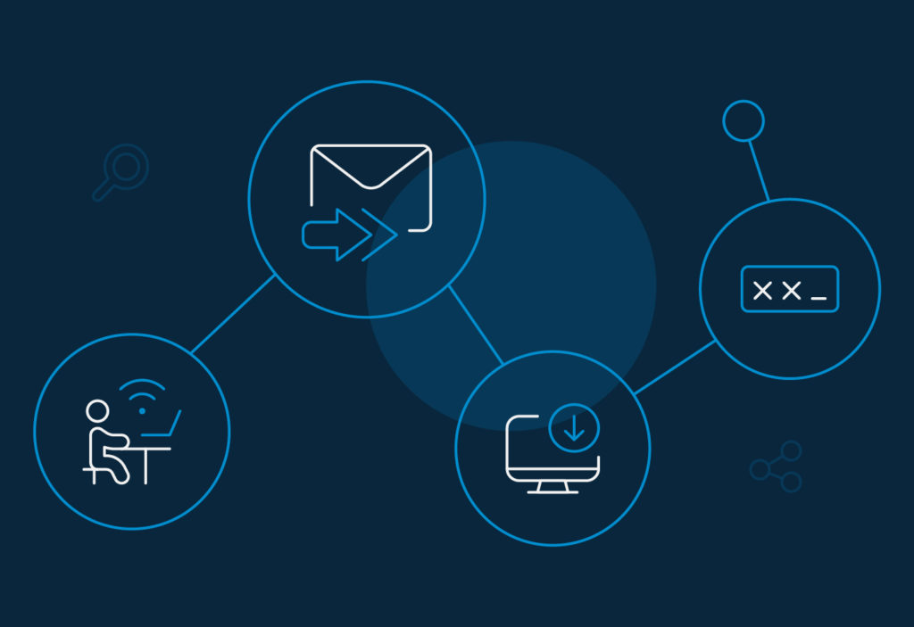
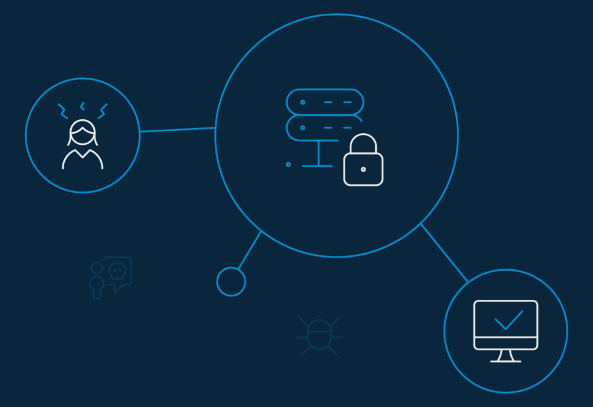

Cyber threat for businesses has always been a big deal. With the world population self-quarantined at home and the stock market succumbing to the ill-fated Covid-19, cybercriminals are making the most of the on-going crisis and adding on to the cyberthreat landscape.

In April 2020 alone, WHO reported that some 450 active official email addresses and passwords [were leaked online](https://www.who.int/news-room/detail/23-04-2020-who-reports-fivefold-increase-in-cyber-attacks-urges-vigilance) along with thousands of other credentials – all linked with people working to mitigate the coronavirus impact.

For cybercriminals, it has become easier than ever to conduct social engineering campaigns where they use fake emails to exploit the fear around the COVID-19 pandemic.

Before going through the protection module, let's find out a few more creative examples of cyber threat for businesses.

- Online sellers are claiming they offer unlimited delivery of essentials products like groceries, medical, cleaning, and household supplies. When buyers pre-order, they never receive the order.
- Cybercriminals are creating fake websites with bogus face masks, hand sanitizers, wipes, and other medical equipment.
- Charities are losing money to man-in-the-middle attacks. Scammers are stealing donated money by hacking into organizations' accounts and redirecting donors to fake accounts.
- Phishing attempts by tempting users to get hold of personal data like account numbers, Social Security numbers, and [login credentials](https://www.loginradius.com/blog/2019/09/prevent-credential-stuffing-attacks/). 

Amidst IT facing the heat to mitigate the Covid-19 data breach challenges, certain techniques like phishing attack remain constant.

It is time for businesses to pull the chord on attackers exploiting accounts and gaining access to high-profile resources. 

## Industries at Risk During COVID-19

With the majority of companies working on the "work from home" module, cyber threats for businesses have increased multi-fold – which is irrespective of any industry. The most notable ones include:

### **Media Industry**

The [media and entertainment industry](https://www.loginradius.com/blog/2020/02/customer-experience-media-entertainment-industry/) is rapidly becoming a new favorite for cyber hackers as they find creative ways to exploit revenue-driven assets like intellectual property or commercially sensitive data in the industry's security infrastructure. 

Moreover, with the shooting popularity of streaming sites due to the pandemic, hackers are turning these services into a new hotspot for exploitation. 

According to the cybersecurity firm Mimecast, [more than 700 fake websites](https://www.capetalk.co.za/podcasts/136/early-breakfast-with-abongile-nzelenzele/310995/streaming-services-spoofed-more-than-700-suspicious-domains-impersonating-netflix-found) resembling Netflix and Disney+ signup pages were identified between 6th April 2020 and 12 April 2020. 

It seems like with the world population obliged to stay at home, hackers are redirecting their attention to streaming services for understandably obvious reasons – i.e. to pose cyber threat for businesses. 

### **Hospitality Industry**

Hospitality is one of the hardest-hit industries during this time of the pandemic. It witnessed a sharp decline in the first quarter of 2020. But, just because the industry isn't in its best shape at the moment, it doesn't mean they aren't a target for bad actors anymore. 

Hackers are getting increasingly sophisticated and finding new ways to steal guests' information from systems, servers, and even the front desks. 

[Marriott data breach](https://www.loginradius.com/blog/2020/04/marriott-data-breach-2020/) at the end of February 2020 made headlines for the second time. More than 5.2 million guest data including names, birth-dates, phone numbers, language preferences, and loyalty account numbers were exposed as a result of the breach.

A data breach in this sector can lead to severe cyber threat for businesses like damage to reputation, loss of customer trust, and cost thousands of dollars in fines and penalties. 

### **Financial Industry**

The [financial industry](https://www.loginradius.com/blog/2020/04/financial-industry-identity-management/) is no alien to cyberattacks during the novel coronavirus pandemic. The U.S. Secret Service and the FBI even declared that [North Korea's hacking activities](https://www.us-cert.gov/ncas/alerts/aa20-106a) are threatening the country's financial system and the stability of the global community at large.

As governments across the globe are sanctioning millions of dollars to mitigate the economic crisis, financial institutions play the primary role in distributing the funds to companies and citizens. Therefore, this industry is a juicy target, not just for North Korea but for the bad actors at large. 

With people working remotely on less secure networks, they are easy targets for hackers to exploit sensitive systems and even bring down national economies. 

### **Retail Industry**

Mimecast observed more than [60,000 COVID-19-related fake domains](https://www.mimecast.com/globalassets/cyber-resilience-content/100-days-of-coronavirus-threat-intelligence.pdf) were created since January 2020 to steal from unsuspecting panic-buyers through lookalike domains during the time of crisis. 

The [retail industry](https://www.loginradius.com/blog/2020/05/customer-experience-retail-industry/) has a lot to do with payment and transactions. Retailers are loaded with customers' personally identifiable information, and if hacked, millions of data are exposed.

No doubt, attackers have become more opportunist and automated with time. In response to the increasing impersonation attack campaigns and cyber threat for businesses, organizations need to review their cybersecurity strategies and add multiple layers of security as their first line of defense. 

### **Gaming Industry**

[Gamers are taking advantage](https://www.loginradius.com/blog/2020/01/improving-customer-experience-in-the-gaming-industry/) of social distancing to boost gaming skills while the newbies are using games to relieve their boredom or alleviate their anxiety.

No doubt, the gaming industry is gradually becoming a lucrative target [for hackers](https://securityintelligence.com/posts/player-vs-hacker-cyberthreats-to-gaming-companies-and-gamers/) to make money - mostly in exchange for in-game items for profit. 

Also, gamers fall under elite demographics who do not mind spending money. So, their financial status is also a big turn-on for hackers. 

### **Education Industry**

The pandemic has reformed the online learning landscape (for good). E-learning is quickly shaping up as the new normal for the global education industry.

With schools and colleges temporarily shut, the impact of the crisis is reshaping application processes and taking active care of crisis management strategies. 

That was the good part. Now, speaking of what went wrong, criminals are in no mood to spare this industry too. Recently, the popular online learning platform Unacademy [was hacked online](https://www.business-standard.com/article/companies/unacademy-s-database-hacked-information-of-11-million-users-compromised-120050701280_1.html). 

The breach exposed details of 22 million users and listed 21,909,707 records for sale at $2,000 on darknet forums. Most of the compromised data included usernames, hashed passwords, email addresses, profile details, account status, date of joining, and last login date.

## Best Practices for Companies to Deal With Cyber Threats During COVID-19

As companies across the globe are adapting to new working environments to remain socially distant, it seems like cybercriminals are competing within themselves to come up with innovative ways to devise new cyber threat for businesses and exploit new vulnerabilities. 

It is high time for enterprises to understand the [severity of cyberattacks](https://www.loginradius.com/blog/2019/10/cybersecurity-attacks-business/) and work in advance to mitigate those threats. Following are a few best practices:

### **Secure remote working.**

No matter how hard you try, remote working can never be like working from the office. There is a huge difference in attitude between the two. But when we at a more comfortable space, it is much easier to make mistakes.

- Train your employees on how to work on a remote setup. Get work from home organization policies drafted and educate employees so they can comply. 
- Ensure that your employees' system communication at home is free from eavesdropping. Educate them on how to configure home Wi-Fi router for added security. Also, hard to guess passwords is a must. 
- If you're working in a BYOD model, ask your employees to [cover basic security features](https://www.loginradius.com/blog/2019/10/cybersecurity-best-practices-for-enterprises/) like installing antivirus software and multi-factor authentication.
- All desktops, laptops and mobile devices should be patched and updated.
- Ensure your employees do not click or open any unknown attachment or donation links. In case of suspicion, ask them to verify first.

### **Get the security fundamentals right.** 

Bear in mind that cybercriminals are always on the lookout to leverage every vulnerability in their favor to pose cyber threat for businesses. Therefore, companies should remain composed during this global crisis and plan every counteractive move.

- If your organization is working on a remote setup, train your employees to install software updates as soon as they are released. Maybe, ask your IT team to patch anti-malware apps with email and online surfing to mitigate threat vulnerabilities.
- Even though multi-factor authentication is in place, ensure that your employees are practicing good [password hygiene](https://www.loginradius.com/blog/2018/12/infographic-the-death-of-passwords/). Popular recommendations include passphrases, never using the same password for different accounts, updating default passwords, adding special characters instead of just digits or letters.
- Keep backup of your data and regularly test processes as things pile up. Moreover, it comes handy when businesses fall victim of ransomware attacks. Not relying on just the one data backup center means not having to pay criminals to get your data back.

### **Conduct safer meetings.** 

Close to half a million Zoom (a video conferencing app) accounts were [sold on the dark web](https://www.bleepingcomputer.com/news/security/over-500-000-zoom-accounts-sold-on-hacker-forums-the-dark-web/). Get the severity? Businesses need to be extra cautious while conducting meetings in a remote environment. Top recommendations include: 

- The IT department should approve of the web-conference platform.
- Introduce new participants as they join in to avoid falling for imposters.
- Do not use the same meeting access codes for meetings. Change them occasionally.
- Never record meetings, unless extremely needed.

### **Secure confidential data.** 

Because employees are working in their network environments, it has become imperative to [secure confidential organizational data](https://www.loginradius.com/security/). Here are some instructions businesses would want to send out:

- Restrict employees from transferring business data to personal computers.
- Documents with sensitive data should be locked securely outside of office hours. 
- Do not allow employees to print documents or emails that contain sensitive data, if not necessary.

## How LoginRadius Mitigates the Risk for Organizations

The coronavirus outbreak has pushed more people to go digital. A [customer identity and access management](https://www.loginradius.com/blog/2019/06/customer-identity-and-access-management/) (CIAM) solution like the cloud-based LoginRadius can help businesses deal with scalability and offer a secure environment to sustain the newfound digital identities. 

Few of the advantages for business and its customers include:

- **Frictionless access**: With [single sign-on (SSO)](https://www.loginradius.com/blog/2019/05/what-is-single-sign-on/), businesses can allow customers to authenticate without the need to create a new account every single time while entering into their multiple web-based services.
- **Seamless login**: [Social login](https://www.loginradius.com/social-login/) reduces login issues and password fatigue. It is easy to use as customers do not need to fill out long traditional forms or remember complex credentials. They are instead authenticated using their existing social media credentials.
- **Advanced login options**: Businesses can enjoy new and advanced login options like [passwordless authentication](https://www.loginradius.com/blog/2019/10/passwordless-authentication-the-future-of-identity-and-security/) where customers can authenticate and log in with a one-time link sent to their email address, phone number, and one-touch login customers can log in without the obligation to create new accounts. 
- **Enhanced protection**: LoginRadius offers [multi-factor authentication (MFA)](https://www.loginradius.com/blog/2019/06/what-is-multi-factor-authentication/) as an essential security feature to secure customers' sensitive data and account access. It prevents attackers from running cyber threat for businesses to a large extend. For example, MFA verifies identities by mandating customers to enter an additional code or open a link sent to their registered mobile number or email id.
- **Consent and privacy management**: LoginRadius provides global [data access governance](https://www.loginradius.com/data-governance/) policies for businesses to ensure that regional data storage and other privacy compliances are met. Companies can abide by user-centric preferences laid out by international laws like the [EU's GDPR and California's CCPA](https://www.loginradius.com/blog/2019/09/ccpa-vs-gdpr-the-compliance-war/).

## Conclusion 

The digital space is all about identity, where cyber threat for businesses is at an all-time high. With the world on a standstill due to the pandemic, the idea of secure data governance and scalable identity management in the volatile environment should make the cut.

