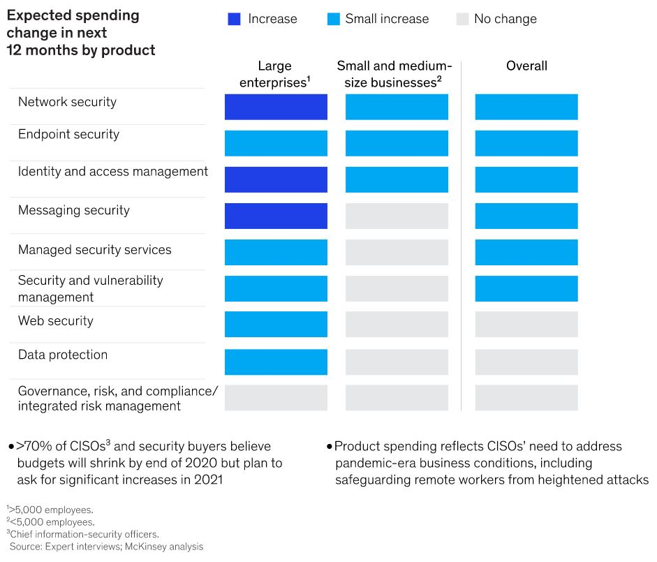

The year 2021 will mark the 4th anniversary of the first WannaCry Ransomware attack, which brought the concept of ransomware breaches into the limelight. It has been about half a decade since then. 

Cybersecurity isn’t just an IT issue anymore. It has caused substantial losses to businesses, governments, and individuals around the world. As we head into the third quarter of 2021, this insight is picking up steam.

In this blog, we will look at the top security breaches in June 2021—when the world economy is already dealing with the effects of the coronavirus.

## Popular Companies That Lost Control of Consumer Data in June 2021

### 1. LinkedIn's Massive Data Breach

According to a report by [RestorePrivacy](https://restoreprivacy.com/linkedin-data-leak-700-million-users/), on June 22, a user on a famous hacker site announced the sale of data from 700 million people. 

One million LinkedIn members' email addresses, full names, phone numbers, addresses, and geolocations were included in a sample shared by the user.

LinkedIn, on the other hand, explained the data's apparent legitimacy. "Our initial study has revealed that this data was scraped from LinkedIn and other websites and that it contains the same data that we disclosed earlier this year in our April 2021 scraping update," the company noted.

This is LinkedIn's second data security breach incident this year. Earlier, in April 2021, around 500 million user data was stolen from the platform, which included publicly visible profile data.

### 2. Alibaba's Billion-item Data Leak

A software developer based in China used Alibaba’s popular [Taobao shopping website](https://www.theregister.com/2021/06/16/alibaba_tabao_scraped_data_leak/) for eight months to collect more than 1.1 billion pieces of user information without the company noticing until recently.

A spokeswoman for Alibaba Group Holding Ltd. said the company proactively discovered and addressed a security flaw in its systems that allowed some unauthorized searches by a third party. The company said it would strengthen security and work with law enforcement but didn’t say how many people were affected.

The firm revealed that 925 million of its users an average of once a month use their platforms for retail, and the breach of its database caused no personal information or financial losses.

**Also Read**: [9 Data Security Best Practices For 2021](https://www.loginradius.com/blog/start-with-identity/data-security-best-practices/)

### 3. EA Suffers a Data Breach

Hackers broke into Electronic Arts (EA), the video-game publisher behind Battlefield, FIFA, and The Sims, and [stole detailed source code](https://www.theverge.com/2021/6/10/22528003/ea-data-breach-frostbite-fifa-internal-tools-hack) to FIFA 21, the Frostbite engine, and other game development tools. 

Other reputable game creators are unlikely to utilize EA's code without permission, but malevolent hackers might use it to cheat or breach a game or engine. A data hack might expose confidential projects and game concepts. Breaching of security is also bad for a company's reputation.

In addition, the hackers claimed to have Microsoft Xbox and Sony SDKs and API keys for sale. They even uploaded a screenshot displaying a total of 780GB of stolen items.

Screenshot: [Bleepingcomputer](https://www.bleepingcomputer.com/news/security/hackers-breach-gaming-giant-electronic-arts-steal-game-source-code/)

### 4. CVS Data Records Accidentally Exposed

According to [ABC News](https://abc7chicago.com/cvs-data-breach-medical-records-health-cyber-attack/10798172/), more than one billion search data from CVS Pharmacy's website were exposed online. The vulnerability was discovered by a cybersecurity researcher named Jeremiah Fowler. 

The details are related to search phrases on CVS Pharmacy's website and included information about Covid-19 vaccines that people were looking for. Fowler added that users typed in their email address in some cases, which was available in the records.

CVS admitted to ABC News that they had overlooked a database connected to them and that the breach stemmed from a third-party vendor who was hosting the information. The database has been shut down since. 

**Also Read**: [Protecting Organization From Cyber-Threats: Business at Risk During COVID-19](https://www.loginradius.com/blog/start-with-identity/cyber-threats-business-risk-covid-19/).

### 5. JBS SA: The World’s Largest Meat Supplier

Computer network disruptions at JBS, a multinational conglomeration of animal processing and food manufacturing companies, have had trouble reeling in Australia, Canada, and the US. 

JBS has the five largest beef plants in the United States, and the shutdown has put a fifth of the country's meat supply on hold.

In June, [JBS confirmed](https://www.bbc.com/news/world-us-canada-57318965) that it paid a ransom of nearly $11 million worth of bitcoin to hackers after they disabled its computer systems and demanded payment in the cryptocurrency.

### 6. NYC Law Department’s Large-Scale Lockout

The [New York City Law Department](https://www.wsj.com/articles/new-york-city-law-department-hit-by-cyberattack-11623105336) was hacked, leaving thousands of its lawyers locked out of their accounts.

It turned out that a hacker got into the network of the 1,000-lawyer agency by using a worker's email password. The invasions caused havoc with the city's lawyers, halted court procedures, and threw the department's legal affairs into turmoil. Most expressed concerns about the exposure of Social Security numbers and other sensitive data.

Officials also stated that there was no evidence that the attack harmed the city's computer systems, even though the inquiry was still ongoing. Investigators are still attempting to figure out who the criminal is and the motive of the perpetrator.

## Protect Your Organization Against Cyber Attacks

Seeing how cyber attacks can cause damage should be reason enough to take preventive measures right away. For instance, McKinsey sees next-generation [Identity and Access Management](https://www.loginradius.com/) leading enterprise cybersecurity spending in 2021. 

**Image Source**: [McKinsey ](https://www.mckinsey.com/business-functions/risk/our-insights/covid-19-crisis-shifts-cybersecurity-priorities-and-budgets)

What other steps can you take to reinforce your organization's cybersecurity framework and protect it from cyberattacks?

*   **Passwordless authentication:** [Passwordless authentication](https://www.loginradius.com/blog/start-with-identity/passwordless-authentication-the-future-of-identity-and-security/) eliminates the need for users to enter passwords during the verification process. Instead, they must produce another type of proof that verifies their identity, such as a one-time password (OTP), secret PIN, SMS- or app-generated codes, biometrics, etc. 

    Hackers want your data. They spend a lot of time trying to break into computer systems, and your passwords are the keys to those systems. So, when you do not have passwords in the first place, that gateway is already locked. 

*   **Data encryption and regular data backups**: Data encryption is still one of the most effective methods of preventing data leaks. Ensure that sensitive data, such as private consumer information, employee information, and other sorts of sensitive corporate data, is encrypted first and then backed up. 

    This way, if your company's sensitive data slips into the wrong hands or you fall victim to ransomware attacks, there's nothing to lose. 

*   **Use MFA**: Two-factor authentication or multi-factor authentication adds additional layers of security to the traditional password-based method of identity verification. You'll need to provide an extra authentication method such as a PIN, passcode, or even your fingerprint to re-verify your identity. 

Authenticating consumers is difficult and time-consuming. When used in conjunction, [a CIAM solution like LoginRadius](https://www.loginradius.com/contact-sales/) can significantly improve cybersecurity. It uses the approaches mentioned above and all recommended practices to filter permitted access and avoid typical attack situations.

