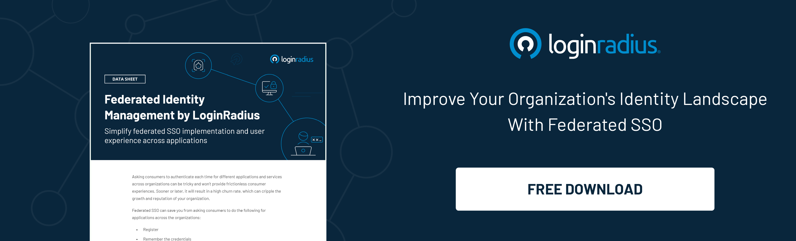

For organizations today, maintaining an array of productive networking tools is all about easy access. Enterprises often introduce new applications that support their production and help them implement their business strategies successfully. However, every time an application or tool gets implemented, the end-users are forced to create new credentials for access.

As a result, employees and customers end up with too many passwords to remember. Unfortunately, remembering all the different credentials is easier said than done. More than [60% of employees](https://www.techrepublic.com/article/25-of-employees-admit-that-they-use-the-same-password-for-everything/) use the same password for their work and personal applications, leading to greater vulnerability to data breaches. And about 13% of users reuse passwords on all their accounts regularly. In fact, compromised passwords are accountable for 81% of hacking-related breaches. 

Enterprises need to use methods to maximize the use of digital identities for multiple users. And tools like single sign-on (SSO) and federated identity management (FIM) seem to be the go-to methods for most organizations. However, most companies do not understand the differences between these two methods. And the implications they may have on the overall company security.

What is SSO, how is it different from FIM, and what are the benefits of both methods? Let's find out.

## What is Single Sign-On (SSO)

Since the early days of the internet, using a single digital identity for multiple logins was considered a risk from cybersecurity's perspective. And it is indeed. However, logging in to different web applications one by one is time-consuming, inconvenient, and disrupts the workflow. The solution to this dilemma lies with SSO. 

A [single sign-on](https://www.loginradius.com/single-sign-on/) or SSO is an authentication scheme that allows users to access multiple web applications securely through a single set of credentials. For example, it's what lets you browse your Gmail account in one tab and use Youtube in another tab on your browser. 

It also allows web services like online banking to grant access to various sections within the same account. Typically, your savings and general account are very distinct and require separate login credentials. However, with SSO, when you click on another section of your account, the site re-authenticates you with the credentials you used during the initial login.

In enterprises, it lets employees access various business applications like HR functions, financial records, and more with only one login credential. 

### How single sign-on works

SSO is a [token-based system](https://www.loginradius.com/blog/start-with-identity/pros-cons-token-authentication/), which means users are assigned a token for identification instead of a password. Let's say you go to an application you want to use; you will receive a security token that contains all your information (like your email address, username, etc.). Then, an Identity Provider compares this token to the credentials you provide during login and grants your authentication.

### Benefits of single sign-on

* **Reduces costs and password resets:** It eliminates the need for frequent password resets and reduces customer care calls, lowering IT costs. 
* **Streamlines production:** It eliminates the need for employees to remember multiple passwords and can cut down the time it takes to access the resources they need to do their jobs securely.
* **Enhanced customer experience:** It allows customers to access all the services and products an organization offers through a single login, removing the vexation of logging in multiple times.
* **Reliable security:** Most SSO platforms now have built-in security integrations with thousands of software applications. And, one password can grant you access to all of them.

## What is Federated Identity Management (FIM)

[Federated Identity Management](https://www.loginradius.com/blog/start-with-identity/what-is-federated-identity-management/) (Identity Federation) is a system that allows users from different enterprises (domains) to use the same digital identity to access all their applications and networks. 

Through FIM, an enterprise maintains its unique management system. It is interlinked with other enterprises through a third service (the identity provider) that stores the credentials. The identity provider or identity broker also offers the trust mechanism required for FIM to work. 

### How FIM works

An FIM system is established between two or more identity brokers across organizations based on mutual trust. FIM partners communicate through authorization messages, using the SAML or a similar Extensible Markup Language standard, like OAuth or OpenID Connect. 

Due to this, users only need to authenticate themselves to one domain (their home domain). When they later log in to a service such as a SaaS application, they don't have to provide credentials to the service provider again. The service provider believes that the identity provider has validated these credentials and granted them access.

### Benefits of FIM  

FIM removes the obstacles that prevent users from accessing the resources they need. Users can access applications and resources from different domains without remembering multiple passwords or logging in every time. Hence, reducing time and increasing productivity.

If organizations work on a project together, FIM allows the participants to access and use resources across different domains by simplifying the authentication and authorization process. Additionally, each organization can set permissions and access levels across systems in various security domains for a user.

FIM also helps enterprises streamline customer experiences, data management, privacy, and compliance.

## Federated Identity Management vs. SSO

Although SSO and FIM are used together, they do not mean the same thing. While single sign-on is an important component of FIM, it is not the same as FIM. The main difference between Identity Federation and SSO lies in the range of access. 

SSO allows users to use a single set of credentials to access multiple systems within a single organization (a single domain). On the other hand, FIM lets users access systems across federated organizations. They can access the applications, programs, and networks of all members within the federated group.

If we follow the above bank example, customers can access various external banking services like loan applications or ordering checks seamlessly through a single login with FIM.

## In Conclusion

Expanding digital identity management can boost an organization's work efficiency by reducing authentication time for all programs and applications. Using SSO or FIM have their benefits, along with the associated security and financial incentives. 

As you advance towards improving customer and employee support, these protocols can help you streamline password creation and [user authentication](https://www.loginradius.com/authentication/). 

