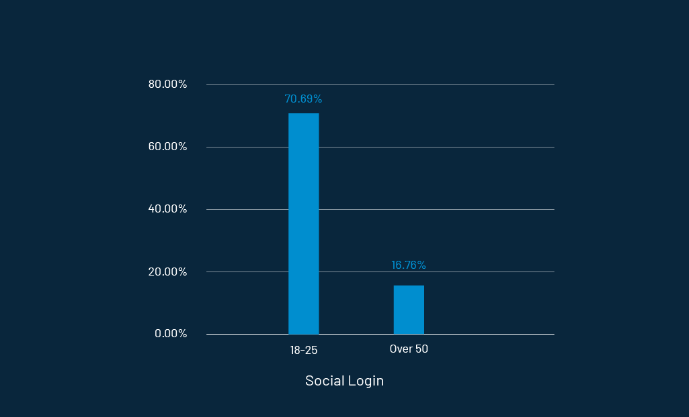

With the growing need to be online, people are logging into far too many websites all at once. No wonder problems like changing passwords, usernames, and registered mail IDs become obstacles in many instances. 

It is a bad experience for users and definitely not good news for businesses too!

User experience dominates everything else in today’s marketplace. Among 4.8 billion internet users today, [73% of people prefer user experience](https://www.pwc.com/future-of-cx) over price in their choice of brand. 

It is pretty obvious now that brands should seek new ways to deliver an exceptional customer experience. 

Having spoken about experience, the user interface also crosses the mind. They are two sides of the same coin but cannot be compared with the same weight. Here is my summarized take on both of them. 

**_The user interface is the space where interaction between humans and machines occurs. User experience, on the other hand, encompasses all the aspects of a person’s behavior, attitude, and emotions about using a particular product, system, or service._**

No matter where you are on the web, there are various windows open for user interactions. These may be places where users fill their shopping carts, interactive web games, or (most certainly) the website login and registration forms. 

Login is a big deal that decides the entire UX your website is going to deliver. Businesses should try to put as little resistance as possible into their registration process. As with it comes customer identities—the most accurate first-party data beneficial for conversions and customer retention.

So, what are the best practices that businesses should adopt to create easy-to-sign up registration forms?

## The Idea Behind a Simple Signup Form

A big mailing list and lead generation are the two primary goals of any business. 

For example, look at [Tinder’s 60 million daily active users](https://expandedramblings.com/index.php/tinder-statistics/). 

There is no magical potion behind their user acquisition practices. They are just a bit more careful in their strategies.

A crucial step in creating a sign-up form is to spend time understanding the user's reasons for signing up. Before preparing your questions, it’s important to think about the following: 

*   Why is there a need to re-enter your email id when you just mentioned it?
*   Do you really NEED a username? Won’t a combination of email id and password be enough for you to log in?
*   If, in the end, you still need to verify your email account, won’t a single space asking for your email id be sufficient?
*   Will [Social Login](https://www.loginradius.com/resource/social-login-reconsidered/) be a good alternative for your situation? If yes, then which network providers should you include?
*   Why make your visitors wait till the end of form submission to know about their mistakes like already registered email-id, username already exists, or the password doesn’t meet the guidelines?

When you finally have all your answers, let's help you design your registration page. 

First stop. Remember [the 8-second rule](https://bizibl.com/marketing/download/8-second-era-connect-distracted-consumers). Your design will either capture a buyer’s interest or lose them for good within the first eight seconds. 

So, how do you keep pace with consumer demands? The following rules will help. 

**Rule #1:** Keep the dimensions of all your form fields big. Not everyone is handy with tabs or uses their mouse to click on each field.

**Rule #2:** Make sure your visitors don't have to delete anything when filling out your text fields, as this would just waste their time.

**Rule #3:** Follow the single-column design for your Signup page, as two columns will create confusion when tabbing.

**Rule #4:** Make your sign-up button visible enough with a clear call to action message.

**Rule #5:** Ask only for information that is needed and relevant to your business. Do not stretch your registration form to a length that frustrates your visitor.

**Rule #6:** Do not confuse your visitors and keep it simple and consistent throughout your entire web interface. Also, make it easy to find where to register.

**Rule #7:** Build a value around registration and let your visitors know the purpose of your signup. 

And last, perform A/B testing on your signup forms. You will surely get some space for improvements.

## 5 Examples of High-Conversion Sign Up Page

### 1. Pinterest

Image source: [Pinterest](https://www.pinterest.com/)

**Sign-Up form takeaways**

1. The signup form is a popup that dims the background to only focus on the form. Great designing strategy indeed! 
2. No bombarding of social networks. Only Facebook and Google are enough.
3. Shows the advantages of registering for an account that is good enough to attract new visitors.

### 2. Lane Crawford

Image Source: [Lane Crawford](https://secure.lanecrawford.com/account/accountCreation.jsp)

**Sign-Up form takeaways**

1. Invites visitors to join its world of style by showcasing the benefits for registered users.
2. Dynamic representation of offers that are currently going on the portal.

### 3. GNC

Image source: [GNC](https://www.gnc.com/checkout/index.jsp)

**Sign-Up form takeaways**

1. A neat and clean sign-up form with no additional fields.
2. It has separate sections for login and registration.

### 4. Canva

Image source: [Canva](https://www.canva.com/login)

**Sign-Up form takeaways**

1. It has a large form field for easy input.
2. It has ONLY 2 form fields for a [faster signup process](https://www.loginradius.com/blog/fuel/2021/01/sign-up-tips-conversion-rate/).
3. It offers an easy one-click signup process with either your Facebook, Google, or Apple account.

### 5. Make My Trip 

Image source: [MakeMyTrip](https://www.makemytrip.com/)

**Sign-Up form takeaways**

1. A concise signup form asking only for your phone number.
2. It displays a big slider of the latest offers on the registration page itself.
3. Let you filter your trip even before you sign up. Amazing!

## Benefits of Using Social Login

So far now, you have seen examples of registration forms of different varieties. The one thing common that you will notice in all of the above examples is Social Login. 

You must have probably used them many times to log on to various websites. They are increasingly common and faster modes of registration. 

In fact, according to [Consumer Digital Identity Trend Report 2020](https://www.loginradius.com/resource/digital-identity-trends-2020/), 70.69% of 18-25 year-olds prefer social login.

Well, no surprise there! 

Image source: [LoginRadius](https://accounts.loginradius.com/auth.aspx?plan=developer)

But should you be using them for your own business? Read on the following [advantages of social login](https://www.loginradius.com/blog/start-with-identity/2021/02/social-login-infographic/) to decide whether you should consider them an alternative to the traditional registration process. 

*   **Faster registration process:** Social login is extremely useful as it cuts down the lengthy and frustrating registration process to just one click.
*   **More conversions:** Users logged in via social networks are more likely to make a purchase than those who don’t use social login.
*   **No more password fatigue:** Obviously, memorizing your multiple credentials is a big problem, but social login makes it easy. 
*   **Multiple identities:** Visitors can log on to your website with various social identities that are for sure an excellent opportunity for businesses to control their online identity.
*   **Huge amount of visitor data:** With social login, you get instant demographic and psychographic data about your visitors that further lead you towards better segmentation, personalization, and goal-targeted offers.
*   **Less failed logins:** When there is no need to memorize usernames and passwords, naturally, there will be no more failed logins. 

But what about the downside?

## Drawbacks of Social Login

When people find so many options in front of them, they are most likely to do one of the following:

*   Sometimes consumers forget which service they used to sign up, and then they hesitate to log in and leave the website.
*   At times, people choose the wrong provider to sign in, leading to creating a second account. Unfortunately, there is no accurate way to determine whether a Twitter or Facebook profile belongs to the same person.

Many companies overlook the crucial factors to consider when integrating social login into their website. Some precautions to take include:

## Best Practices for Integrating Social Login

**Tip #1:** Do not clutter your website with too many network providers just because it is a popular feature on the block. Add only those which are relevant to you. It is okay if you have only two providers on your login screen.

**Tip #2:** Find where most of your targeted audience floats. Look into every social media channel and find out which will work best for your business while keeping your product and service in mind.

**Tip #3:** Ask for the correct data from consumers and also explain why you want them. Apart from some basic information that a social network provider allows you to retrieve, access to all the other information should be permission-based. ** **

**Tip #4:** Give your visitors a notion of what they can get in exchange for their social credentials.  Just tickle their interests and give them a feeling that they are missing out on something really big.

## A Few Recent Stats on Social Login Preferences 

1. **70.69%** of 18-25 year-olds prefer social login compared to 16.76% of over 50s.

2. **38.69%** of females prefer social login compared to 48.55% males.

3. In **North America**, Facebook and Google are the most popular social networks preferred by 40.23% and 38.04% of consumers, respectively. 

4. In **Europe**, a similar trend is witnessed. Facebook is preferred by 36.12% of consumers, and Google is preferred by 34.89%.

5. **Facebook** is still preferred by 51.72% of consumers in the APAC region, and Google is preferred by 26.033%.

So, get cracking! Obviously, you do not want to lose out on your potential customers. Enjoy the endless benefits of Social Login with the [LoginRadius unified social API](https://www.loginradius.com/social-login/). 

