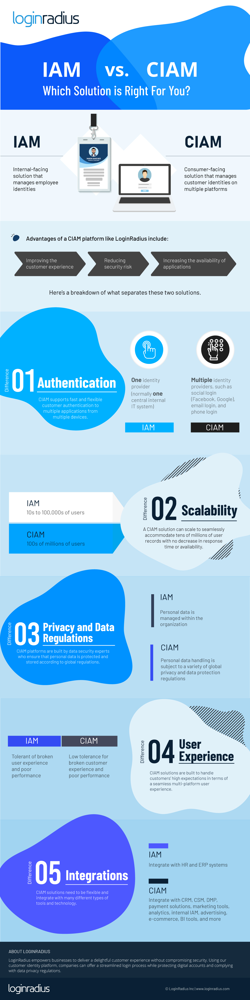

Traditional identity management is no longer enough to serve consumers.
This should really go without saying. After all, internal management systems were originally built to manage employee identities, and their expectations of a good user experience does not necessarily align **with customer expectations**.

It also doesn’t help that the needs of consumers are growing with every passing year, and internal identity management systems are not built to keep up.

For example, online users now expect a seamless and secure [customer experience](https://www.loginradius.com/blog/2017/08/unified-customer-identities-increase-ecommerce-conversions-revenue) across multiple devices and platforms. But internal identity management systems will always struggle to meet this requirement.

**Identity and access management (IAM) solutions** are traditionally used to streamline employee provisioning, manage access rights, assist in compliance reporting, automate approval workflows, fuel authentication and authorization, and for numerous other security-relevant functions.

But out of convenience, businesses try to adopt this technology to manage customer identities as well. Unfortunately, internal identity management systems just don’t have the right capabilities to manage and secure the hundreds of millions of users on [consumer-facing platforms](https://www.loginradius.com/blog/2018/10/treating-customers-like-criminals/).

This is where **customer IAM solutions** come in. [These solutions](https://www.loginradius.com/blog/2018/03/top-5-business-objectives-that-ciam-solves/) have been built to specifically handle the requirements for customer authentication, scalability, privacy and data regulations, the user experience, as well as integration.

In comparison to internal management, a [customer identity and access management](https://www.loginradius.com/blog/2019/06/customer-identity-and-access-management) (CIAM) solution improves the customer experience, reduces security risks, shrinks costs, and increases the availability of applications.

In this infographic, we compare the following features of both an IAM and CIAM solution:

- Authentication
- Scalability
- Privacy and data regulations
- User experience
- Integrations

