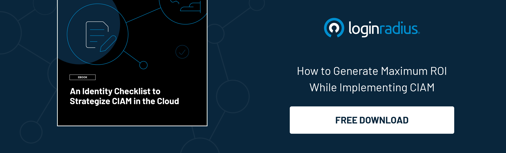

In a world where every user demands a personalized experience, businesses without personalization would surely miss out on business opportunities. 

However, customizing a user identity system is a whole different concept and isn’t just limited to adding a personalized greeting for a user with their name. 

Customizing experiences right from the beginning when the user interacts with a brand impacts conversions and overall lead generation. 

Whether collecting user information, displaying the most relevant results, or suggesting products based on their previous preferences, customization is undoubtedly pivotal in improving conversions, sales, and lead generation. 

This post will highlight customized identity systems and learn how it paves the path for increased business advancements. 

## What is an Identity System? 

Before we inch towards the business benefits of customizing an identity system, let’s first understand what an identity system is. 

An identity system or identity management system is an information system or a group of technologies working together to ensure the right individual has access to the right resources. 

Moreover, an identity system or a [consumer identity and access management](https://www.loginradius.com/) (CIAM) system helps businesses secure millions of consumer identities on their platform to offer a robust mechanism that prevents data breach. 

 

A CIAM solution also offers valuable insights into a consumer’s behavior, which further allows businesses to tailor their marketing and onboarding strategies. 

## Role of Identity System Customization

Since we have a fair knowledge of identity systems, let’s understand how customization can be a game-changer for achieving business goals through an identity system. 

We all come across different personalization experiences whenever we purchase goods from online marketplaces. 

Whether it’s Amazon suggesting a pair of running shoes when you purchase sports shorts or Netflix suggesting you a series based on your preferences, personalization is undeniably the key to push consumers to the sales funnel. 

However, the actual game begins in the first couple of seconds whenever an individual interacts with a brand for the first time. 

Yes, enterprises need to understand the importance of the onboarding process, which, if personalized adequately, can do wonders for their brand. 

Let’s understand this thing with an example.

Imagine a user lands on a website and thinks about signing up. The website asks for a long list of details for the signup procedure. 

The user somehow manages to fill the enormous signup form (although around 80% of users will switch at this moment). 

Now the website, after the signup process, again asks for specific information. This information would be used to deliver a personalized experience but would undoubtedly hamper the user experience. 

The remaining users would now switch platforms. 

Here’s where an identity management solution like LoginRadius comes into play. 

The innovative CIAM solution leverages [progressive profiling](https://www.loginradius.com/blog/start-with-identity/presenting-progressive-profiling-loginradius/) that gradually collects user information and automatically delivers personalized journeys and thus reducing fatigue and improving signup rates and conversions. 

## How LoginRadius Offers Competitive Edge to Businesses? 

Let’s learn how LoginRadius helps brands deliver a flawless customized experience that increases conversions and improves lead generation rates. 

* **Personalized Experiences:** Bring in more revenue through LoginRadius that offers a great personalized experience. When you know people’s preferences, you can offer what they want, when they want it, the way they want it.
* **Customer Data Protection (MFA and [Adaptive Authentication](https://www.loginradius.com/blog/start-with-identity/adaptive-authentication/)):** Consumers are infamous for repeating passwords across various online sites. Advanced CIAM solutions like LoginRadius use adaptive multi-factor authentication (MFA), which considers critical parameters such as location, the hour of the day, and gadgets to authenticate users. It promotes even greater [password security](https://www.loginradius.com/blog/async/password-security-best-practices-compliance/) by requiring additional verification for high-risk password resets.
* **Digital Consumer Interactions that are Seamless and Trustworthy:** Many businesses have numerous online apps and interfaces. You can create a seamless customer experience by connecting all of your platforms with a single CIAM solution like LoginRadius: A single point of entry for all applications. Its identification database makes it necessary for users to verify multiple times when moving between them. During the login procedure, this adds to the friction.
* **Flexible APIs for Customization:** When it comes to safeguarding access to information, developers strive to provide a seamless client experience. LoginRadius’ APIs provide developers with the freedom to define authentication requirements at any point in the planning process.
* **Support for Several Channels:** LoginRadius provides various entrance points throughout all devices, making it as simple as possible for clients to get the tools they need to operate their company.

## Final Thoughts 

Businesses leveraging personalization are exceptionally ahead of their competitors as consumers are always expecting more personalized journeys. 

The key lies in considering personalization right from the beginning when a user first interacts with the brand, which can be achieved through identity system customization. 

LoginRadius helps brands create personalized journeys for their users that quickly signup and land into the sales funnel. 

Brands that wish to invoke the true potential of personalization must consider relying on the LoginRadius CIAM solution. [Talk to our sales team](https://www.loginradius.com/contact-sales/) today! 

