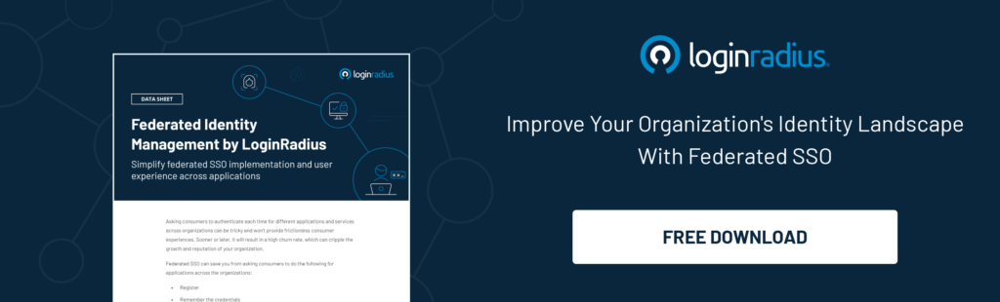
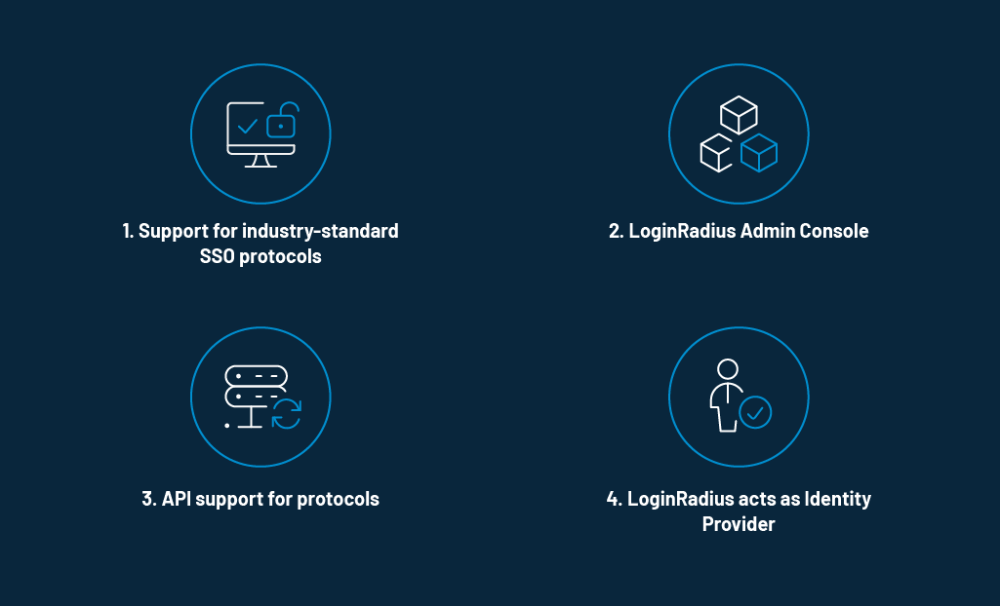
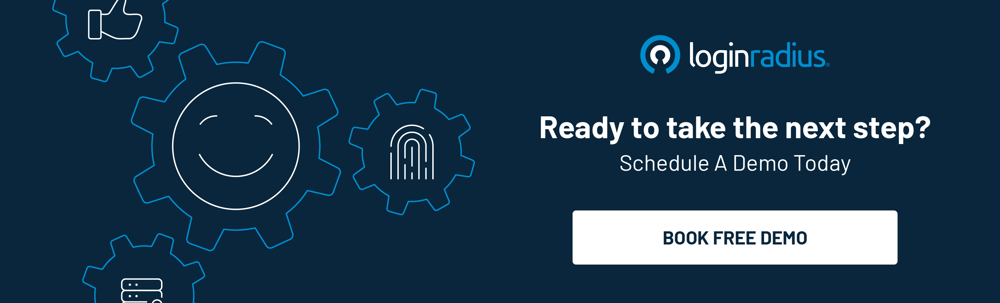

Back in the day, when consumers wanted to access different sites and applications, they had to register first, and then log in with their usernames and passwords every single time. Such experiences are no longer acceptable to consumers and they choose to opt-out of such services.

The recently launched Federated Identity Management by LoginRadius is an arrangement to simplify the implementation of [Single Sign-On (SSO)](https://www.loginradius.com/single-sign-on/) and user experience across applications. 

## Intent Behind the Launch

Federated Identity Management by LoginRadius helps businesses and applications use a single set of identity data. Consumers need not create multiple accounts for multiple organizations to access their web applications. These applications do not  communicate with each other directly and standard SSO protocols like JWT, SAML, OAuth 2.0, OIDC etc are used to establish the communication.

[Federated Identity Management](https://www.loginradius.com/federated-sso/) is designed by LoginRadius to help your business in the following ways: 

- **Gain access across multiple applications**: It helps applications work together, so consumers can access multiple applications without requiring a new access credential.

- **Seamless consumer authentication**: It provides seamless access to applications, making the consumer experience quicker, simpler, and more convenient. 

- **Cost-effectiveness**: It lowers the administrative cost as the support for maintenance of web pages like login, register, access management, consumer management is not required to be managed by your organization.

- **Highly secure model**: Because there is no direct communication with multiple service providers, passwords aren't exposed, leading to higher levels of security.

**Key Capabilities of Federated Identity Management by LoginRadius**

1\. **Support for industry-standard SSO protocols**: LoginRadius supports the following standard SSO protocols: 

- **SAML**: The LoginRadius Admin Console offers a comprehensive self-service of SAML configurations. 
- **JWT**: LoginRadius offers JWT formatted, encrypted token by email, phone, and username.
- **OAuth 2.0**: All authentication-related APIs of LoginRadius accept OAuth 2.0 token.
- **OpenID Connect (OIDC)**: LoginRadius follows all standards specified in the OpenID Connect specs.
- **Web Services Federation**: LoginRadius extends support for WS Federation by creating a token-based security model. 

2\. **LoginRadius Admin Console**: LoginRadius offers a simple dashboard to manage all configurations required for the above mentioned SSO protocols.

3\. **API support for protocols**: LoginRadius covers end-to-end API support for the SSO protocols mentioned above which make integration and implementation relatively easy to be executed within any system.

4\. **LoginRadius acts as Identity Provider**: LoginRadius acts as an IdP which stores and authenticates the identities that consumers use to log in to systems, applications, files servers, and more depending upon the configuration.

## A Final Word

Federated Identity Management by LoginRadius is a way to connect multiple web applications and services using the same identity data. It’s a many to one mapping to help your consumers access your business and partners with a single credential set.   

