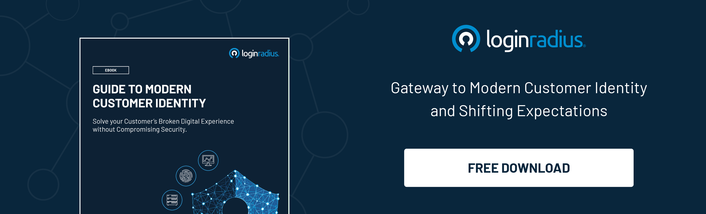

In the ever-expanding digital world, new generation corporate leaders are navigating the complex environment, which is accelerating at a great pace.

The new waves of automation relying on artificial intelligence and robotics have already changed the conventional business models leaving consumers and producers to make faster decisions.

However, as enterprises embark on a journey to digitize more parts of their business, the risk of cyber-attacks and data breaches grows. 

Moreover,[ amid the global pandemic](https://www.loginradius.com/blog/start-with-identity/2020/05/cyber-threats-business-risk-covid-19/), organizations are now struggling more than ever before to face new risks, vulnerabilities, and privacy issues since they adopted a paradigm shift to remote working.

Talking about modern web applications, most businesses may encounter a security and privacy breach if API (application programming interface) isn’t correctly implemented.

So does it mean that an online business strictly needs to focus on APIs and their correct deployment to ensure robust security?

Yes, absolutely!

Let’s learn about risk management in uncertain times and how holistic APIs could be a game-changer when it comes to delivering secure and enriched user experiences. 

## Holistic APIs: Removing the Barriers for Addressing Corporate Risks

Have you wondered how IT professionals and security task forces within an organization comprehensively access data to analyze security vulnerabilities? Well, teams must stringently rework their API coverage to ensure maximum security.

This simply means that a new-generation threat intelligence solution, which is transparent regarding the overall data coverage is the need of the hour.

Moreover, vendors should provide a list of threat sources much more than what is currently available via off-the-shelf APIs.

But how can this be achievable?

Vendors should prioritize sourcing their data in the most unique ways by leveraging a secure mechanism that facilitates the invisible communication between applications and APIs without hampering the overall user experience.

A reliable [CIAM (consumer identity and access management)](https://www.loginradius.com/blog/start-with-identity/2019/06/customer-identity-and-access-management/) solution like LoginRadius can help enterprises in leveraging the true potential of holistic APIs for an enhanced user experience backed by robust security.

When enterprises combine the standard security threat intelligence sources with API data using the finest CIAM, data analysts could easily do their jobs quickly. This also paves the path for analyzing previously overlooked risks that can be now included in the security management strategy.

Here’s how LoginRadius CIAM can help businesses stay ahead of the curve with secure integrations with real-time monitoring.

## How LoginRadius CIAM Affects an Enterprise’s Bottom Line

A wider scope of data when collected and cataloged precisely, can be used to address potential areas of threat and can be used to create effective strategies.

This further supports quick and reliable threat detection for security teams working in an enterprise to ensure the highest level of security for both the organization and consumers.

LoginRadius offers better insights into data from both a security and marketing perspective. Enterprises can efficiently utilize data to know more about their consumers, their behavior, and at the same time, keep an eye on attempts that may hamper security and privacy.

The API capabilities are endless as it covers all areas of threat intelligence that not only helps in predicting vulnerabilities but eventually provides a more insightful structure for overall business growth.

## Integration with Third-Party Analytics Solution

LoginRadius enables businesses to effortlessly integrate with popular insights and analytics applications that can enhance data analytics for scaling business growth and preparing a roadmap to enhance [user security](https://www.loginradius.com/blog/start-with-identity/2020/12/data-security-best-practices/).

Apart from this, enterprises can also custom-build an integration with an application of their choice to suit their exact business requirements. The data gathered by LoginRadius flows live, so the enterprise never has to pause for a data update and sync between integrated systems.

These integrations also play a crucial role in handling certain risks associated with user identity exploitation as the IT team can analyze data and requests from users, which further provides areas of potential risks.

## Built-in API flows and Exception Logic

To help enterprises save both time and resources during deployment and post-go-live maintenance, the LoginRadius SDK libraries provide a built-in flow for all of the APIs.

You have full control to customize these built-in flows even further to meet your requirements. A key feature of the SDKs is the built-in error logic, along with auto-handling of exceptions based on the input.

This enables a flawless experience for admins as well as developers while deploying the product or integrating third-party applications using APIs.

## Simplified and Efficient Implementation

The LoginRadius SDKs help businesses with integrating and simplifying API calls in their native server-side applications that eventually saves a lot of time.

All error and exception handling functionalities are built-in, and LoginRadius also handles the security updates and patches to ensure that your system receives the necessary updates at all times.

Businesses can leverage these SDKs to build an exceptional login and registration experience for their web applications and enjoy seamless connectivity to applications without any risk of data or privacy breaches.

## REST APIs and OAuth 2 Protocol

The SDKs are built using industry-standard technologies such as REST APIs and [OAuth 2.0](https://www.loginradius.com/blog/async/oauth2/) protocol. These SDKs are entirely open source, allowing businesses to modify and build off of the code to serve their unique requirements.

Apart from this, separate credentials are given to each person on the team to ensure security and accountability during the entire implementation process.

## Final Thoughts

In an era where things are going uncertain amid the global pandemic, there’s a continuous need for enterprises to work on providing the highest level of security as exploiters are finding new ways to breach security.

As far as the risks involved in deploying APIs are concerned, LoginRadius CIAM helps businesses swiftly navigate the implementation processes with utmost security.

