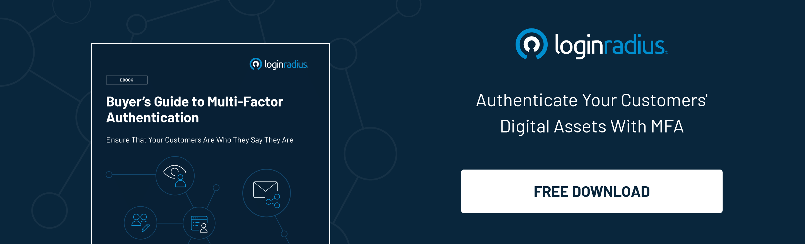

Username and password were considered the only way to authenticate a user when we look back into ancient times.

However, with advancements in technology, authentication has witnessed significant progress in the past couple of years.

Today, when it comes to securing user accounts and offering the finest user experience, WebAuthn leaves no stone untouched in delivering a seamless authentication experience.

[WebAuth](https://www.loginradius.com/blog/async/webauthn-authentication-application/) has offered endless benefits to enterprises striving to manage and secure consumer identities and data as it sets a new bar for user authentication.

Moreover, with robust authentication backed by a flawless user experience, including passwordless experience, WebAuthn provides a long list of opportunities to businesses.

In this post, we’ll learn more about WebAuthn and how it paves the path for a secure and seamless user login experience.

## What is WebAuth

For those who aren’t aware of the term ‘WebAuthn’- it is a new standard for authentication, which is published by the World Wide Web Consortium and is supported by the FIDO alliance.

WebAuthn works by offering a way for users to authenticate through third-party authentication providers. These third-party authentication providers can be built into the operating system, like Windows Hello, or Android biometrics, and even external authenticators, including a USB authenticator.

Since the use of WebAuthn is now becoming an industry-standard in the digital world, enterprises must gear up to leverage their true potential when it comes to securing consumer data.

## How WebAuthn Works

WebAuthn is supported on various web browsers including Firefox, Chrome, Edge, and Safari. It’s a part of the [FIDO2 framework](https://www.loginradius.com/resource/fido2-authentication-standard-datasheet) and this framework is a set of technologies that enables authentication without the reliance on passwords between servers, authenticators, and web browsers.

The Web Authentication API (WebAuthn) allows servers to quickly register and provide authentication to users that are using public-key cryptography instead of username and passwords.

In this overall process, a private-public key pair, i.e., the credential is created for a web application and the private key is securely stored on a particular user’s device. On the other hand, the public key along with the credential ID (randomly generated) is further sent to the server for storage. The server further uses that particular public key to prove the identity of a user.

Also, the public key here is no secret. The reason is, it becomes useless without a corresponding private key. Now even if the attacker has the public key, it’s of no use.

## How does it Work for User Login

WebAuthn is widely used to provide biometric MFA (multi-factor authentication) where voice, fingerprint, or a retina scan is considered as a unique factor to a particular user.

Today, most of the devices have a biometric device, like a smartphone, which can use the unique data that further creates and manages credentials, which can be accessed only by the owner.

Since WebAuthn supports MFA, it can help to replace the standard website or web application password as it’s a far more secure way of authenticating.

Whenever a user needs to prove their identity, the smart biometric can be utilized to authenticate a user on a particular platform without the need to enter credentials again and again.

Let’s understand this with a real-life example where we can use WebAuthn for handling authentication after an individual has registered with a web application.

Suppose the user is registered from their phone and navigates to the web application to log in. In that case, they are prompted to enter their password or biometric, which is associated with that particular account. The user can simply use their biometric to log in without the need to enter lengthy passwords.

Apart from this, the website or web application owner can also use it for multi-factor authentication that further reinforces overall login security.

In this entire scenario, the user login is secured as attackers that have access to user credentials cannot access the account as MFA kicks in and demands the user to go through another stringent authentication process.

## Implementing Passwordless Authentication with LoginRadius

The best way to provide seamless registration and authentication for your customers is with a [passwordless login](https://www.loginradius.com/blog/start-with-identity/passwordless-authentication-the-future-of-identity-and-security/) solution through WebAuthn. This gives your users a hassle-free way to access their accounts—with no passwords needed! 

The LoginRadius Identity Platform is an out-of-the-box way for you to do this easily. The identity and access management platform is fully customizable too, so you can simplify your customer experience to suit your company’s needs.

## How does LoginRadius Passwordless Authentication Work?

**Step 1:** On the website login page, a customer will be asked to enter the email address. It will act as their username too.

**Step 2:** LoginRadius will send a temporary verification link to the associated email address. You can custom-set the duration that link will remain active before it expires.

**Step 3:** The customer is prompted to click the verification link, which is then authenticated and redirected to the website the customer originated from.

## Conclusion

As the number of data breaches increases due to credential misuse, adding robust layers of security for your consumers is the need of the hour.

WebAuthn could be a game-changer for any business striving to [win consumer trust](https://www.loginradius.com/customer-security/) as it offers a great user experience backed with the highest level of security.

If you wish to deliver the next level of login experience to your consumers that not only ensures robust security but eventually helps to scale your business growth, LoginRadius is what you need.

[Reach us](https://www.loginradius.com/contact-sales/) for a personalized demo and know-how LoginRadius works for your business.

